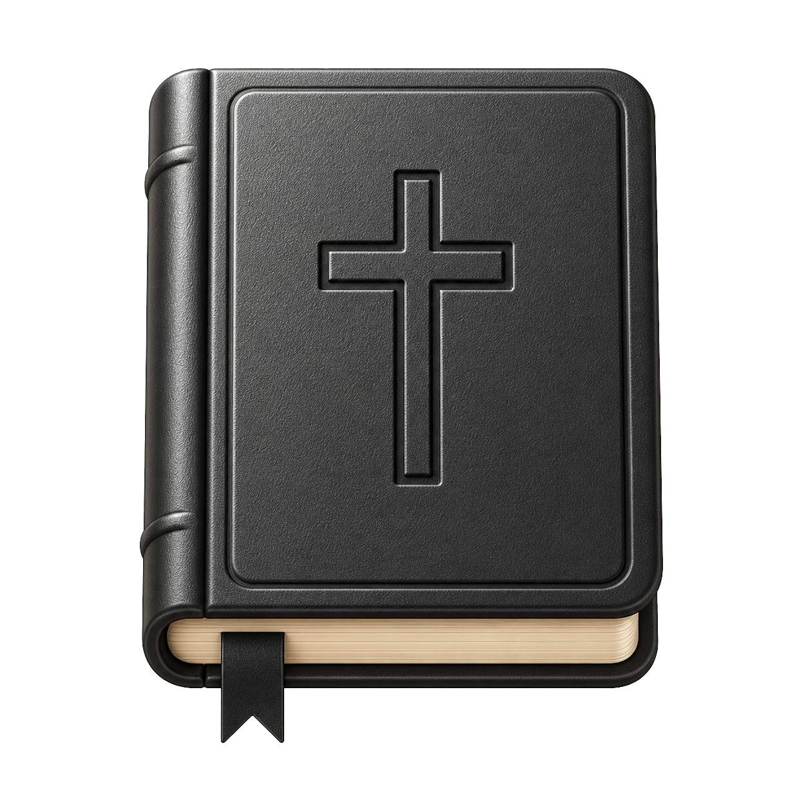
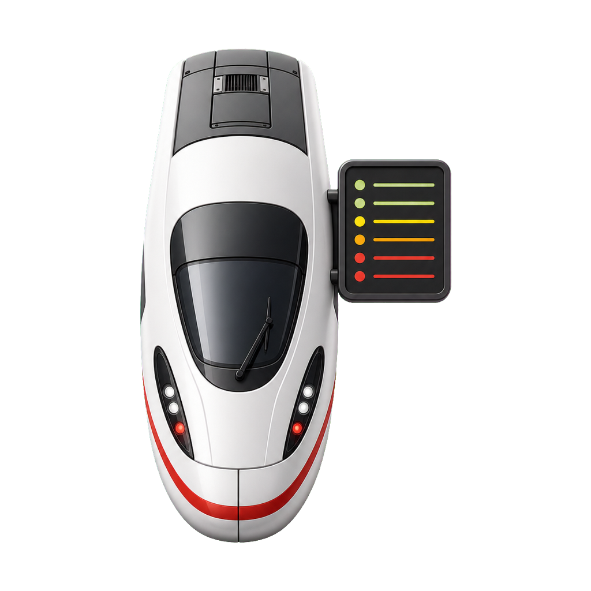
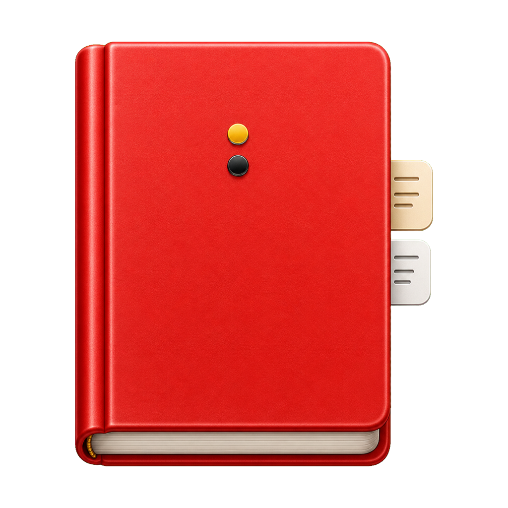
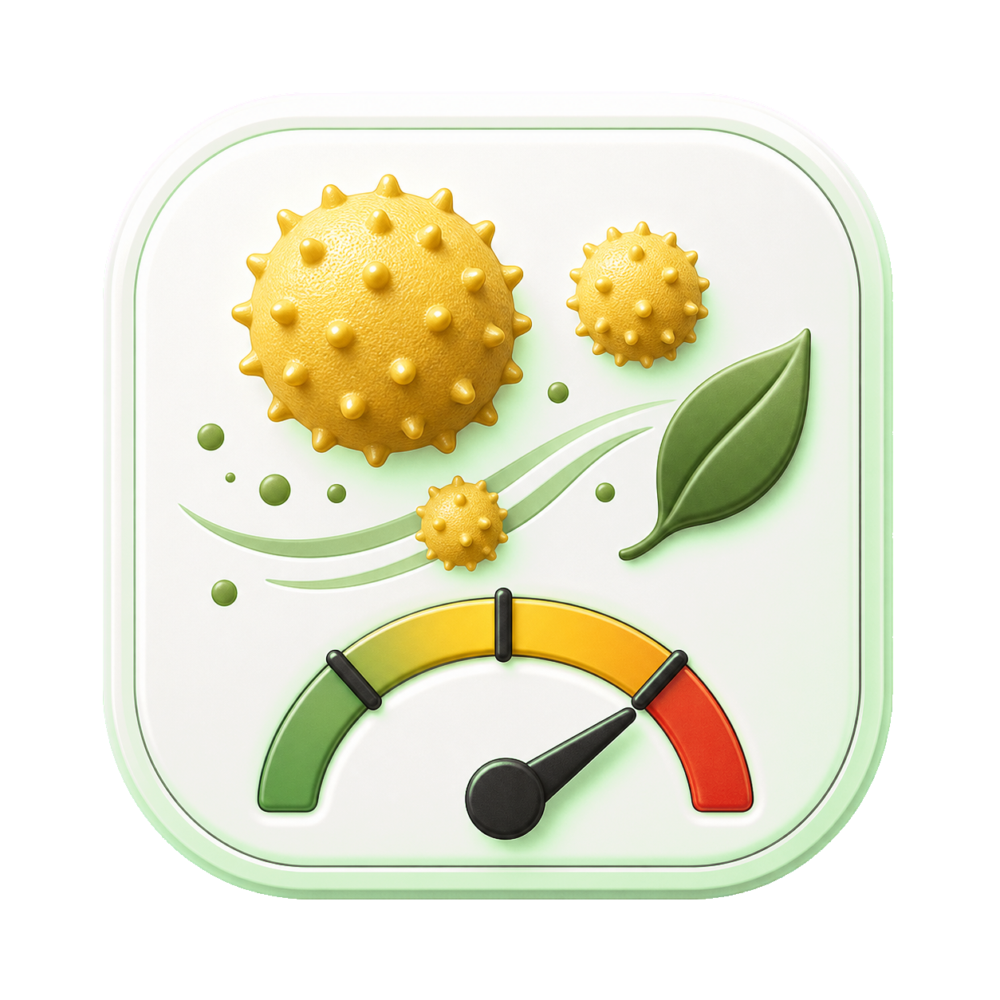
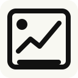
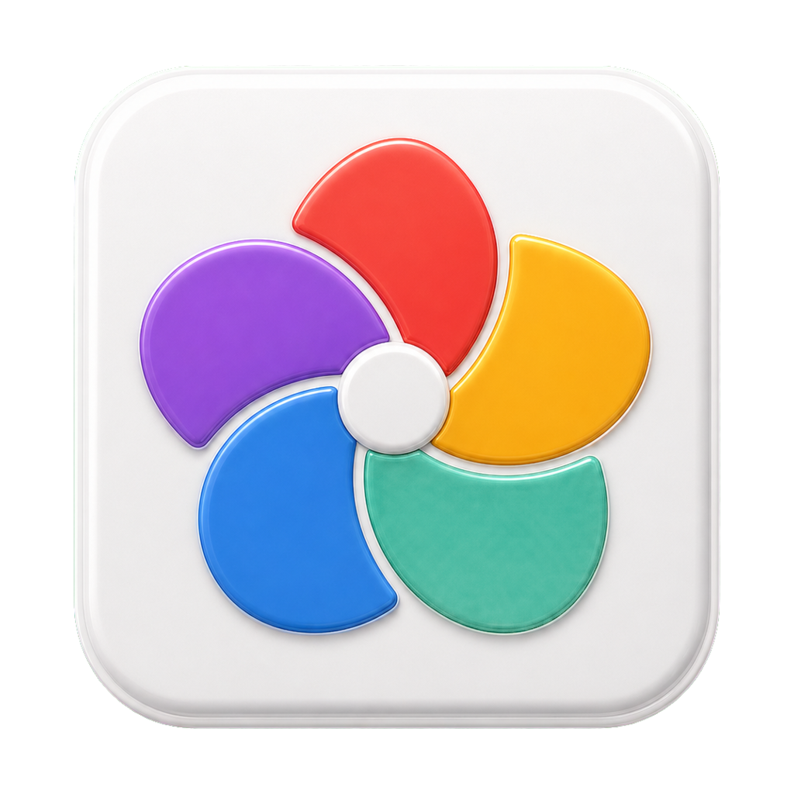
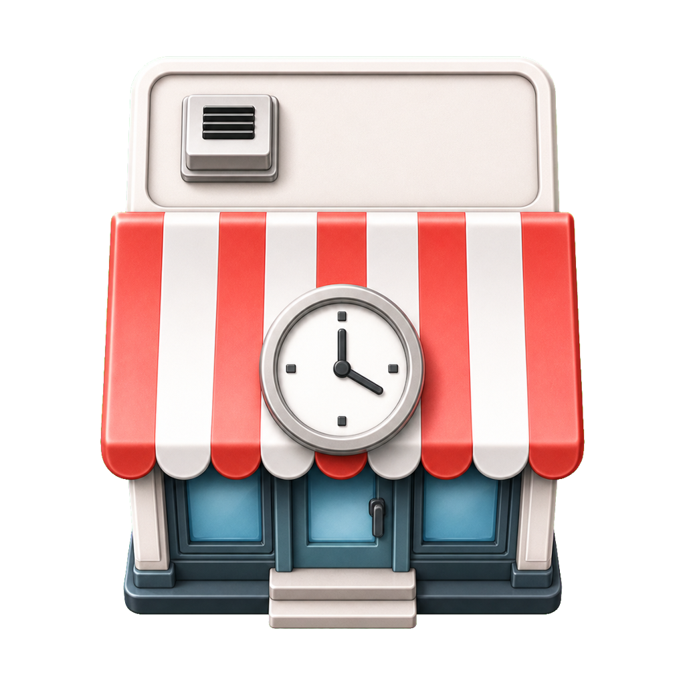
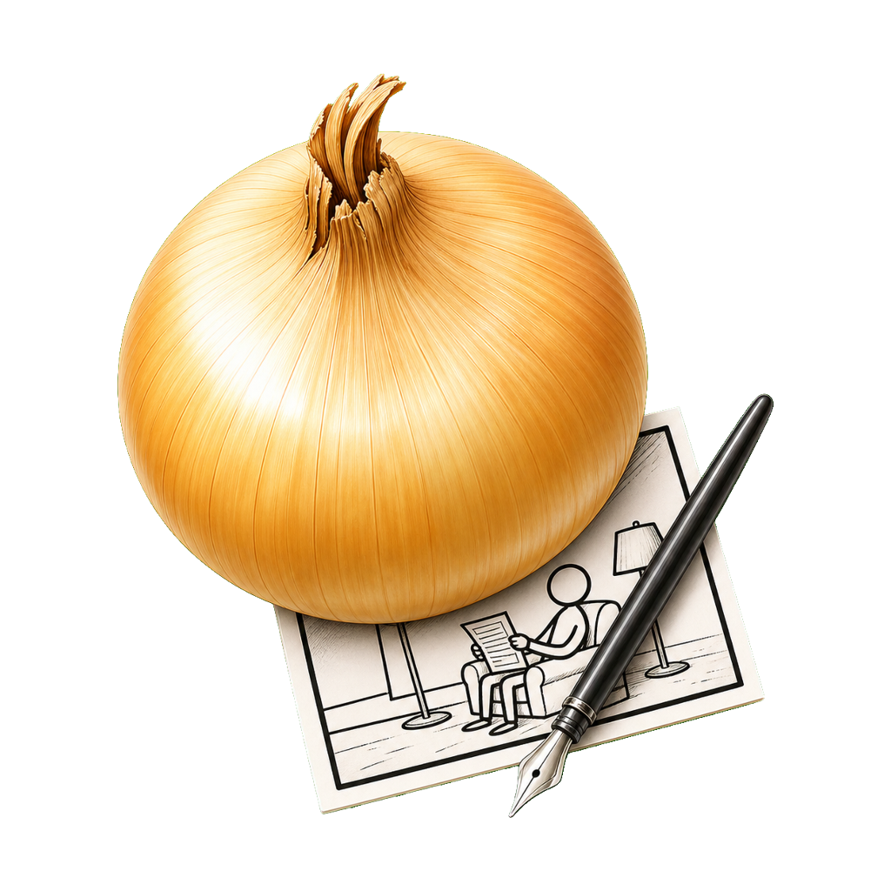
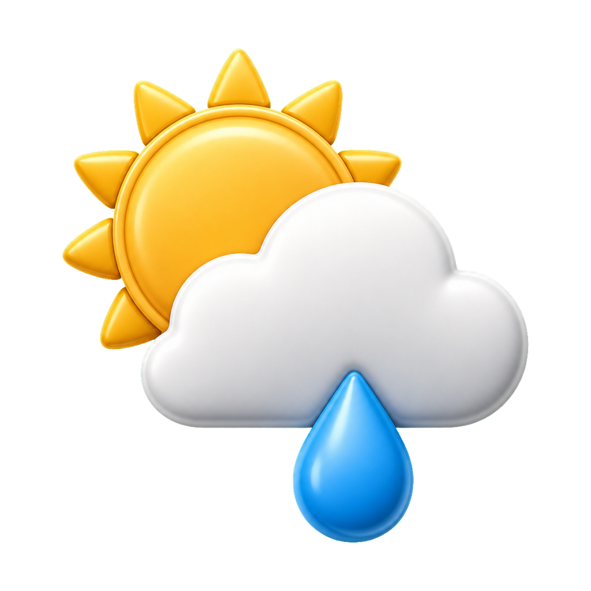

# paperlesspaper Integrations

This repository contains a Docker-ready collection of paperlesspaper Open Integrations. Each integration is a small HTML/CSS/JS provider that exposes a manifest, a render page, and optionally a settings page or server-side data route.

The structure is based on the official [paperlesspaper Open Integration overview](https://docs.paperlesspaper.de/open-integration/overview). That documentation defines the core contract this repo follows: a public `config.json`, a deterministic `render.html` surface for screenshot generation, optional `settings.html`, and loading markers that let paperlesspaper wait until async content is ready.

## Quick Start

Install dependencies and start the local provider:

```sh
npm install
npm start
```

The server listens on `http://localhost:3000` by default. Check the health endpoint with:

```sh
curl http://localhost:3000/health
```

## How It Works

Integrations live in `applications/<slug>/`.

| File | Purpose |
| --- | --- |
| `config.json` | Install manifest consumed by paperlesspaper. |
| `render.html` | Full-screen display surface captured for the ePaper image. |
| `settings.html` | Optional custom settings UI embedded by paperlesspaper. |
| `api/data.js` | Optional server-side data loader exposed at `/<slug>/api/data`. |
| `languages/*.json` | Localized labels and descriptions. |
| `assets/*` | Integration-specific icons and static assets. |

The Express server maps every application folder to predictable URLs:

```txt
/:slug/             -> applications/:slug/render.html
/:slug/render.html  -> applications/:slug/render.html
/:slug/config.json  -> applications/:slug/config.json
/:slug/api/data     -> applications/:slug/api/data.js
/assets/*           -> shared helper assets
```

Render pages use shared assets from `@paperlesspaper/openintegration`, copied into `public/` during `npm install` and Docker builds.

## Available Integrations

The production base URL is:

```txt
https://integrations.paperlesspaper.de
```

For example, the Quote manifest is available at `https://integrations.paperlesspaper.de/quote/config.json`, and its interactive demo is available at `https://integrations.paperlesspaper.de/quote/run`.

For local development, use `http://localhost:3000/<slug>/config.json`.

| Icon | Integration | Slug | Demo | Manifest URL | Description |
| --- | --- | --- | --- | --- | --- |
|  | [Apple Photos Gallery](applications/apple-photos-gallery/README.md) | `apple-photos-gallery` | [run](https://integrations.paperlesspaper.de/apple-photos-gallery/run) | [config.json](https://integrations.paperlesspaper.de/apple-photos-gallery/config.json) | Shows a random or numbered image from a public Apple Photos shared album. |
|  | [Astronauts](applications/astronauts/README.md) | `astronauts` | [run](https://integrations.paperlesspaper.de/astronauts/run) | [config.json](https://integrations.paperlesspaper.de/astronauts/config.json) | Shows the current people in space, grouped by spacecraft or station. |
|  | [Bible Verses](applications/bible-verses/README.md) | `bible-verses` | [run](https://integrations.paperlesspaper.de/bible-verses/run) | [config.json](https://integrations.paperlesspaper.de/bible-verses/config.json) | Shows a random Bible verse or a curated verse of the day. |
|  | [Day Calendar](applications/day-calendar/README.md) | `day-calendar` | [run](https://integrations.paperlesspaper.de/day-calendar/run) | [config.json](https://integrations.paperlesspaper.de/day-calendar/config.json) | Shows the current day with optional demotivational quotes or funny facts from the paperlesspaper DayCalendar app. |
|  | [Deutsche Bahn Abfahrten](applications/deutsche-bahn-abfahrten/README.md) | `deutsche-bahn-abfahrten` | [run](https://integrations.paperlesspaper.de/deutsche-bahn-abfahrten/run) | [config.json](https://integrations.paperlesspaper.de/deutsche-bahn-abfahrten/config.json) | Shows upcoming realtime departures for a Deutsche Bahn station. |
|  | [Duden Wort des Tages](applications/duden-wort-des-tages/README.md) | `duden-wort-des-tages` | [run](https://integrations.paperlesspaper.de/duden-wort-des-tages/run) | [config.json](https://integrations.paperlesspaper.de/duden-wort-des-tages/config.json) | Shows Duden's German word of the day with meaning, usage, origin, type, and frequency. |
|  | [DWD Pollenflug](applications/dwd-pollenflug/README.md) | `dwd-pollenflug` | [run](https://integrations.paperlesspaper.de/dwd-pollenflug/run) | [config.json](https://integrations.paperlesspaper.de/dwd-pollenflug/config.json) | Shows current DWD pollen forecasts for a German forecast region. |
|  | [Finance Snapshot](applications/finance-snapshot/README.md) | `finance-snapshot` | [run](https://integrations.paperlesspaper.de/finance-snapshot/run) | [config.json](https://integrations.paperlesspaper.de/finance-snapshot/config.json) | Shows a compact snapshot of markets, commodities, crypto, currencies, energy, and selected stocks. |
|  | [Formula 1 Races](applications/formula-1-races/README.md) | `formula-1-races` | [run](https://integrations.paperlesspaper.de/formula-1-races/run) | [config.json](https://integrations.paperlesspaper.de/formula-1-races/config.json) | Shows the upcoming Formula 1 Grand Prix with circuit details, date, session times, and a track image. |
|  | [Immich Photos](applications/immich-photos/README.md) | `immich-photos` | [run](https://integrations.paperlesspaper.de/immich-photos/run) | [config.json](https://integrations.paperlesspaper.de/immich-photos/config.json) | Shows a random, newest, or oldest photo from an Immich server. |
|  | [Mastodon](applications/mastodon/README.md) | `mastodon` | [run](https://integrations.paperlesspaper.de/mastodon/run) | [config.json](https://integrations.paperlesspaper.de/mastodon/config.json) | Shows a Mastodon home timeline, hashtag stream, or profile feed. |
|  | [Newsstand](applications/newsstand/README.md) | `newsstand` | [run](https://integrations.paperlesspaper.de/newsstand/run) | [config.json](https://integrations.paperlesspaper.de/newsstand/config.json) | Shows a fresh newspaper front page from Riley Walz's Papers archive. |
|  | [Opening Hours](applications/opening-hours/README.md) | `opening-hours` | [run](https://integrations.paperlesspaper.de/opening-hours/run) | [config.json](https://integrations.paperlesspaper.de/opening-hours/config.json) | Shows current opening status, today's hours, and the weekly schedule for a place. |
|  | [Quote](applications/quote/README.md) | `quote` | [run](https://integrations.paperlesspaper.de/quote/run) | [config.json](https://integrations.paperlesspaper.de/quote/config.json) | Shows a deterministic daily quote. |
|  | [Simple Calendar](applications/simple-calendar/README.md) | `simple-calendar` | [run](https://integrations.paperlesspaper.de/simple-calendar/run) | [config.json](https://integrations.paperlesspaper.de/simple-calendar/config.json) | Shows a configurable monthly calendar inspired by the TRMNL Simple Calendar recipe. |
|  | [The Onion - Editorial Cartoon](applications/the-onion-editorial-cartoon/README.md) | `the-onion-editorial-cartoon` | [run](https://integrations.paperlesspaper.de/the-onion-editorial-cartoon/run) | [config.json](https://integrations.paperlesspaper.de/the-onion-editorial-cartoon/config.json) | Shows a recent editorial cartoon from The Onion's Cartoons section. |
|  | [Uptime Kuma Monitor](applications/uptime-kuma-monitor/README.md) | `uptime-kuma-monitor` | [run](https://integrations.paperlesspaper.de/uptime-kuma-monitor/run) | [config.json](https://integrations.paperlesspaper.de/uptime-kuma-monitor/config.json) | Shows a public Uptime Kuma status page with monitor states, 24-hour uptime, heartbeat history, incidents, and maintenance. |
|  | [Waste Collection Schedule](applications/waste-collection-schedule/README.md) | `waste-collection-schedule` | [run](https://integrations.paperlesspaper.de/waste-collection-schedule/run) | [config.json](https://integrations.paperlesspaper.de/waste-collection-schedule/config.json) | Shows the next waste collection dates from an ICS/iCal feed or manual recurring schedules. |
|  | [Weather](applications/weather/README.md) | `weather` | [run](https://integrations.paperlesspaper.de/weather/run) | [config.json](https://integrations.paperlesspaper.de/weather/config.json) | Shows current weather and a three-day forecast from Open-Meteo. |
|  | [World Cup 2026](applications/world-cup-2026/README.md) | `world-cup-2026` | [run](https://integrations.paperlesspaper.de/world-cup-2026/run) | [config.json](https://integrations.paperlesspaper.de/world-cup-2026/config.json) | Shows World Cup 2026 results, fixtures, and the group table for a favorite team. |
|  | [XKCD](applications/xkcd/README.md) | `xkcd` | [run](https://integrations.paperlesspaper.de/xkcd/run) | [config.json](https://integrations.paperlesspaper.de/xkcd/config.json) | Shows the latest, random, or offset XKCD comic. |

## Development

Use the render URL while building an integration:

```txt
http://localhost:3000/<slug>/
```

Use the manifest URL when installing it in paperlesspaper:

```txt
http://localhost:3000/<slug>/config.json
```

Open Integrations should render within `100vw` by `100vh`, avoid browser-only chrome, and keep layout stable for predictable screenshots. If an integration fetches data, create the loading marker immediately and only mark the page loaded once content is ready:

```html
<div id="website-has-loading-element"></div>
<div id="website-has-loaded">ready</div>
```

## Screenshots

Regenerate local variant screenshots and update `configVariants` in application manifests:

```sh
npm run screenshots
```

Useful filters while iterating:

```sh
npm run screenshots -- --config-only
npm run screenshots -- --app weather --resolution 800x480
```

Generated screenshots are ignored by git under `output/` and `applications/*/screenshots/`.

## Docker

Build and run the container directly:

```sh
npm run docker:build
npm run docker:run
```

Or use Docker Compose:

```sh
docker compose up --build
```

## Hosting

When hosting this provider for real devices, expose it over HTTPS and make sure paperlesspaper can fetch each integration manifest from the browser. The public install URL on the production deployment looks like:

```txt
https://integrations.paperlesspaper.de/<slug>/config.json
```

Some integrations call upstream APIs from `api/data.js`. Keep credentials in environment variables or user-provided settings, not in committed files. `.env`, `node_modules`, generated output, and local workspace files are intentionally ignored.

## Adding An Integration

1. Create `applications/<slug>/`.
2. Add a `config.json` manifest with `name`, `version`, `description`, `renderPage`, and any settings schema.
3. Add `render.html` and make it deterministic at the target viewport size.
4. Add `settings.html` only when the built-in schema fields are not enough.
5. Add `api/data.js` only when data should be fetched server-side.
6. Run `npm run screenshots -- --app <slug>` to refresh variants.

Use the smallest provider that works: plain manifest settings first, a custom settings page when the user experience needs it, and server routes only when browser-side rendering cannot call the upstream service directly.
