# paperlesspaper Integrations

This repository contains a Docker-ready collection of paperlesspaper Open Integrations. Each integration is a small HTML/CSS/JS provider that exposes a manifest, a render page, and optionally a settings page or server-side data route.

The structure is based on the official [paperlesspaper Open Integration overview](https://docs.paperlesspaper.de/open-integration/overview). That documentation defines the core contract this repo follows: a public `config.json`, a deterministic `render.html` surface for screenshot generation, optional `settings.html`, and loading markers that let paperlesspaper wait until async content is ready.

## Quick Start

Install dependencies and start the local provider:

```sh
npm install
npm start
```

The server listens on `http://localhost:3000` by default. Check the health endpoint with:

```sh
curl http://localhost:3000/health
```

## How It Works

Integrations live in `applications/<slug>/`.

| File               | Purpose                                                      |
| ------------------ | ------------------------------------------------------------ |
| `config.json`      | Install manifest consumed by paperlesspaper.                 |
| `render.html`      | Full-screen display surface captured for the ePaper image.   |
| `settings.html`    | Optional custom settings UI embedded by paperlesspaper.      |
| `api/*.js`         | Optional server-side routes exposed at `/<slug>/api/<name>`. |
| `languages/*.json` | Localized labels and descriptions.                           |
| `assets/*`         | Integration-specific PNG icons and static assets.            |

The Express server maps every application folder to predictable URLs:

```txt
/:slug/             -> applications/:slug/render.html
/:slug/render.html  -> applications/:slug/render.html
/:slug/config.json  -> applications/:slug/config.json
/:slug/api/:name    -> applications/:slug/api/:name.js
/assets/*           -> shared helper assets
```

Render pages use shared assets from `@paperlesspaper/openintegration`, copied into `public/` during `npm install` and Docker builds.

## Available Integrations

The production base URL is:

```txt
https://integrations.paperlesspaper.de
```

For example, the Quote manifest is available at `https://integrations.paperlesspaper.de/quote/config.json`, and its interactive demo is available at `https://integrations.paperlesspaper.de/quote/run`.

For local development, use `http://localhost:3000/<slug>/config.json`.

| Icon                                                                                                       | Integration                                                                         | Demo                                                                          | Manifest URL                                                                             | Description                                                                                                                                    |
| ---------------------------------------------------------------------------------------------------------- | ----------------------------------------------------------------------------------- | ----------------------------------------------------------------------------- | ---------------------------------------------------------------------------------------- | ---------------------------------------------------------------------------------------------------------------------------------------------- |
| 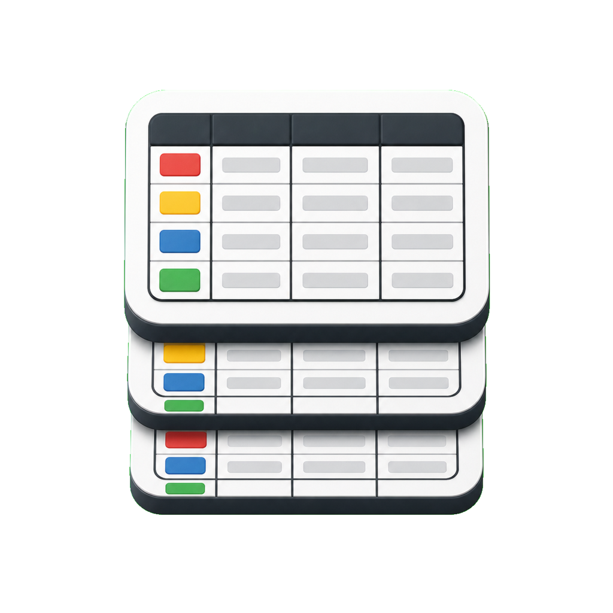                          | [Airtable](applications/airtable/README.md)                                         | [run](https://integrations.paperlesspaper.de/airtable/run)                    | [config](https://integrations.paperlesspaper.de/airtable/config.json)                    | Shows one or more Airtable tables as compact eInk-friendly data views.                                                                         |
|               | [Apple Photos Gallery](applications/apple-photos-gallery/README.md)                 | [run](https://integrations.paperlesspaper.de/apple-photos-gallery/run)        | [config](https://integrations.paperlesspaper.de/apple-photos-gallery/config.json)        | Shows a random or numbered image from a public iCloud shared album.                                                                            |
|                         | [Astronauts](applications/astronauts/README.md)                                     | [run](https://integrations.paperlesspaper.de/astronauts/run)                  | [config](https://integrations.paperlesspaper.de/astronauts/config.json)                  | Shows the current people in space, grouped by spacecraft or station.                                                                           |
|                       | [Bible Verses](applications/bible-verses/README.md)                                 | [run](https://integrations.paperlesspaper.de/bible-verses/run)                | [config](https://integrations.paperlesspaper.de/bible-verses/config.json)                | Shows a random Bible verse or a curated verse of the day.                                                                                      |
| 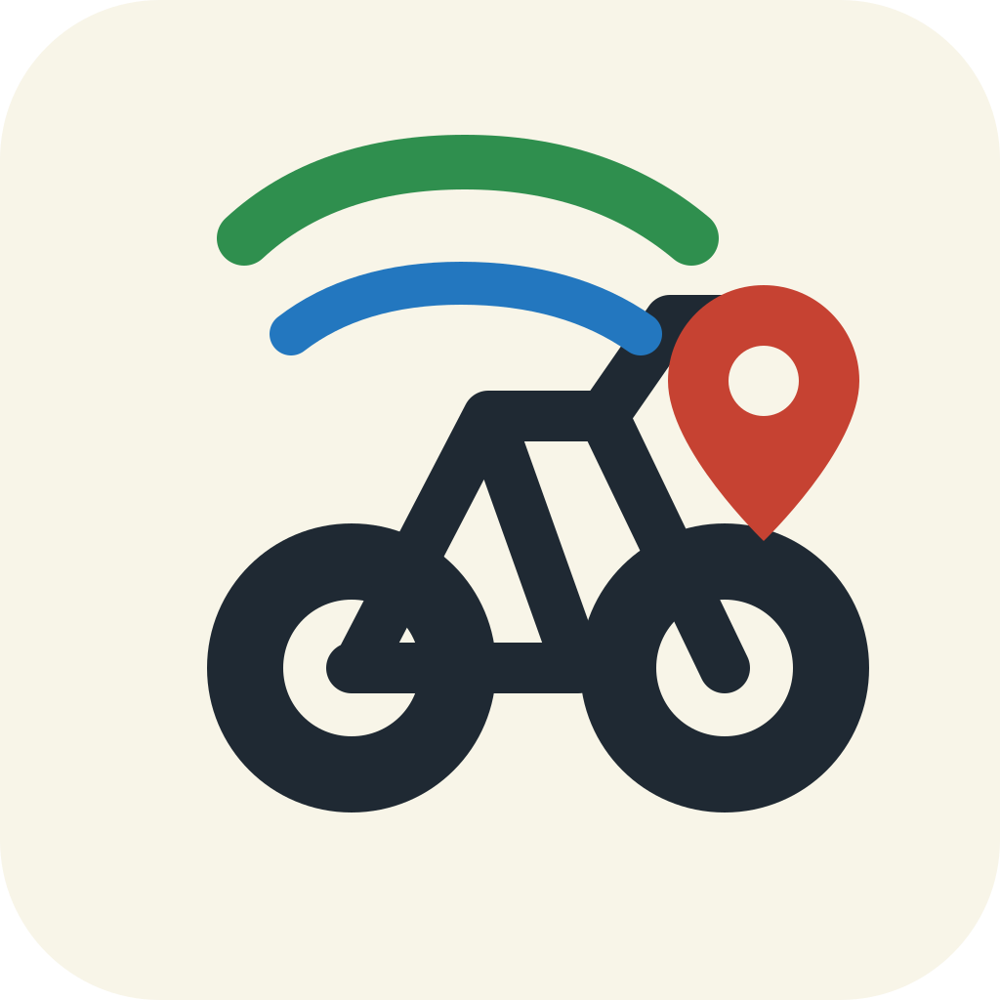                 | [Bike Commute Card](applications/bike-commute-card/README.md)                       | [run](https://integrations.paperlesspaper.de/bike-commute-card/run)           | [config](https://integrations.paperlesspaper.de/bike-commute-card/config.json)           | Shows rain window, wind, route status, and air quality for a bike commute.                                                                     |
| 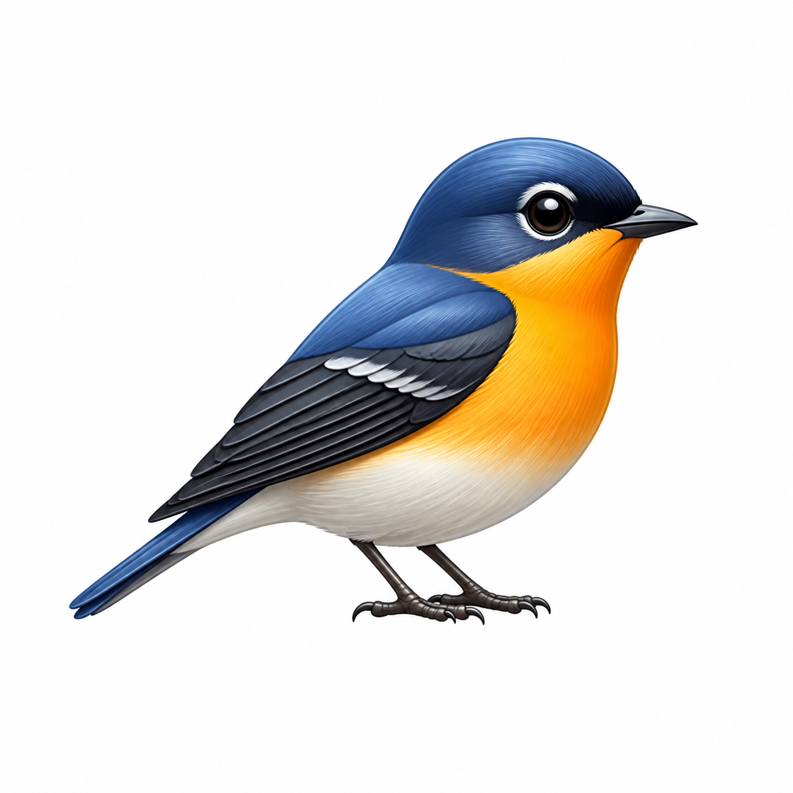                   | [Bird of the Day](applications/bird-of-the-day/README.md)                           | [run](https://integrations.paperlesspaper.de/bird-of-the-day/run)             | [config](https://integrations.paperlesspaper.de/bird-of-the-day/config.json)             | Shows one deterministic daily bird with clean side-profile artwork and compact Wikipedia-sourced facts.                                        |
| 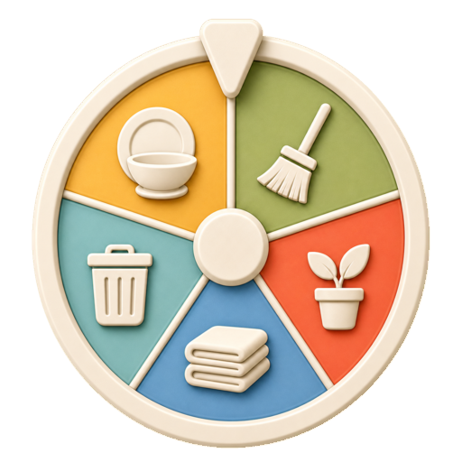                       | [Chore Wheel](applications/chore-wheel/README.md)                                   | [run](https://integrations.paperlesspaper.de/chore-wheel/run)                 | [config](https://integrations.paperlesspaper.de/chore-wheel/config.json)                 | Shows a rotating household chore wheel that assigns chores to members deterministically by day or week.                                        |
| 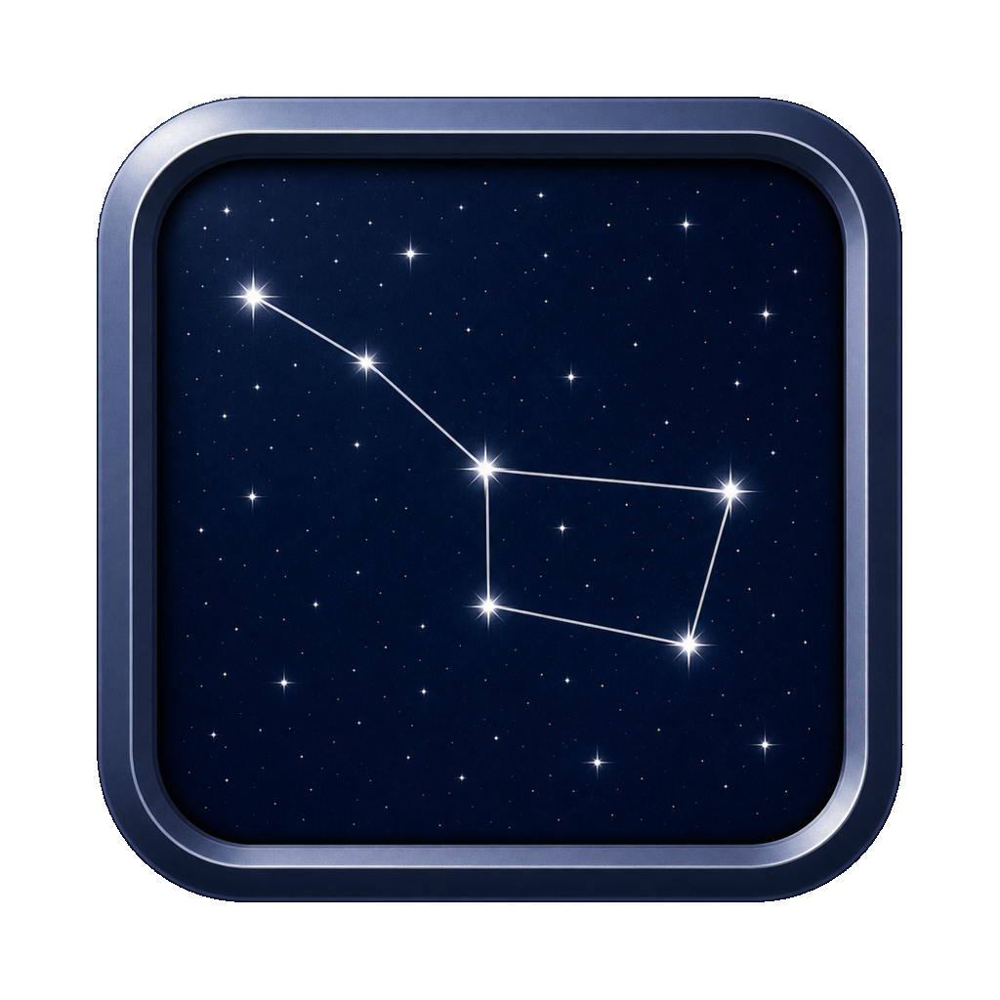         | [Constellations in the Sky](applications/constellations-in-the-sky/README.md)       | [run](https://integrations.paperlesspaper.de/constellations-in-the-sky/run)   | [config](https://integrations.paperlesspaper.de/constellations-in-the-sky/config.json)   | Shows a seasonal constellation sky map with highlighted star patterns and labels.                                                              |
| 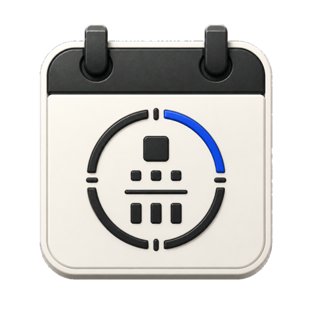                    | [Countdown Card](applications/countdown-card/README.md)                             | [run](https://integrations.paperlesspaper.de/countdown-card/run)              | [config](https://integrations.paperlesspaper.de/countdown-card/config.json)              | Shows a configurable countdown or count-up with days, time, and optional progress.                                                             |
|                 | [Country of the Day](applications/country-of-the-day/README.md)                     | [run](https://integrations.paperlesspaper.de/country-of-the-day/run)          | [config](https://integrations.paperlesspaper.de/country-of-the-day/config.json)          | Shows one deterministic daily country with a flag, capital, region, area, languages, currency, and compact map-friendly facts.                 |
|              | [Daily Buddhism Wisdom](applications/daily-buddhism-wisdom/README.md)               | [run](https://integrations.paperlesspaper.de/daily-buddhism-wisdom/run)       | [config](https://integrations.paperlesspaper.de/daily-buddhism-wisdom/config.json)       | Shows a daily Buddhist wisdom quote from Buddha API.                                                                                           |
|                       | [Day Calendar](applications/day-calendar/README.md)                                 | [run](https://integrations.paperlesspaper.de/day-calendar/run)                | [config](https://integrations.paperlesspaper.de/day-calendar/config.json)                | Shows the current day with optional demotivational quotes or funny facts from the paperlesspaper DayCalendar app.                              |
|            | [Deutsche Bahn Abfahrten](applications/deutsche-bahn-abfahrten/README.md)           | [run](https://integrations.paperlesspaper.de/deutsche-bahn-abfahrten/run)     | [config](https://integrations.paperlesspaper.de/deutsche-bahn-abfahrten/config.json)     | Shows a compact station-board view of upcoming realtime departures for a Deutsche Bahn station.                                                |
|                | [Dinosaur of the Day](applications/dinosaur-of-the-day/README.md)                   | [run](https://integrations.paperlesspaper.de/dinosaur-of-the-day/run)         | [config](https://integrations.paperlesspaper.de/dinosaur-of-the-day/config.json)         | Shows one deterministic daily dinosaur with display-friendly silhouette artwork and compact Wikipedia-sourced facts.                           |
|               | [Duden Wort des Tages](applications/duden-wort-des-tages/README.md)                 | [run](https://integrations.paperlesspaper.de/duden-wort-des-tages/run)        | [config](https://integrations.paperlesspaper.de/duden-wort-des-tages/config.json)        | Shows Duden's German word of the day with meaning, usage, origin, type, and frequency.                                                         |
|                     | [DWD Pollenflug](applications/dwd-pollenflug/README.md)                             | [run](https://integrations.paperlesspaper.de/dwd-pollenflug/run)              | [config](https://integrations.paperlesspaper.de/dwd-pollenflug/config.json)              | Shows current DWD pollen forecasts for a German forecast region.                                                                               |
|                   | [Finance Snapshot](applications/finance-snapshot/README.md)                         | [run](https://integrations.paperlesspaper.de/finance-snapshot/run)            | [config](https://integrations.paperlesspaper.de/finance-snapshot/config.json)            | Shows a compact market dashboard with commodities, crypto, currencies, energy, indices, ETFs, stocks, and trend markers.                       |
| 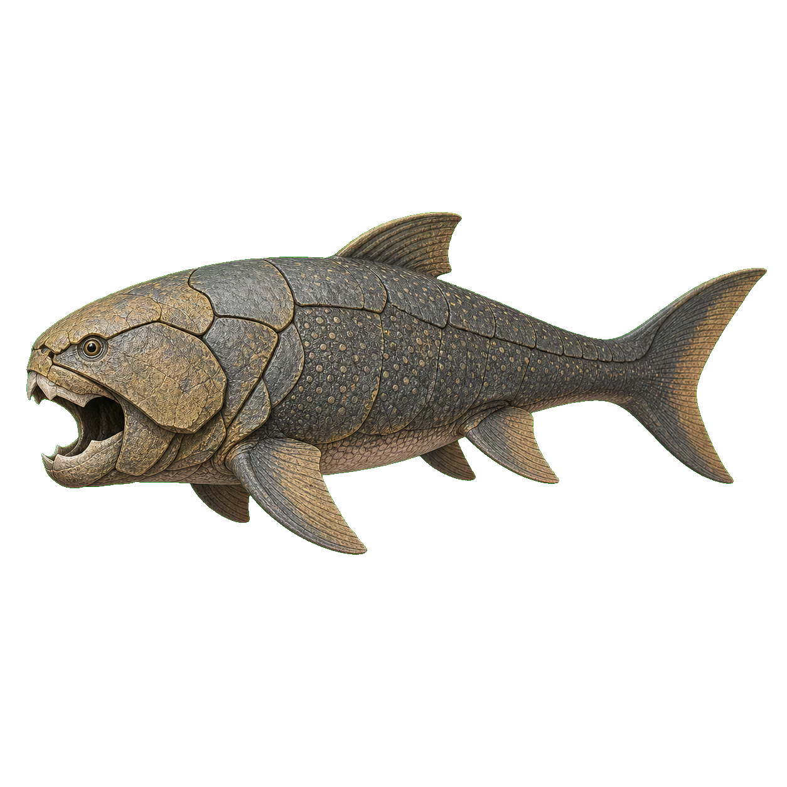                   | [Fish of the Day](applications/fish-of-the-day/README.md)                           | [run](https://integrations.paperlesspaper.de/fish-of-the-day/run)             | [config](https://integrations.paperlesspaper.de/fish-of-the-day/config.json)             | Shows one deterministic daily prehistoric fish with generated CAD-like side-profile artwork and compact Wikipedia-sourced fossil facts.        |
|                    | [Formula 1 Races](applications/formula-1-races/README.md)                           | [run](https://integrations.paperlesspaper.de/formula-1-races/run)             | [config](https://integrations.paperlesspaper.de/formula-1-races/config.json)             | Shows the upcoming Formula 1 Grand Prix with circuit details, date, session times, and a track image.                                          |
| 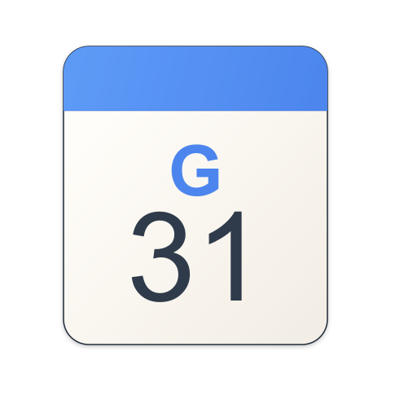                   | [Google Calendar](applications/google-calendar/README.md)                           | [run](https://integrations.paperlesspaper.de/google-calendar/run)             | [config](https://integrations.paperlesspaper.de/google-calendar/config.json)             | Displays upcoming Google Calendar events from host-provided calendar data.                                                                     |
| 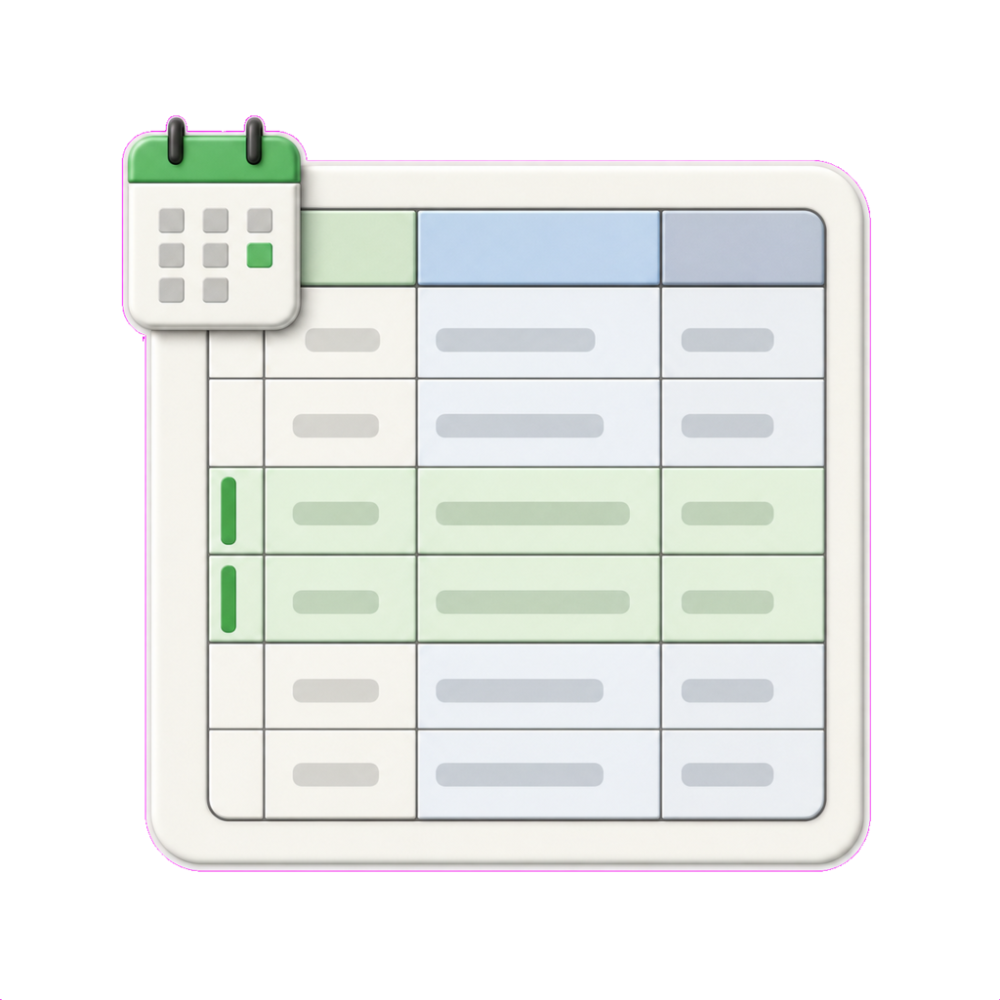                | [Google Sheet Table](applications/google-sheet-table/README.md)                     | [run](https://integrations.paperlesspaper.de/google-sheet-table/run)          | [config](https://integrations.paperlesspaper.de/google-sheet-table/config.json)          | Shows matching rows from a public Google Sheet as a compact Date, Name, and Group table.                                                       |
|                    | [Guest Mode Card](applications/guest-mode-card/README.md)                           | [run](https://integrations.paperlesspaper.de/guest-mode-card/run)             | [config](https://integrations.paperlesspaper.de/guest-mode-card/config.json)             | Shows a guest-ready welcome card with scannable Wi-Fi QR, checkout time, house rules, nearby picks, smart-home hints, and emergency contact.   |
|                      | [Immich Photos](applications/immich-photos/README.md)                               | [run](https://integrations.paperlesspaper.de/immich-photos/run)               | [config](https://integrations.paperlesspaper.de/immich-photos/config.json)               | Shows a random, newest, or oldest photo from an Immich server.                                                                                 |
| 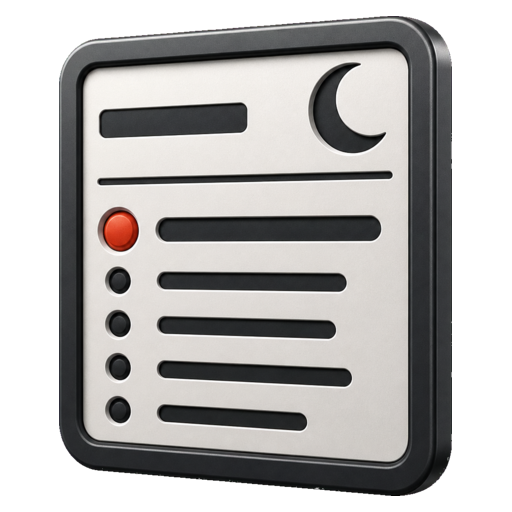              | [Islamic Prayer Times](applications/islamic-prayer-times/README.md)                 | [run](https://integrations.paperlesspaper.de/islamic-prayer-times/run)        | [config](https://integrations.paperlesspaper.de/islamic-prayer-times/config.json)        | Shows location-based Islamic prayer times with calculation methods, next-prayer countdown, optional iqamah timing, and Hijri date.             |
|             | [Jewish Date](applications/jewish-date/README.md)                                   | [run](https://integrations.paperlesspaper.de/jewish-date/run)                 | [config](https://integrations.paperlesspaper.de/jewish-date/config.json)                 | Shows the current Jewish/Hebrew calendar date with Hebrew typography, transliteration, and compact daily details.                              |
|                     | [Kids Fact Card](applications/kids-fact-card/README.md)                             | [run](https://integrations.paperlesspaper.de/kids-fact-card/run)              | [config](https://integrations.paperlesspaper.de/kids-fact-card/config.json)              | Displays a kid-friendly dinosaur, space, or animal fact with a deterministic daily thinking prompt.                                            |
| 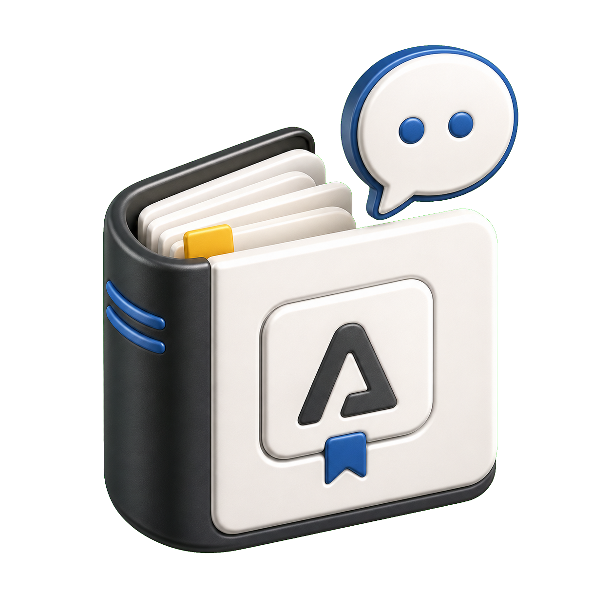                 | [Language Learning](applications/language-learning/README.md)                       | [run](https://integrations.paperlesspaper.de/language-learning/run)           | [config](https://integrations.paperlesspaper.de/language-learning/config.json)           | Shows a deterministic foreign-language word of the day with pronunciation, translation, example, and a small practice prompt.                  |
| 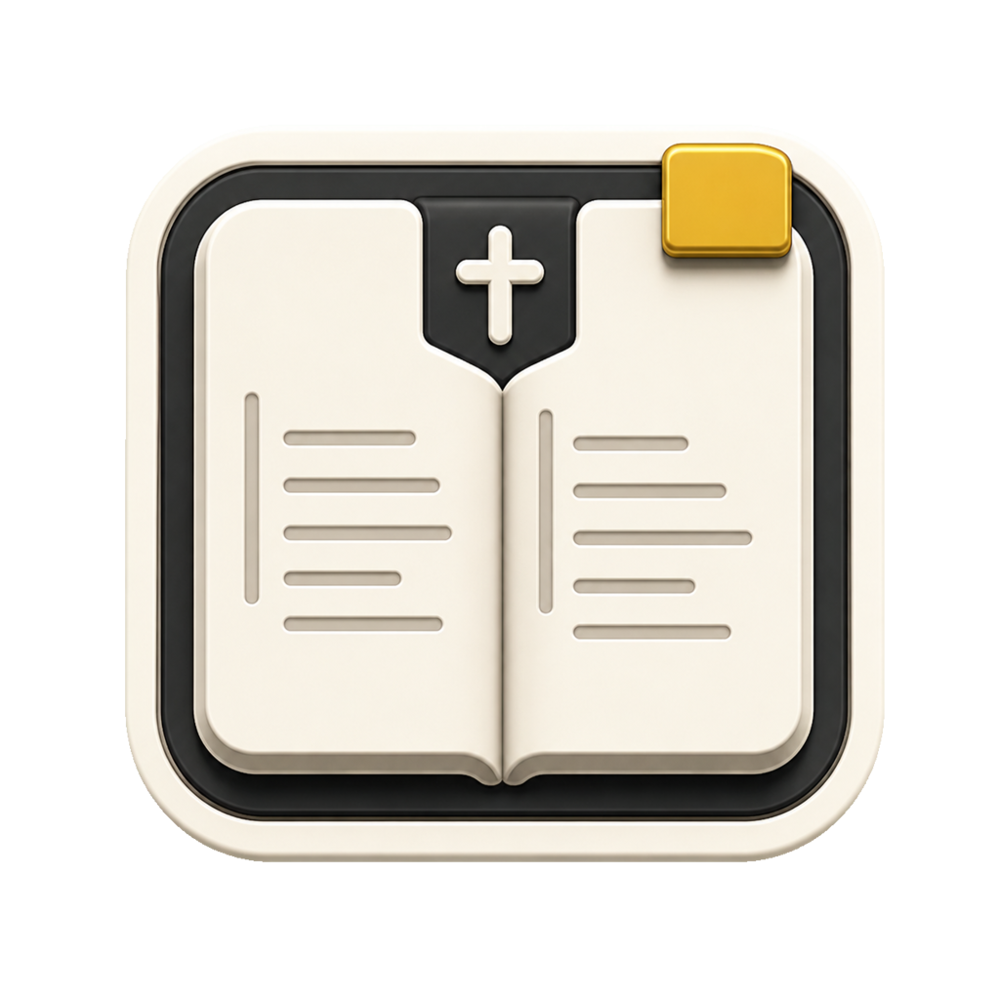                            | [Losung](applications/losung/README.md)                                             | [run](https://integrations.paperlesspaper.de/losung/run)                      | [config](https://integrations.paperlesspaper.de/losung/config.json)                      | Shows the daily Losung and Lehrtext Bible readings from losungen.de.                                                                           |
|                           | [Mastodon](applications/mastodon/README.md)                                         | [run](https://integrations.paperlesspaper.de/mastodon/run)                    | [config](https://integrations.paperlesspaper.de/mastodon/config.json)                    | Shows Mastodon timelines, hashtag streams, and profile feeds as compact eInk-friendly social cards.                                            |
|              | [Memo Medication Times](applications/memo-medication-times/README.md)               | [run](https://integrations.paperlesspaper.de/memo-medication-times/run)       | [config](https://integrations.paperlesspaper.de/memo-medication-times/config.json)       | Shows ANABOX smart medication intake times with medication colors, date header, last update, and a full-screen reminder during intake windows. |
| 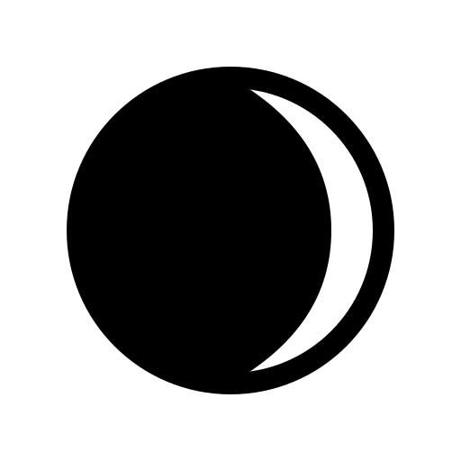                        | [Moon Phase](applications/moon-phase/README.md)                                     | [run](https://integrations.paperlesspaper.de/moon-phase/run)                  | [config](https://integrations.paperlesspaper.de/moon-phase/config.json)                  | Shows the moon phase for a chosen date, with illumination, moon age, hemisphere, and an optional next major phase estimate.                    |
|                          | [Newsstand](applications/newsstand/README.md)                                       | [run](https://integrations.paperlesspaper.de/newsstand/run)                   | [config](https://integrations.paperlesspaper.de/newsstand/config.json)                   | Shows a fresh newspaper front page from Riley Walz's Papers archive.                                                                           |
| 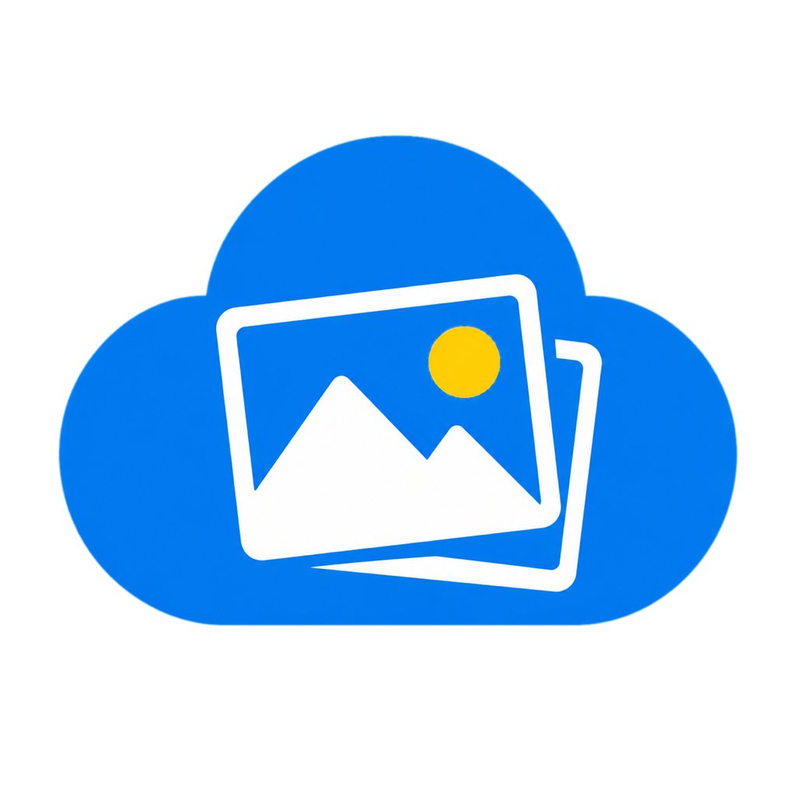                  | [Nextcloud Photos](applications/nextcloud-photos/README.md)                         | [run](https://integrations.paperlesspaper.de/nextcloud-photos/run)            | [config](https://integrations.paperlesspaper.de/nextcloud-photos/config.json)            | Shows a daily, random, dated, or numbered photo from a private Nextcloud Photos album.                                                         |
| 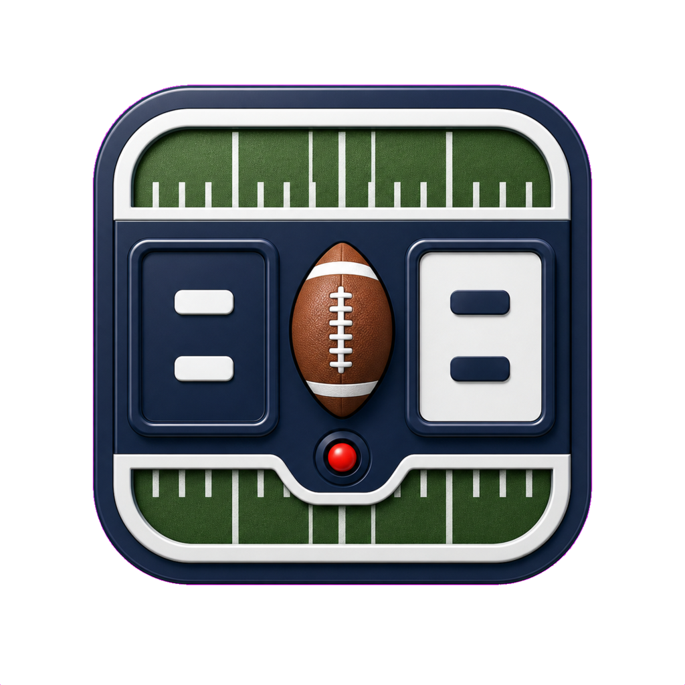 | [NFL Scoreboard](applications/nfl-scoreboard/README.md)                             | [run](https://integrations.paperlesspaper.de/nfl-scoreboard/run)              | [config](https://integrations.paperlesspaper.de/nfl-scoreboard/config.json)              | Shows NFL scores, fixtures, live status, favorite-team highlights, and league leaders from ESPN.                                               |
|                      | [Opening Hours](applications/opening-hours/README.md)                               | [run](https://integrations.paperlesspaper.de/opening-hours/run)               | [config](https://integrations.paperlesspaper.de/opening-hours/config.json)               | Shows current opening status, today's hours, and the weekly schedule for a place.                                                              |
|                              | [Quote](applications/quote/README.md)                                               | [run](https://integrations.paperlesspaper.de/quote/run)                       | [config](https://integrations.paperlesspaper.de/quote/config.json)                       | Shows a deterministic daily quote.                                                                                                             |
|                    | [Simple Calendar](applications/simple-calendar/README.md)                           | [run](https://integrations.paperlesspaper.de/simple-calendar/run)             | [config](https://integrations.paperlesspaper.de/simple-calendar/config.json)             | Shows a configurable monthly calendar inspired by the TRMNL Simple Calendar recipe.                                                            |
|                        | [Simple Text](applications/simple-text/README.md)                                   | [run](https://integrations.paperlesspaper.de/simple-text/run)                 | [config](https://integrations.paperlesspaper.de/simple-text/config.json)                 | Displays configurable plain text or markdown notes with typography, alignment, and framing controls.                                           |
| 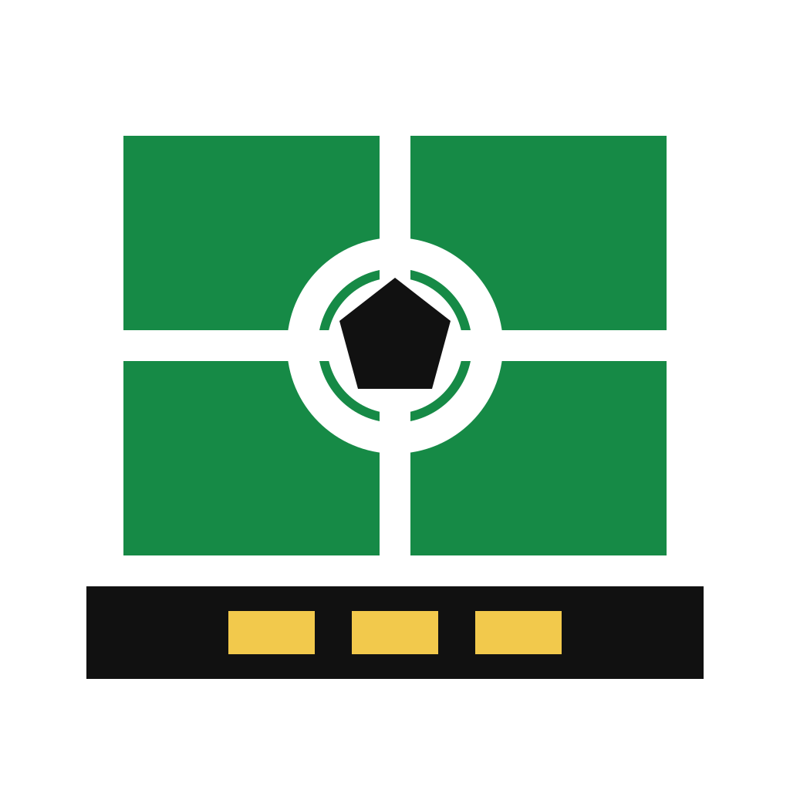                  | [Soccer Standings](applications/soccer-standings/README.md)                         | [run](https://integrations.paperlesspaper.de/soccer-standings/run)            | [config](https://integrations.paperlesspaper.de/soccer-standings/config.json)            | Shows European soccer league standings with favorite-team focus, crest-style markers, compact table rows, and an optional markdown note.       |
| 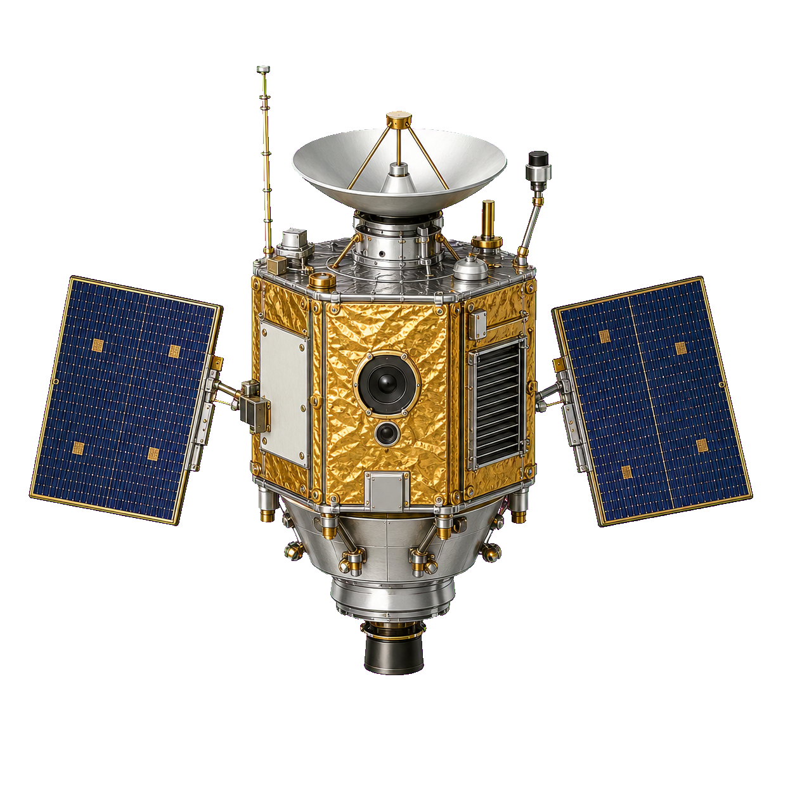             | [Spacecraft of the Day](applications/spacecraft-of-the-day/README.md)               | [run](https://integrations.paperlesspaper.de/spacecraft-of-the-day/run)       | [config](https://integrations.paperlesspaper.de/spacecraft-of-the-day/config.json)       | Shows one deterministic daily spacecraft with centered portrait artwork and compact mission facts.                                             |
|        | [The Onion - Editorial Cartoon](applications/the-onion-editorial-cartoon/README.md) | [run](https://integrations.paperlesspaper.de/the-onion-editorial-cartoon/run) | [config](https://integrations.paperlesspaper.de/the-onion-editorial-cartoon/config.json) | Shows a recent editorial cartoon from The Onion's Cartoons section.                                                                            |
|                           | [Todoist](applications/todoist/README.md)                                           | [run](https://integrations.paperlesspaper.de/todoist/run)                    | [config](https://integrations.paperlesspaper.de/todoist/config.json)                    | Shows Todoist tasks for today, the next seven days, a project, or a custom filter.                                                              |
| 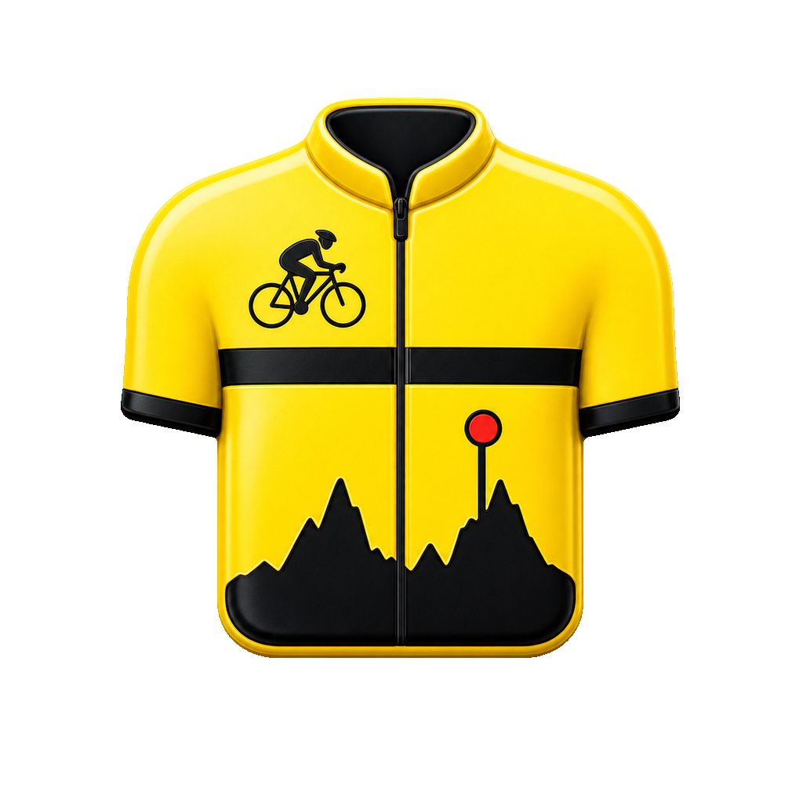                    | [Tour de France](applications/tour-de-france/README.md)                             | [run](https://integrations.paperlesspaper.de/tour-de-france/run)              | [config](https://integrations.paperlesspaper.de/tour-de-france/config.json)              | Shows the current, next, or selected Tour de France 2026 stage with route details, profile imagery, and best-effort official ranking data.     |
| 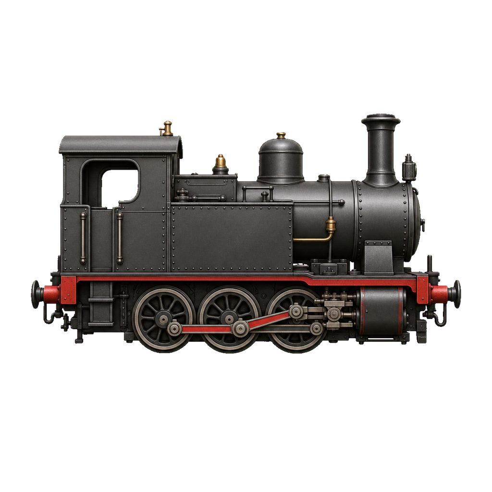                  | [Train of the Day](applications/train-of-the-day/README.md)                         | [run](https://integrations.paperlesspaper.de/train-of-the-day/run)            | [config](https://integrations.paperlesspaper.de/train-of-the-day/config.json)            | Shows one deterministic daily train with first-car artwork and compact facts, focused mostly on European trains.                               |
| 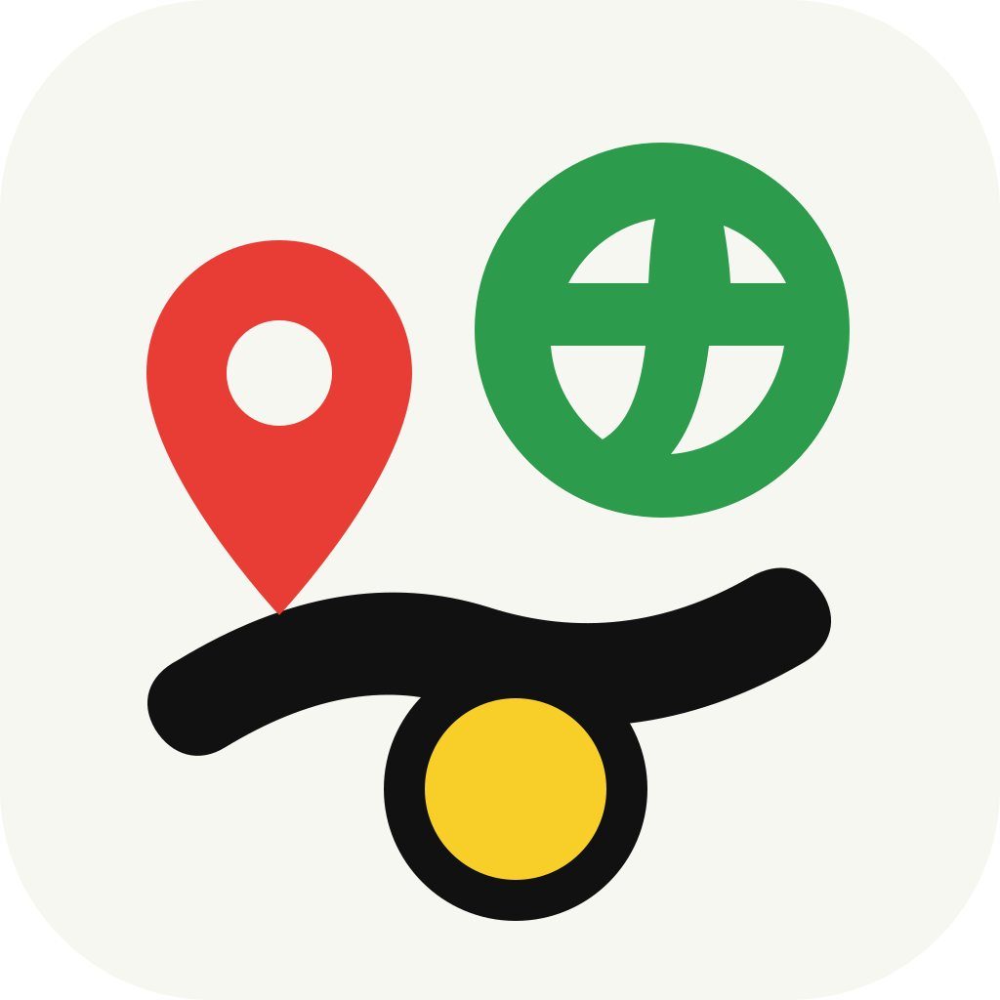                        | [Travel Map](applications/travel-map/README.md)                                     | [run](https://integrations.paperlesspaper.de/travel-map/run)                  | [config](https://integrations.paperlesspaper.de/travel-map/config.json)                  | Shows a personal visited map for countries, US states, or German Bundesländer with year-based coloring.                                        |
| 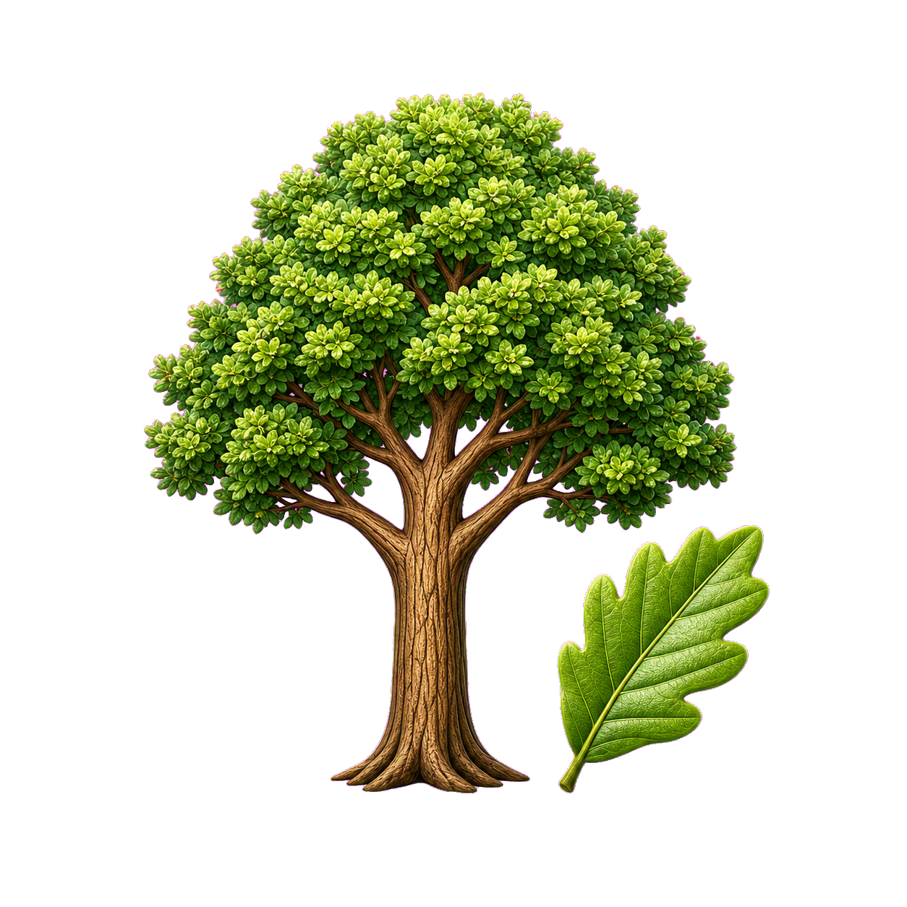                   | [Tree of the Day](applications/tree-of-the-day/README.md)                           | [run](https://integrations.paperlesspaper.de/tree-of-the-day/run)             | [config](https://integrations.paperlesspaper.de/tree-of-the-day/config.json)             | Shows one deterministic daily tree with generated botanical artwork and compact Wikipedia-sourced facts.                                       |
| 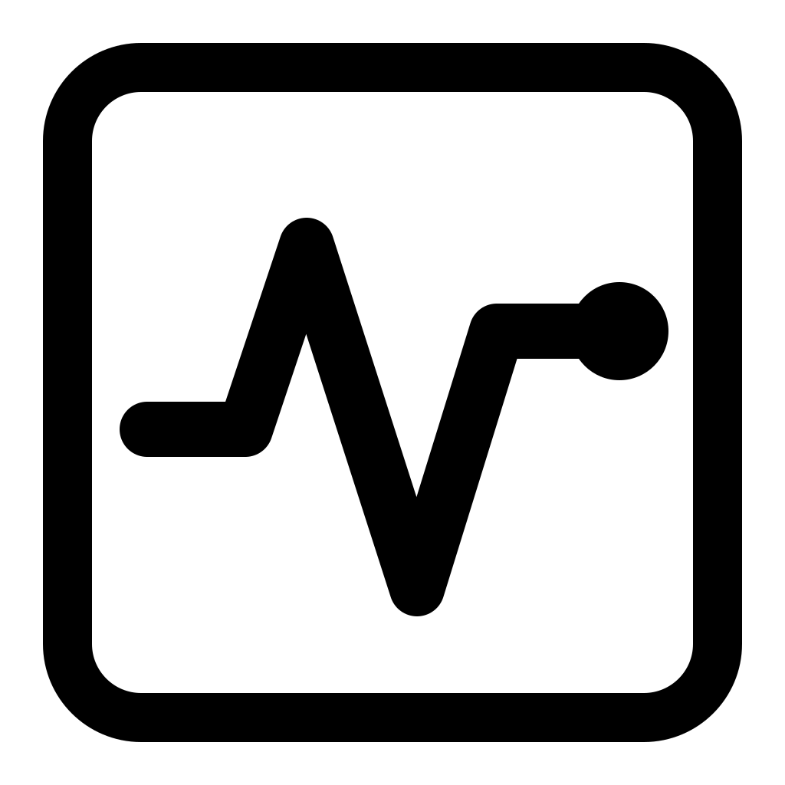               | [Uptime Kuma Monitor](applications/uptime-kuma-monitor/README.md)                   | [run](https://integrations.paperlesspaper.de/uptime-kuma-monitor/run)         | [config](https://integrations.paperlesspaper.de/uptime-kuma-monitor/config.json)         | Shows public Uptime Kuma status pages with monitor states, 24-hour uptime, heartbeat history, incidents, and maintenance windows.              |
|                        | [Vocabulary](applications/vocabulary/README.md)                                     | [run](https://integrations.paperlesspaper.de/vocabulary/run)                  | [config](https://integrations.paperlesspaper.de/vocabulary/config.json)                  | Shows a new word each day with pronunciation, meaning, example usage, related words, and a reflection prompt.                                  |
| 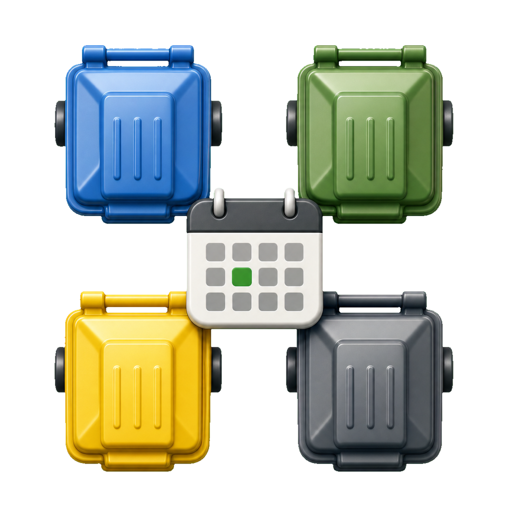         | [Waste Collection Schedule](applications/waste-collection-schedule/README.md)       | [run](https://integrations.paperlesspaper.de/waste-collection-schedule/run)   | [config](https://integrations.paperlesspaper.de/waste-collection-schedule/config.json)   | Shows upcoming waste collection dates from an ICS/iCal feed or manual recurring schedules.                                                     |
|                            | [Weather](applications/weather/README.md)                                           | [run](https://integrations.paperlesspaper.de/weather/run)                     | [config](https://integrations.paperlesspaper.de/weather/config.json)                     | Shows current weather and a three-day forecast from Open-Meteo.                                                                                |
|                     | [World Cup 2026](applications/world-cup-2026/README.md)                             | [run](https://integrations.paperlesspaper.de/world-cup-2026/run)              | [config](https://integrations.paperlesspaper.de/world-cup-2026/config.json)              | Shows World Cup 2026 fixtures, latest results, and the favorite-team group table in an eInk-friendly tournament dashboard.                     |
| 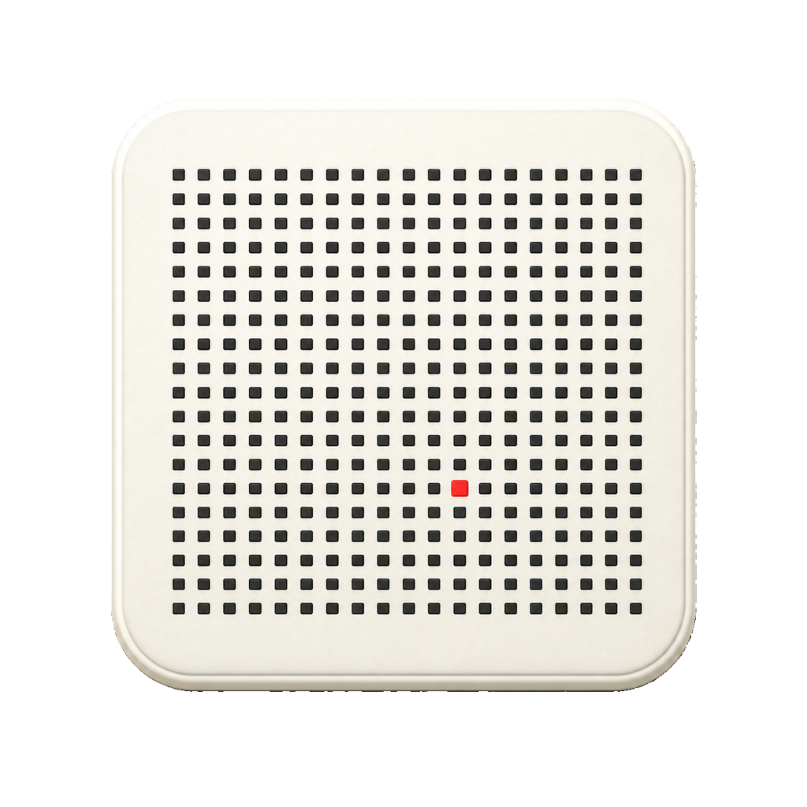                | [Your Life in Weeks](applications/your-life-in-weeks/README.md)                     | [run](https://integrations.paperlesspaper.de/your-life-in-weeks/run)          | [config](https://integrations.paperlesspaper.de/your-life-in-weeks/config.json)          | Shows a week-by-week lifetime grid from a configurable birth date, with age, progress, and current-week markers.                               |
|                               | [XKCD](applications/xkcd/README.md)                                                 | [run](https://integrations.paperlesspaper.de/xkcd/run)                        | [config](https://integrations.paperlesspaper.de/xkcd/config.json)                        | Shows the latest, random, or offset XKCD comic.                                                                                                |

## Development

Use the render URL while building an integration:

```txt
http://localhost:3000/<slug>/
```

Use the manifest URL when installing it in paperlesspaper:

```txt
http://localhost:3000/<slug>/config.json
```

Open Integrations should render within `100vw` by `100vh`, avoid browser-only chrome, and keep layout stable for predictable screenshots. If an integration fetches data, create the loading marker immediately and only mark the page loaded once content is ready:

```html
<div id="website-has-loading-element"></div>
<div id="website-has-loaded">ready</div>
```

## OpenIntegration CLI

This repo installs `@paperlesspaper/openintegration` from `vendor/openintegration`, so after `npm install` the CLI can be run with `npx paperlesspaper-openintegration`.

Create a starter integration:

```sh
npx paperlesspaper-openintegration scaffold ./applications/example --name "Example"
```

By default the scaffold includes `api/data.js`. Add `--no-api` for a static-only integration, or `--force` to overwrite existing scaffold files. The aliases `init` and `create` behave the same as `scaffold`.

Validate an integration:

```sh
npx paperlesspaper-openintegration check ./applications/example/config.json
```

Use `--json` when another script needs machine-readable validation output.

Run the local paperlesspaper host simulator:

```sh
npx paperlesspaper-openintegration dev ./applications/example/config.json
```

The preview opens at `http://127.0.0.1:4300/__paperless/preview` by default. It serves the integration folder, sends the `INIT` payload, renders manifest settings, supports live reload, and includes local render buttons. Useful options are `--host`, `--port`, `--settings '{"title":"Demo"}'`, `--language`, `--orientation`, `--frame-kind`, `--color`, and `--no-watch`.

Render a PNG through local Chrome/Puppeteer and the production-like `epdoptimize` path:

```sh
npx paperlesspaper-openintegration render ./applications/example/config.json --viewport 800x480 --output /tmp/example-landscape.png
npx paperlesspaper-openintegration render ./applications/example/config.json --viewport 480x800 --output /tmp/example-portrait.png
```

`render` defaults to an `800x480` viewport and writes to `render-output/<integration-name>-<viewport>.png` when `--output` is omitted. Add `--raw` to write the unoptimized Puppeteer screenshot, or `--epd-output device` / `--epd-output both` to write device-palette output instead of, or alongside, the default dithered PNG. If Chrome is not in the default location, pass `--chrome-bin <path>` or set `CHROME_BIN` / `PUPPETEER_EXECUTABLE_PATH`.

Recommended loop for a new or changed integration:

```sh
npx paperlesspaper-openintegration check ./applications/example/config.json
npx paperlesspaper-openintegration render ./applications/example/config.json --viewport 800x480 --output /tmp/example-landscape.png
npx paperlesspaper-openintegration render ./applications/example/config.json --viewport 480x800 --output /tmp/example-portrait.png
npx paperlesspaper-openintegration dev ./applications/example/config.json
```

## Screenshots

Regenerate local variant screenshots and update `configVariants` in application manifests:

```sh
npm run screenshots
```

Useful filters while iterating:

```sh
npm run screenshots -- --config-only
npm run screenshots -- --app weather --resolution 800x480
```

Generated screenshots are ignored by git under `output/` and `applications/*/screenshots/`.

## Docker

Build and run the container directly:

```sh
npm run docker:build
npm run docker:run
```

Or use Docker Compose:

```sh
docker compose up --build
```

## Hosting

When hosting this provider for real devices, expose it over HTTPS and make sure paperlesspaper can fetch each integration manifest from the browser. The public install URL on the production deployment looks like:

```txt
https://integrations.paperlesspaper.de/<slug>/config.json
```

Some integrations call upstream APIs from `api/data.js`. Keep credentials in environment variables or user-provided settings, not in committed files. `.env`, `node_modules`, generated output, and local workspace files are intentionally ignored.

## Adding An Integration

1. Create `applications/<slug>/`.
2. Add a `config.json` manifest with `name`, `version`, `description`, `renderPage`, `icon`, and any settings schema.
3. Add a square transparent PNG icon at `assets/icon.png` and reference it as `"./assets/icon.png"`.
4. Add `render.html` and make it deterministic at the target viewport size.
5. Add `settings.html` only when the built-in schema fields are not enough.
6. Add `api/data.js` only when data should be fetched server-side.
7. Run `npm run screenshots -- --app <slug>` to refresh variants.

Use the smallest provider that works: plain manifest settings first, a custom settings page when the user experience needs it, and server routes only when browser-side rendering cannot call the upstream service directly.
