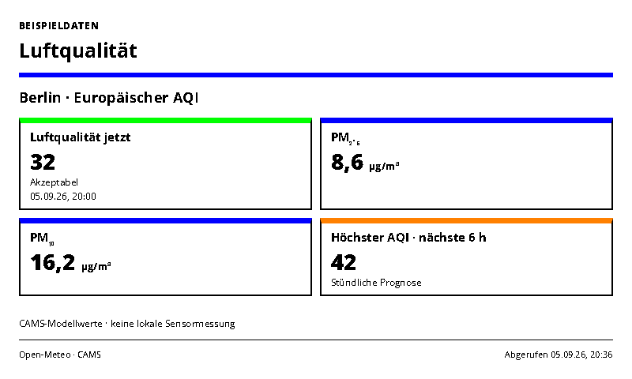
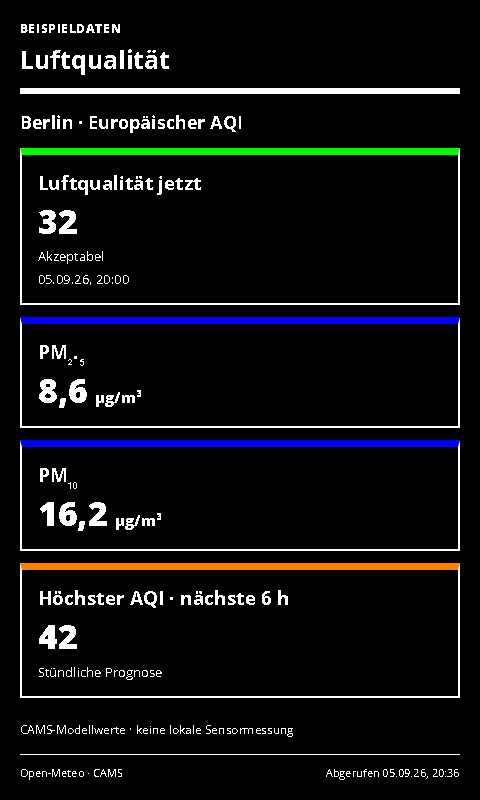

# Air Quality

European air quality, particulate matter and six-hour outlook from Open-Meteo/CAMS.

- [Manifest](./config.json)
- Local preview: `http://localhost:3000/air-quality/run`
- UI languages: German and English; host-selected.
- Theme: `blue-light` with blue/green accents and orange where useful. Yellow is not a default accent.

## Setup and scope

Set latitude, longitude and a matching location label. The default is live Berlin data. No sensor hardware is needed. The optional `apiKey` selects Open-Meteo's dedicated customer endpoint for commercial use. The free endpoint is for non-commercial use; see the [provider terms](https://open-meteo.com/en/terms) and [pricing](https://open-meteo.com/en/pricing).

Shows the current European AQI, its named band, PM₂.₅, PM₁₀ and the highest available hourly AQI during the next six hours. Missing readings stay unavailable. These are CAMS model estimates rather than measurements at your home. The forecast card summarizes available hourly points; it is unavailable if none exist. Suggested refresh: 30–60 minutes. Server cache: 30 minutes.

Attribution: [Open-Meteo Air Quality API](https://open-meteo.com/en/docs/air-quality-api) and the Copernicus Atmosphere Monitoring Service (CAMS); data attribution and licence details are on the provider page. UI colors simplify the six named AQI bands; the written band is always shown.

## Rendering and demo mode

`sampleData: true` uses unmistakably labelled local examples. API failures never silently switch to demo values. The screenshot variants use sample data for reproducible validation; normal defaults are declared in the manifest.

Supports host INIT updates, shared themes, ready/error markers and all four frame sizes. Complete cards are removed when necessary to fit; the footer shows the visible/total count. All displayed timestamps use Europe/Berlin. The source retrieval timestamp remains unchanged while serving a cached response.

Icons are transparent 1024×1024 PNGs; [generation provenance](../../docs/integration-icon-prompts.md). UI graphics use Spectra 6 processing with error diffusion to approximate orange.

## Screenshots

| Light landscape | Dark portrait |
| --- | --- |
|  |  |

Both themes at 800×480, 480×800, 1600×1200 and 1200×1600 are declared in `configVariants`.

## Validation

```sh
npx paperless check applications/air-quality/config.json
npx paperless render applications/air-quality/config.json --viewport 800x480 --settings '{"sampleData":true}' --output /tmp/air-quality.png
npm run check:dashboards
```

Use `PAPERLESSPAPER_TEST_SLUGS=air-quality,river-levels,github-releases,paperless-ngx-inbox npm run check:dashboards -- --render` for the 32 new layout cases and four host-update checks.
