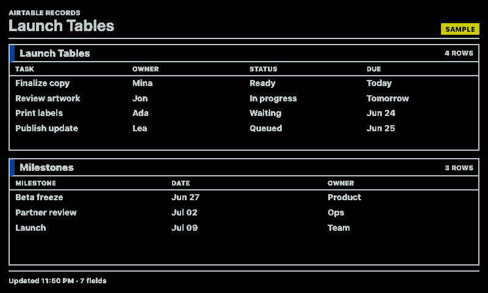
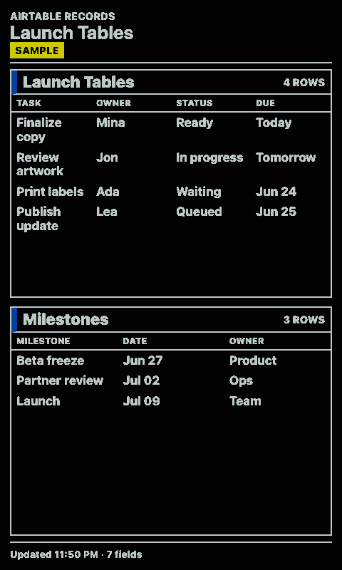
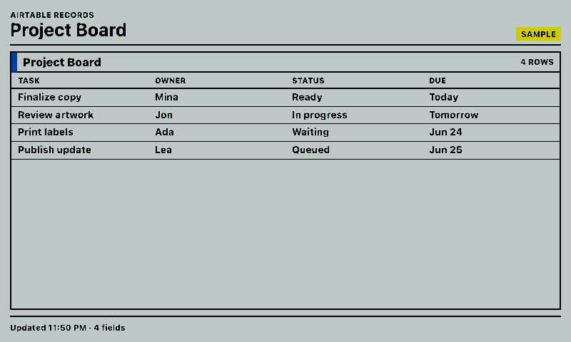
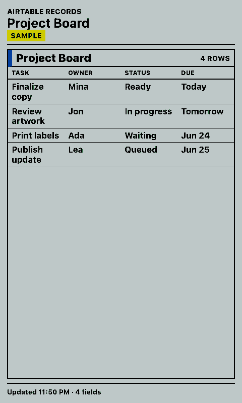

# Airtable

Shows Airtable records as compact, high-contrast tables for paperlesspaper displays.

The integration is inspired by `yashatgit/MMM-Airtable`: it reads records from Airtable, limits the number of rows, supports optional row borders, and can render more than one table. It uses Airtable's REST API directly instead of the MagicMirror node helper.

## Links

- [Demo](https://integrations.paperlesspaper.de/airtable/run)
- [config.json](./config.json)

## Screenshots

| Landscape | Portrait |
| --- | --- |
|  |  |
|  |  |

## Settings

- `token`: Airtable personal access token. Leave blank to use `AIRTABLE_TOKEN` or `AIRTABLE_API_KEY` on the server.
- `baseId`: Airtable base ID, for example `appXXXXXXXXXXXXXX`.
- `tableName`: Table name or table ID.
- `view`: Airtable view name. Defaults to `Grid view`.
- `fields`: Comma- or line-separated field names. Leave blank to infer fields from returned records.
- `filterByFormula`: Optional Airtable formula.
- `sortField` and `sortDirection`: Optional first sort.
- `maxRows`: Number of rows to show, capped at 50.
- `rowBorder`: Toggle table row dividers.
- `tablesJson`: Optional JSON array for multiple tables.

Example `tablesJson`:

```json
[
  {
    "title": "Launch Tasks",
    "tableName": "Tasks",
    "fields": "Task,Owner,Status",
    "maxRows": 4
  },
  {
    "title": "Milestones",
    "tableName": "Milestones",
    "fields": "Milestone,Date,Owner",
    "maxRows": 3,
    "rowBorder": false
  }
]
```

When credentials or table settings are missing, the API returns sample data so previews and screenshots still render.
