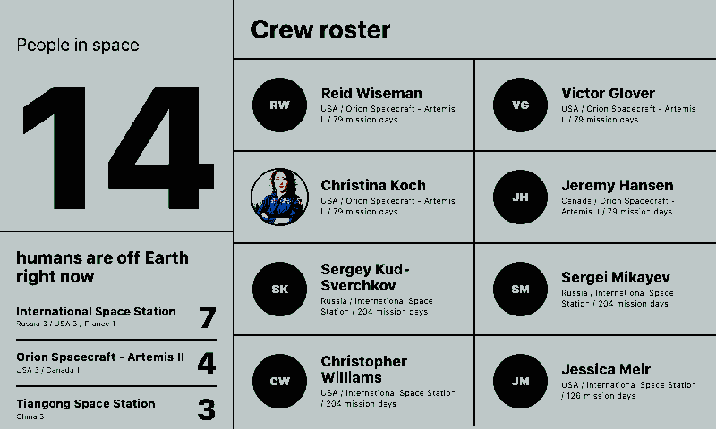
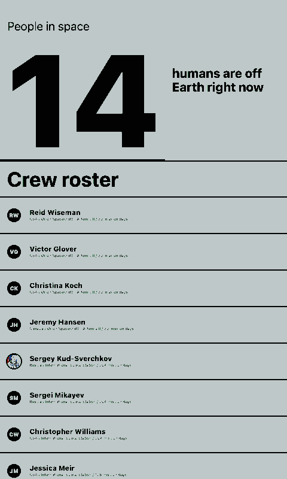
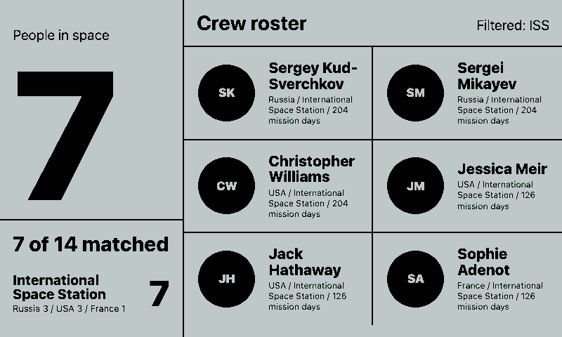
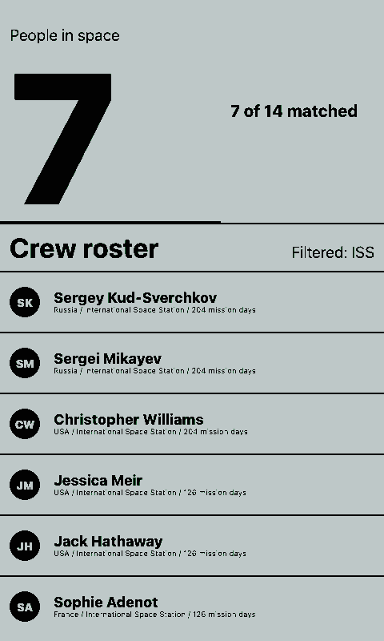

# Astronauts

Plain OpenIntegration dashboard for the live people-in-space roster. It uses the public "How Many People Are In Space Right Now?" JSON feed, requires no API key, and groups the current crew by spacecraft or station.

## Links

- [Demo](https://integrations.paperlesspaper.de/astronauts/run)
- [config.json](./config.json)

## Screenshots

| Landscape | Portrait |
| --- | --- |
|  |  |
|  |  |

## Common URLs

- `/astronauts/`
- `/astronauts/?rosterLimit=12`
- `/astronauts/?locationFilter=ISS`
- `/astronauts/?showPortraits=false`
- `/astronauts/config.json`
- `/astronauts/api/data`

## Settings

- `locationFilter`: optional station or spacecraft text filter
- `rosterLimit`: number of crew entries to show
- `showPortraits`: whether to render grayscale crew portraits

## Language Support

This integration declares `language: ["en", "de", "fr", "es", "it"]` in `config.json` and loads localized UI copy from `languages/<code>.json` using the host-selected `payload.meta.language`.

The language JSON files localize the fixed dashboard labels only; live astronaut names, spacecraft names, countries, and source data remain unchanged from the upstream feed.
