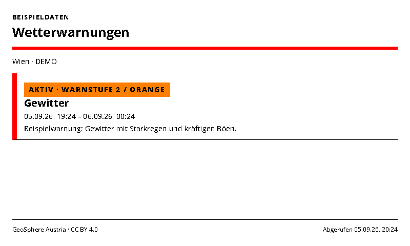
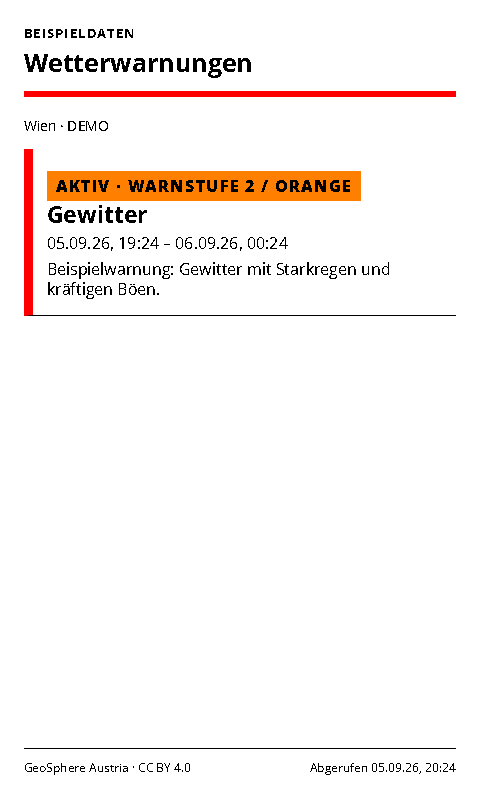
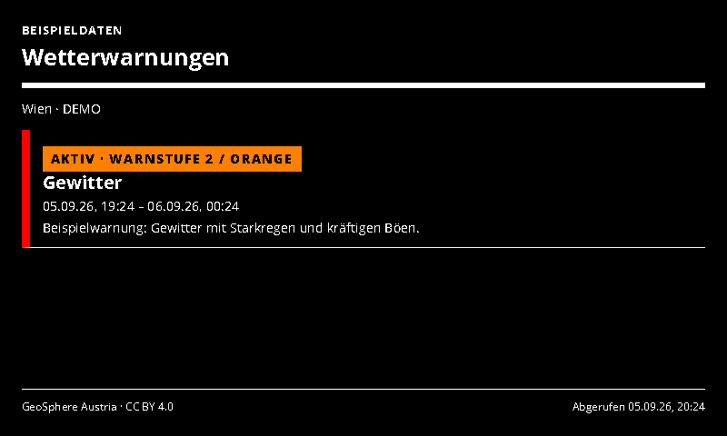
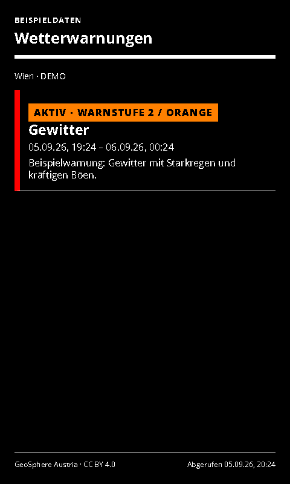

# Austria Weather Warnings

Current and upcoming official GeoSphere warnings for one Austrian municipality.

- [Manifest](./config.json)
- Local preview: `http://localhost:3000/austria-weather-warnings/run`
- Supported UI languages: German and English, selected by the host.
- Default theme: `red-light`, with deliberate Spectra 6 color accents.

## Setup and behavior

Select coordinates within Austria. The GeoSphere API resolves the municipality and returns its warnings. Current warnings are always eligible; future warnings are optional. Expired warnings are removed. Entries sort by severity, then start time. The empty state is only shown after a successful valid response.

Warning levels retain their original labels: yellow, orange and red. Since orange is outside the Spectra 6 palette, level 2 uses a red border and a yellow label with black text; the text explicitly says “Orange” / “level 2”. Level 3 uses a red label with white text. All status meaning remains readable without color. Data is cached for five minutes, with the source retrieval time shown. Display refresh should be chosen accordingly; eInk refresh intervals mean this is not a real-time alarm channel.

Data: [GeoSphere Austria / Home Assistant documentation](https://www.home-assistant.io/integrations/geosphere_austria_warnings), CC BY 4.0. The adapter uses the documented-by-client `getWarningsForCoords` feed and supports epoch and Europe/Vienna local warning timestamps.

## Preview and data handling

`sampleData: true` explicitly enables labelled demonstration data. Demo data is never used as a fallback for a failed live connection. Disable demo mode after entering connection settings. All configured screenshot variants use demo data.

The page uses the INIT/update lifecycle, shared theme and ready/error markers. Entry limits and responsive layouts target 800×480, 480×800, 1600×1200 and 1200×1600.

## Screenshots

| Landscape | Portrait |
| --- | --- |
|  |  |
|  |  |

Additional large-format screenshots are declared in `configVariants`.

## Validation

```sh
npx paperless check applications/austria-weather-warnings/config.json
npx paperless render applications/austria-weather-warnings/config.json --viewport 800x480 --settings '{"sampleData":true}' --output /tmp/austria-weather-warnings.png
npm run check:dashboards
npm run check:dashboards -- --render
```

The collection check includes adapter tests; `--render` also generates the two configured variants at four sizes and checks for overflow. Icons and generation prompts: [icon provenance](../../docs/integration-icon-prompts.md).
