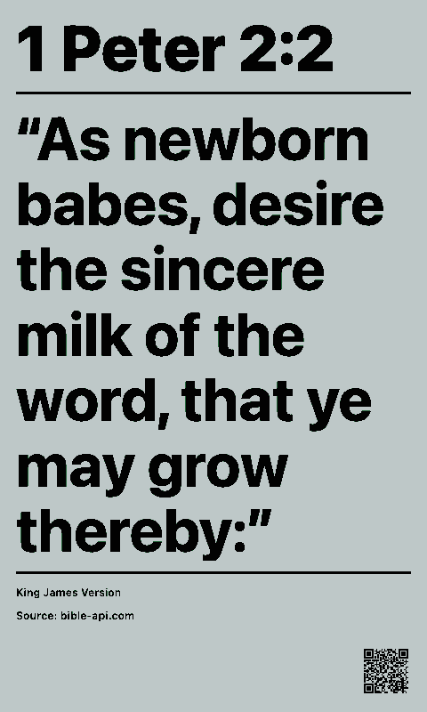

# Bible Verses

Shows a random Bible verse or curated verse of the day on a paperlesspaper display.

## Links

- [Demo](https://integrations.paperlesspaper.de/bible-verses/run)
- [config.json](./config.json)

## Screenshots

| Landscape                                                                                                                             | Portrait                                                                                                                            |
| ------------------------------------------------------------------------------------------------------------------------------------- | ----------------------------------------------------------------------------------------------------------------------------------- |
|  |  |
|        |        |

## Settings

- `mode`: choose `random` or `daily`. Daily mode uses the curated DailyVerses.net verse of the day and follows the selected display language.
- `source`: random verse API source, either `bible-api` or `bolls`. Daily mode ignores this and uses DailyVerses.net.
- `version`: Bible translation. `bible-api` supports `asv`, `kjv`, and `web`; `bolls` supports `asv`, `kjv`, `web`, `lut`, `elb`, `sch`, and `mb`. Daily mode uses DailyVerses.net translations where available (`kjv`, `web`, `lut`/`lu12`, `elb`) and otherwise uses the default translation for the selected DailyVerses language.
- `scope`: choose from the whole Bible, Old Testament, or New Testament. This only applies to random mode. For Bolls, OT/NT filtering is best-effort because its random endpoint does not accept a testament filter.
- `showHeader`: show or hide the top reference title.
- `showFooter`: show or hide the translation/source footer.
- `showQrCode`: show or hide a bottom-right QR code that opens a readable passage page for the exact verse.
