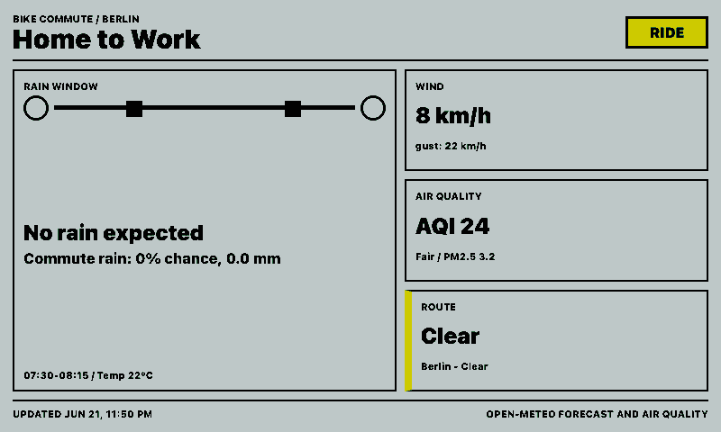
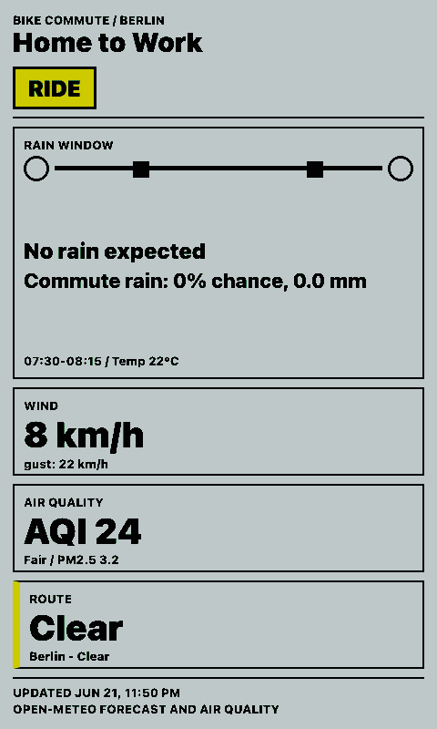
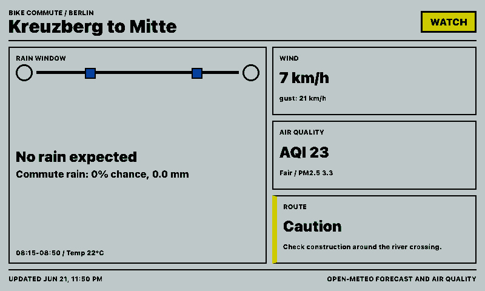
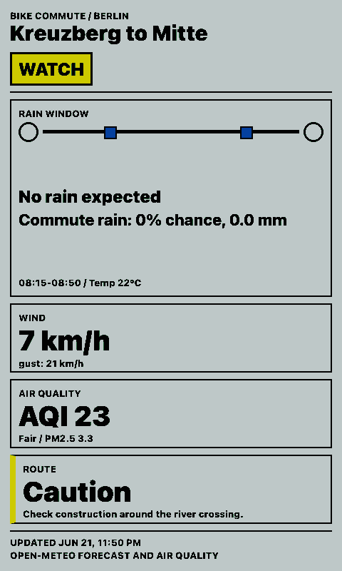

# Bike Commute Card

Bike Commute Card shows a compact ride decision for a regular commute:

- rain window and rain chance during the commute
- wind speed and gusts
- route disruption status and note
- European AQI plus PM2.5 / PM10

## Links

- [Demo](https://integrations.paperlesspaper.de/bike-commute-card/run)
- [config.json](./config.json)

## Screenshots

| Landscape | Portrait |
| --- | --- |
|  |  |
|  |  |

## APIs

Yes, for most of the card:

- Rain and wind use the public Open-Meteo Forecast API.
- Air quality uses the public Open-Meteo Air Quality API.
- Bike-route disruption has no universal public API. Cities and providers expose this differently, for example local roadworks/open-data portals, GTFS-RT alerts, Open511 feeds, TomTom/HERE traffic APIs, or a custom office/facility feed. This integration keeps route status as an editable setting so it works everywhere; a city-specific `api/data.js` adapter can replace that part later.

Both Open-Meteo endpoints are used without API keys.

## Settings

Set `latitude` and `longitude` to the midpoint or most weather-sensitive part of the commute. `commuteStart` is local time in `HH:MM` format, and `commuteDurationMinutes` defines the window used for the commute rain/wind summary.
