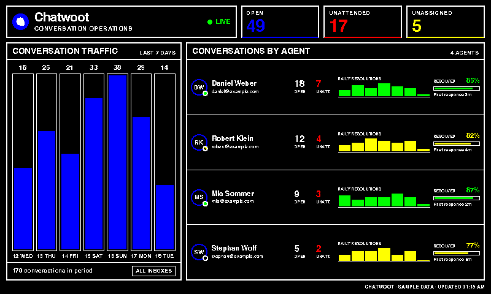
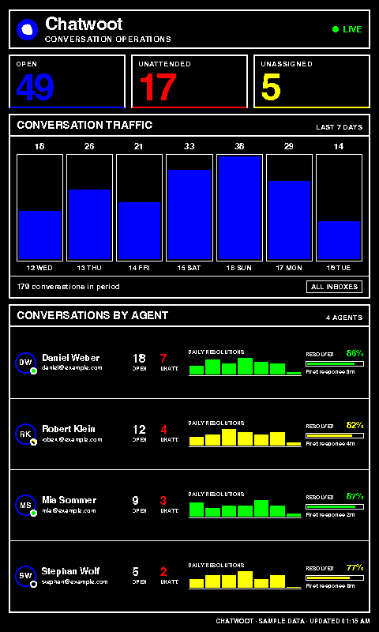

# Chatwoot

Shows live Chatwoot workload and recent team performance on a paperlesspaper display. The dashboard combines current open, unattended, and unassigned counts with recent conversation traffic, per-agent workload, resolution rates, response times, and one daily resolution chart per displayed agent.

Signal colors are semantic: blue marks conversation traffic and open load, red highlights unattended work, amber-orange marks unassigned work and medium performance, and green marks live, available, or high-performing states. On six-color Spectra displays, amber-orange resolves through the yellow device channel so it remains distinct from red.

## Links

- [Demo](https://integrations.paperlesspaper.de/chatwoot/run)
- [config.json](./config.json)
- [Chatwoot API documentation](https://developers.chatwoot.com/api-reference/introduction)

## Screenshots

| Landscape | Portrait |
| --- | --- |
|  |  |

## Settings

- `baseUrl`: Chatwoot base URL. The default is Chatwoot Cloud; self-hosted instances can use their own origin.
- `accountId`: numeric account ID from a Chatwoot URL such as `/app/accounts/1/`.
- `apiAccessToken`: user access token from Chatwoot Profile settings. Use a token with access to account reports.
- `rangeDays`: reporting range used for traffic and per-agent performance charts, from 3 to 7 days so labels stay legible on fixed-size displays.
- `agentLimit`: maximum number of agents on the fixed-size display, from 1 to 6.
- `timezone`: IANA timezone used to group report data into display days.
- `showSource`: shows the Chatwoot source and last update time.
- `timeoutMs`: timeout for each Chatwoot API request.

Credentials can also be supplied through `CHATWOOT_BASE_URL`, `CHATWOOT_ACCOUNT_ID`, and `CHATWOOT_API_ACCESS_TOKEN` in the server environment. Secrets are sent from the render page to the same-origin integration API in a JSON POST body; they are not added to the render URL.

When the account ID or token is blank, the adapter returns deterministic sample data for local previews and screenshots.

## API usage

The adapter uses Chatwoot's documented account and agent report endpoints:

- `/api/v2/accounts/{account_id}/reports/conversations?type=account` for current account metrics.
- `/api/v2/accounts/{account_id}/reports/conversations?type=agent` for current open and unattended counts per agent.
- `/api/v2/accounts/{account_id}/reports` for account traffic and each displayed agent's daily resolutions.
- `/api/v2/accounts/{account_id}/summary_reports/agent` for agent conversation, resolution, and response-time summaries.
- `/api/v1/accounts/{account_id}/agents` for agent names and availability.

The integration performs five account-level requests plus one small trend request for each displayed agent. Individual trend failures leave that chart empty without hiding the live workload data.

The icon is the official standalone Chatwoot mark from the [Chatwoot brand assets](https://www.chatwoot.com/brand).

## Local preview

```sh
npx paperless dev applications/chatwoot/config.json
```

With credentials:

```sh
npx paperless dev applications/chatwoot/config.json --settings '{"accountId":1,"apiAccessToken":"YOUR_TOKEN"}'
```

## Language support

The dashboard includes English and German fixed UI copy. The host-selected `payload.meta.language` controls labels and date/number formatting.
