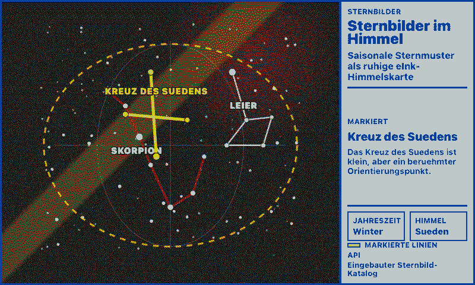
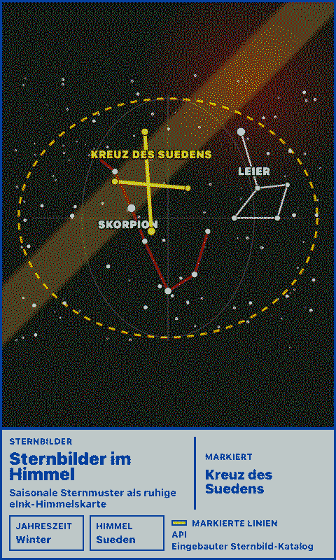
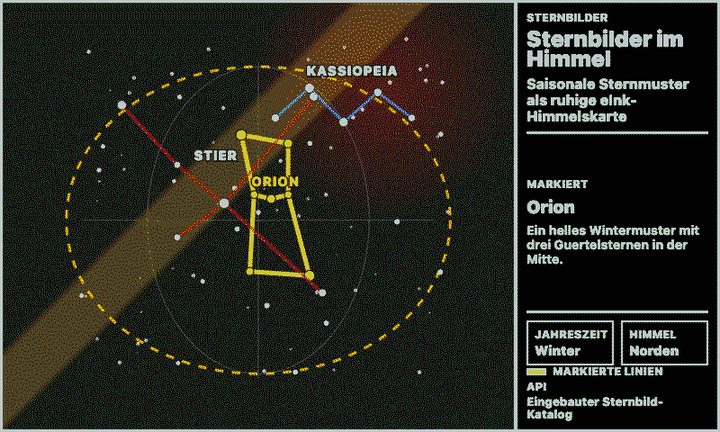
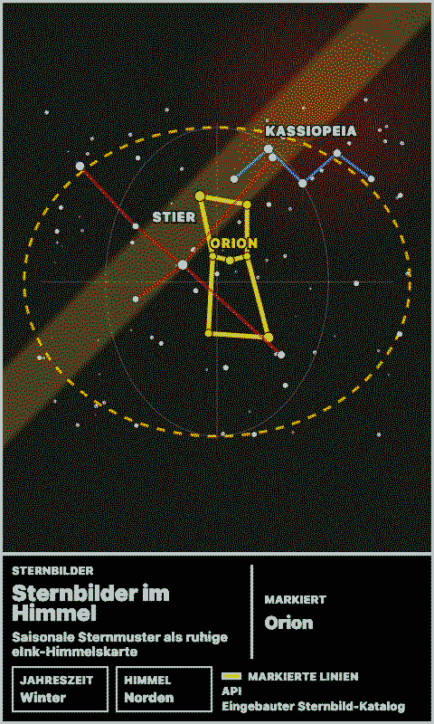

# Constellations in the Sky

Displays a location-aware constellation sky map for paperlesspaper. The app renders a VirtualSky canvas with real star positions, constellation line art, localized labels, optional IAU boundaries, and an optional Milky Way outline.

## Links

- [Demo](https://integrations.paperlesspaper.de/constellations-in-the-sky/run)
- [config.json](./config.json)

## Screenshots

| Landscape | Portrait |
| --- | --- |
|  |  |
|  |  |

## Astronomy Engine

This integration has its own `package.json`. It depends on a local npm package wrapper at `vendor/virtualsky`, then `npm install` copies the browser-ready files into the generated `assets/virtualsky/` folder.

The render page loads those generated assets and preloads the local JSON catalogues before marking the page ready:

- `assets/virtualsky/virtualsky.min.js`
- `assets/virtualsky/virtualsky-planets.js`
- `assets/virtualsky/stuquery.min.js`
- `assets/virtualsky/stars.json`
- `assets/virtualsky/lines_latin.json`
- `assets/virtualsky/boundaries.json`
- `assets/virtualsky/galaxy.json`
- `assets/virtualsky/lang/de.json`
- `assets/virtualsky/lang/en.json`

VirtualSky gives the integration a real observer-based sky projection without API keys or runtime network calls. It is more accurate than the previous hand-placed seasonal catalogue, but it remains a lightweight browser planetarium rather than a professional ephemeris tool.

## Settings

- `latitude`: observer latitude in decimal degrees.
- `longitude`: observer longitude in decimal degrees.
- `timeMode`: current time, tonight, or custom date.
- `customDate`: optional `YYYY-MM-DD` date for custom mode.
- `customTime`: local `HH:MM` time for tonight/custom mode.
- `projection`: stereo, polar, lambert, ortho, mollweide, or planechart.
- `direction`: facing azimuth in degrees.
- `magnitude`: faintest star magnitude to display.
- `showLabels`: show or hide constellation labels.
- `showMilkyWay`: draw the Milky Way outline.
- `showBoundaries`: draw IAU constellation boundaries.
- `showGrid`: draw an azimuth/elevation grid.
- `showPlanets`: draw planets, Sun, and Moon using VirtualSky's built-in ephemeris plugin.

## Local URLs

```txt
http://localhost:3000/constellations-in-the-sky/
http://localhost:3000/constellations-in-the-sky/config.json
http://localhost:3000/constellations-in-the-sky/api/data
```
