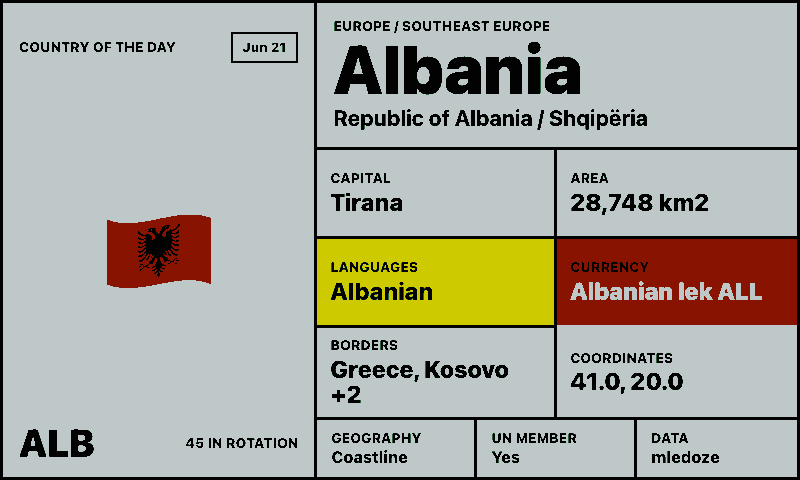
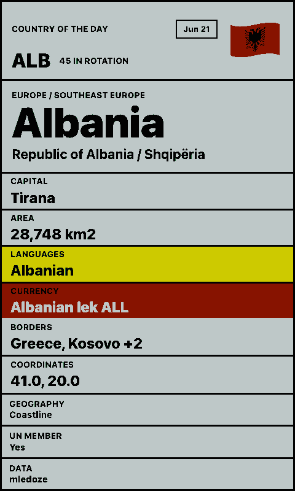
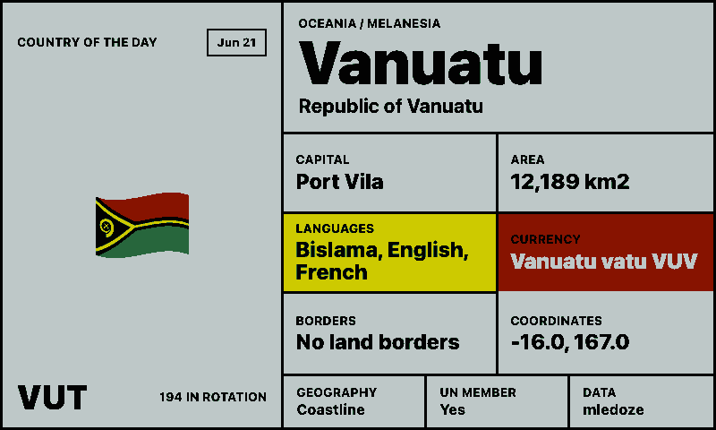
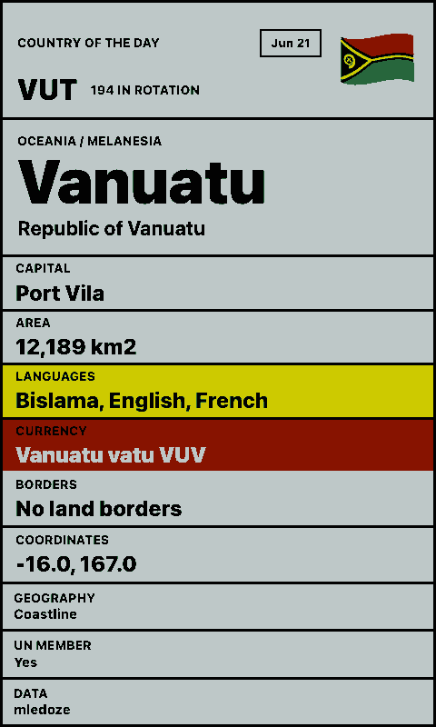

# Country of the Day

Shows a deterministic daily country on a paperlesspaper display. The app chooses one country per date from the selected region, then shows a large flag, localized country name, capital, area, languages, currency, borders, coordinates, UN membership, and data source.

## Links

- [Demo](https://integrations.paperlesspaper.de/country-of-the-day/run)
- [config.json](./config.json)

## Screenshots

| Landscape | Portrait |
| --- | --- |
|  |  |
|  |  |

## API

There is not a widely used public "country of the day" API. This integration creates the "of the day" behavior itself by hashing the date plus an optional rotation seed, then enriches the selected country from the public `mledoze/countries` JSON dataset:

```txt
https://raw.githubusercontent.com/mledoze/countries/master/countries.json
```

REST Countries is another country data API, but its current v5 API requires an API key. The older keyless v3.1 endpoint now returns a deprecation response, so this integration avoids depending on it.

## Settings

- `region`: limit the daily rotation to one world region, or use `any`.
- `independentOnly`: exclude dependent territories when enabled.
- `countryCode`: pin a specific country by ISO alpha-2, ISO alpha-3, or exact country name.
- `seed`: optional text that creates a different daily rotation.
