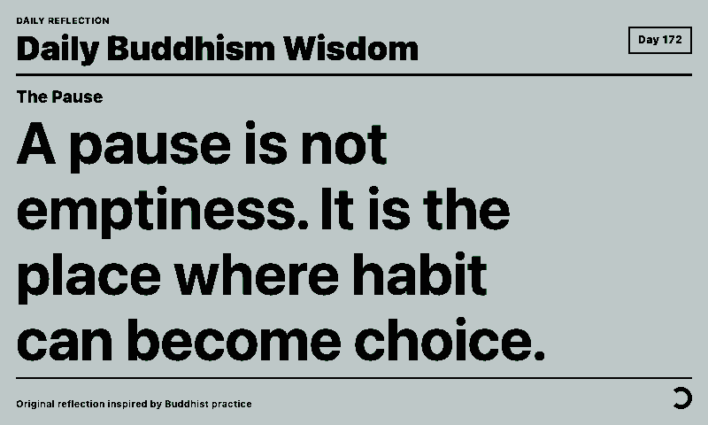
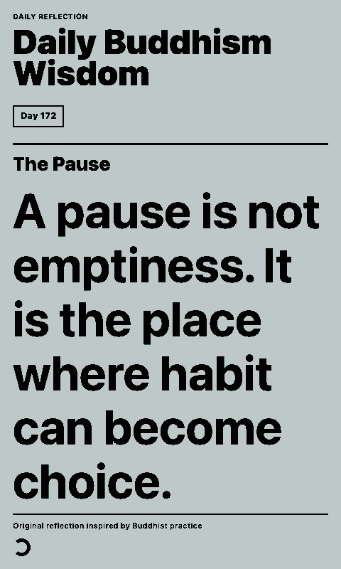

# Daily Buddhism Wisdom

Shows the daily quote from [Buddha API](https://buddha-api.com/) on a paperlesspaper display. A small local fallback is used if the remote quote cannot be loaded.

## Links

- [Demo](https://integrations.paperlesspaper.de/daily-buddhism-wisdom/run)
- [config.json](./config.json)

## Screenshots

| Landscape | Portrait |
| --- | --- |
|  |  |

## Settings

- `showPage`: show or hide the daily wisdom text.
- `fontSize`: choose the text size from `xx-small` through `xx-large`.
- `fontWeight`: choose a CSS font weight.
- `textAlign`: align the reflection text.
- `lineHeight`: adjust line spacing.
- `showAttribution`: show or hide the author and source line.
- `showDay`: show or hide the current day-of-year number.
- `author`: optionally restrict the daily quote to Buddha, Dalai Lama, Dogen, or Thich Nhat Hanh.

## Local URLs

```txt
http://localhost:3000/daily-buddhism-wisdom/
http://localhost:3000/daily-buddhism-wisdom/config.json
```
