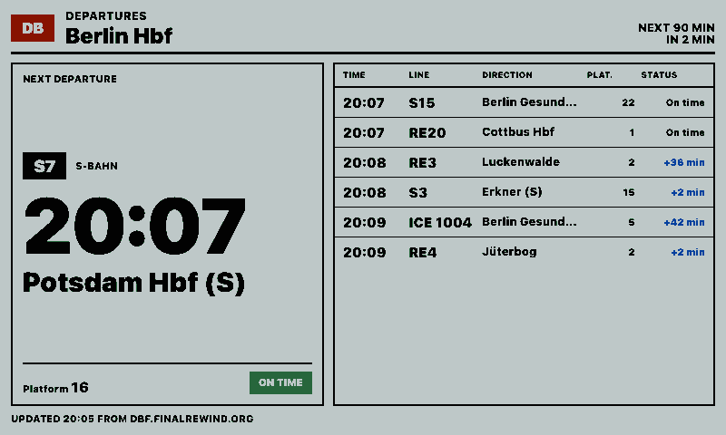
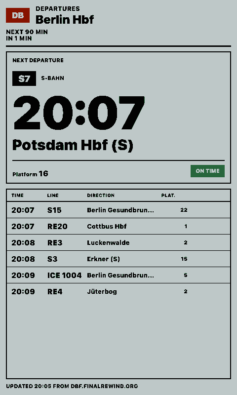
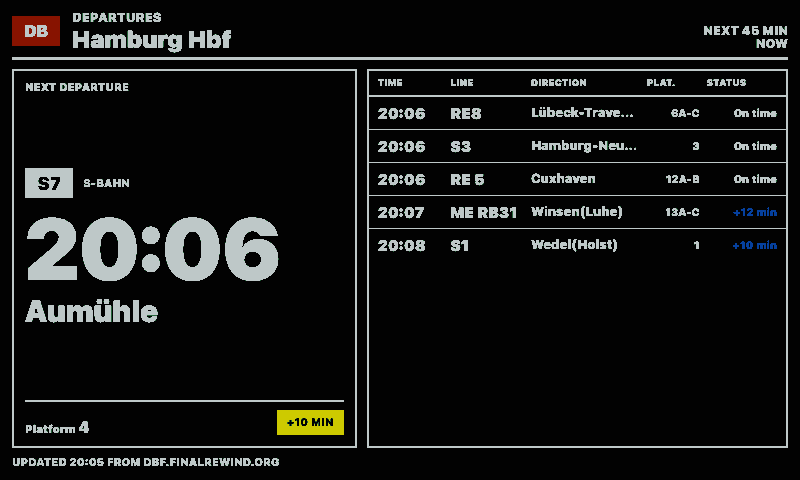
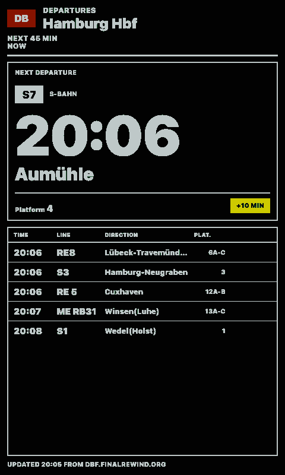

# Deutsche Bahn Abfahrten

Shows upcoming realtime departures for a Deutsche Bahn station, inspired by the TRMNL Deutsche Bahn Abfahrten plugin.

## Links

- [Demo](https://integrations.paperlesspaper.de/deutsche-bahn-abfahrten/run)
- [config.json](./config.json)

## Screenshots

| Landscape | Portrait |
| --- | --- |
|  |  |
|  |  |

## Settings

- `stationName`: station search text, used when `stationId` is empty
- `stationId`: optional DB stop/station ID, for example `8011160` for Berlin Hbf
- `duration`: lookahead window in minutes
- `limit`: number of departures to display
- `products`: comma-separated product filters such as `nationalExpress,regional,suburban,bus`
- `locale`: BCP 47 locale for time formatting
- `timeZone`: IANA time zone for departure times
- `showCancelled`: show or hide cancelled departures
- `showPlatformChanges`: keep platform changes highlighted in the board

## Data source

The integration reads the public `v6.db.transport.rest` API:

```txt
https://v6.db.transport.rest/locations
https://v6.db.transport.rest/stops/{stationId}/departures
```

This API does not require an API key, returns realtime departure data when the upstream DB data contains it, and is subject to the public service's rate limits and availability.

## Language Support

This integration declares `language: ["en", "de", "fr", "es", "it"]` in `config.json` and loads localized fixed UI copy from `languages/<code>.json` using the host-selected `payload.meta.language`.

The language JSON files localize dashboard labels, empty states, update text, and error titles only. Integration settings such as `locale`, `language`, or external API language codes remain separate.
