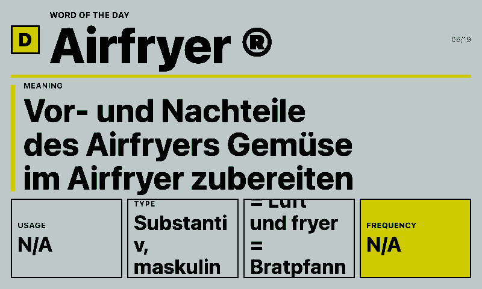
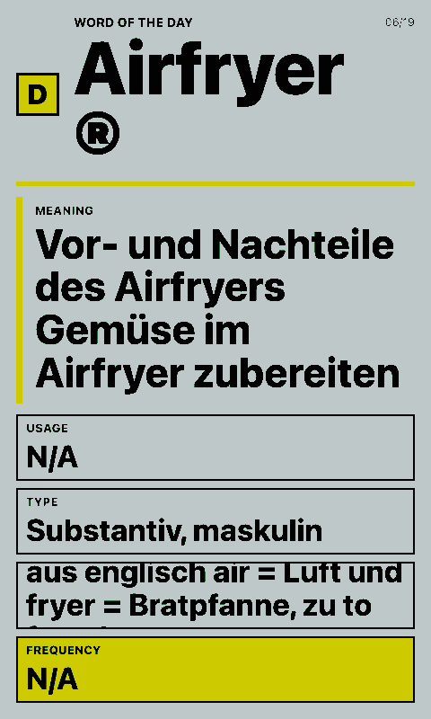

# Duden Wort des Tages

Shows Duden's German word of the day on a paperlesspaper display.

## Links

- [Demo](https://integrations.paperlesspaper.de/duden-wort-des-tages/run)
- [config.json](./config.json)

## Screenshots

| Landscape | Portrait |
| --- | --- |
|  |  |

## Data

The integration fetches `https://www.duden.de/wort-des-tages`, follows the current word link, and extracts:

- word
- meaning
- usage
- type
- origin
- frequency

Set `wordPath` to a Duden `/rechtschreibung/...` path to pin a specific word.

## Language Support

This integration declares `language: ["en", "de", "fr", "es", "it"]` in `config.json` and loads localized fixed UI copy from `languages/<code>.json` using the host-selected `payload.meta.language`.

The language JSON files localize dashboard labels, empty states, update text, and error titles only. Integration settings such as `locale`, `language`, or external API language codes remain separate.
