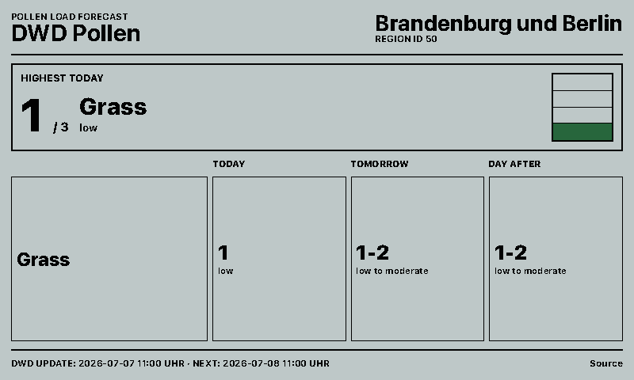
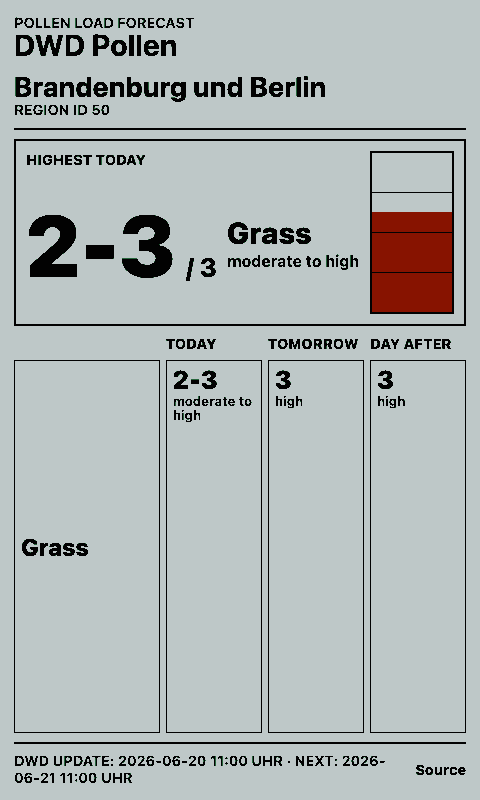
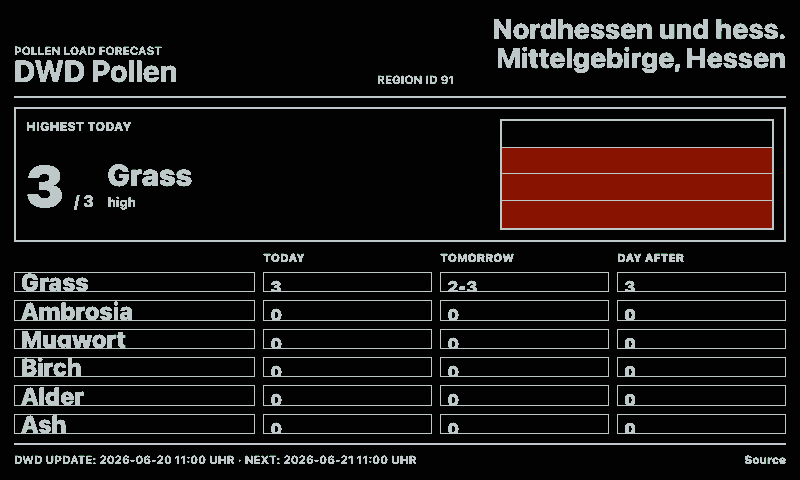
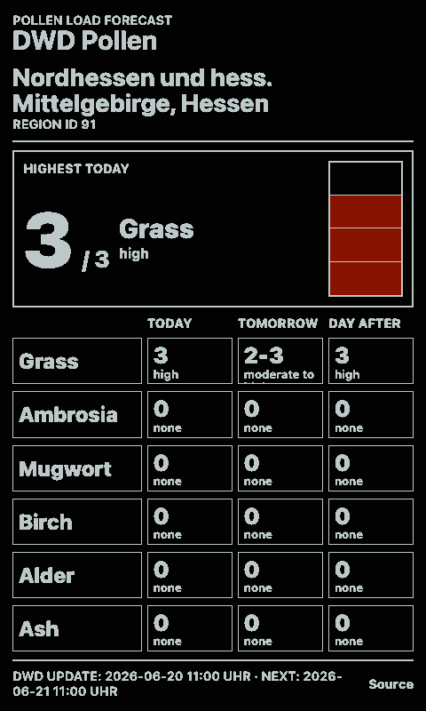

# DWD Pollenflug

Shows the current pollen forecast from Deutscher Wetterdienst (DWD) for one German forecast region.

The integration fetches DWD's `s31fg.json` health alert feed server-side, normalizes DWD range values such as `2-3` to half-step index values, and renders today, tomorrow, and the day after tomorrow when present.

## Links

- [Demo](https://integrations.paperlesspaper.de/dwd-pollenflug/run)
- [config.json](./config.json)

## Screenshots

| Landscape | Portrait |
| --- | --- |
|  |  |
|  |  |

## Settings

| Setting | Description |
| --- | --- |
| `regionId` | DWD region or part-region ID. Use `50` for Brandenburg und Berlin or `91` for Rhein-Main. |
| `limit` | Number of pollen rows to display. |
| `sortBy` | Sort by current severity or alphabetically by pollen name. |
| `showEmpty` | Include pollen types with zero forecast load. |

The DWD index ranges from `0` for no load to `3` for high load, with half steps for transition ranges.
