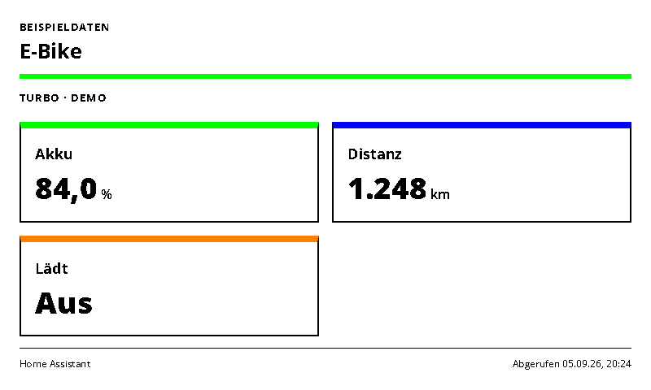
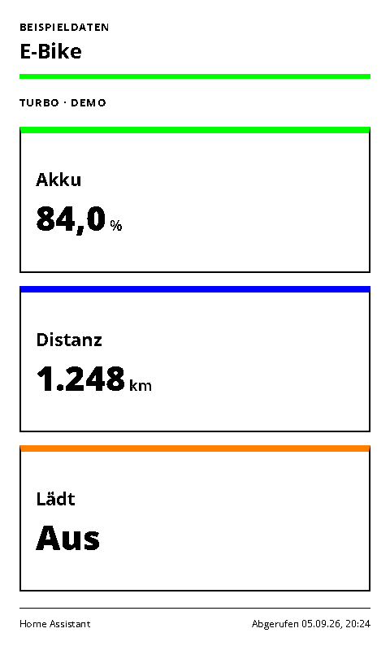
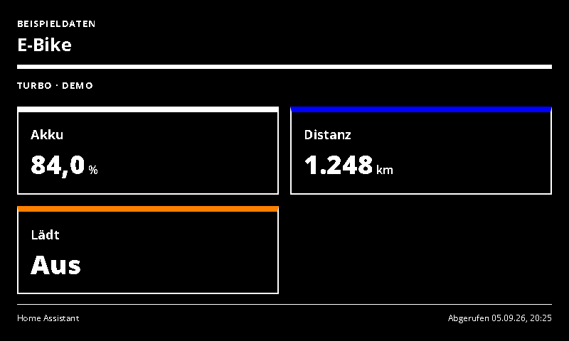
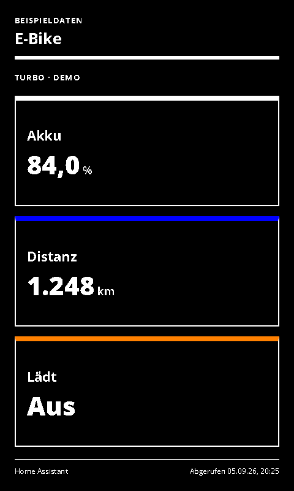

# E-Bike Status

Battery and ride telemetry from Home Assistant, including Specialized Turbo.

- [Manifest](./config.json)
- Local preview: `http://localhost:3000/ebike-status/run`
- Supported UI languages: German and English, selected by the host.
- Default theme: `green-light`, with deliberate Spectra 6 color accents.

## Setup and behavior

Connect Home Assistant with a base URL and long-lived token. Map a battery entity and optionally a distance sensor and charging binary sensor, then disable `sampleData`. Set a bike name if desired. The adapter is read-only and works with any compatible Home Assistant sensors, including Specialized Turbo after pairing it in Home Assistant.

This provider does not pair over Bluetooth, log into a Specialized account, or estimate remaining range. It displays only the values and units actually supplied by the selected entities. A bike that is asleep, disconnected or out of Bluetooth range may expose unavailable or old data; the entity timestamp is shown where supplied. [Specialized Turbo integration](https://www.home-assistant.io/integrations/specialized_turbo).

## Preview and data handling

`sampleData: true` explicitly enables labelled demonstration data. Demo data is never used as a fallback for a failed live connection. Disable demo mode after entering connection settings. All configured screenshot variants use demo data.

Connection values are sent to the same-origin adapter in a JSON POST body, not in render-page query strings. Tokens use password-type form inputs. The trusted renderer and integration server still receive these secrets; deploy on trusted HTTPS infrastructure. Do not paste live secrets into shareable demo links.

For private/local services, see [server network configuration](../../docs/dashboard-integrations.md#private-services). A hosted renderer cannot automatically reach your home network.

The page uses the INIT/update lifecycle, shared theme and ready/error markers. Entry limits and responsive layouts target 800×480, 480×800, 1600×1200 and 1200×1600.

## Screenshots

| Landscape | Portrait |
| --- | --- |
|  |  |
|  |  |

Additional large-format screenshots are declared in `configVariants`.

## Validation

```sh
npx paperless check applications/ebike-status/config.json
npx paperless render applications/ebike-status/config.json --viewport 800x480 --settings '{"sampleData":true}' --output /tmp/ebike-status.png
npm run check:dashboards
npm run check:dashboards -- --render
```

The collection check includes adapter tests; `--render` also generates the two configured variants at four sizes and checks for overflow. Icons and generation prompts: [icon provenance](../../docs/integration-icon-prompts.md).
