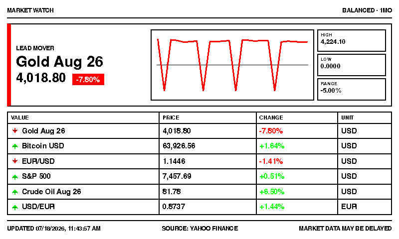
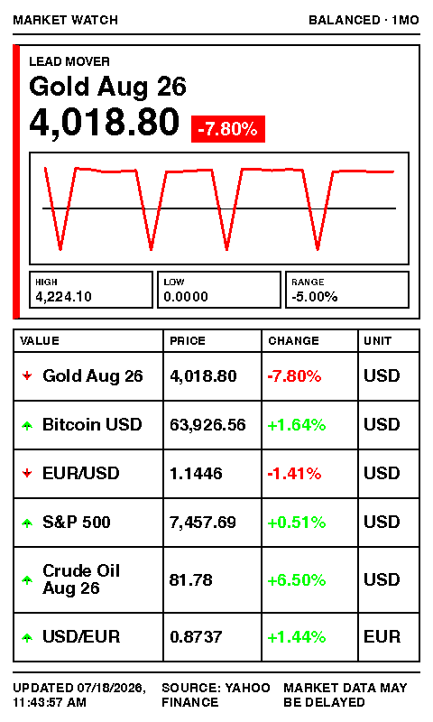
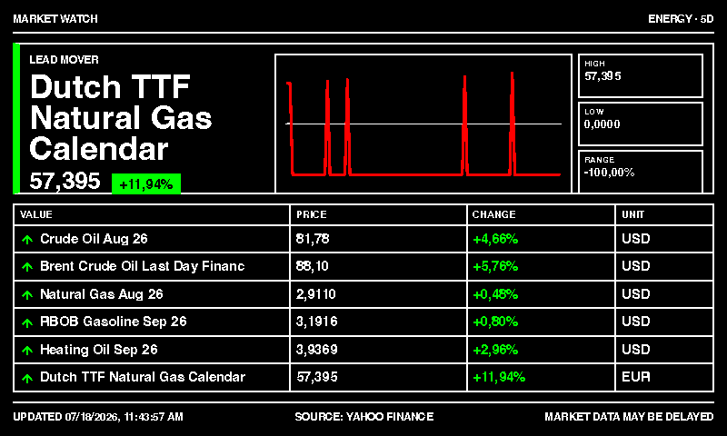
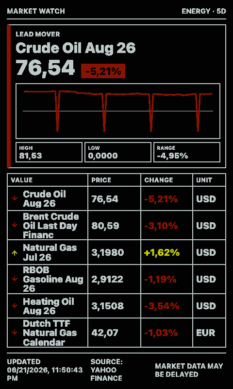

# Finance Snapshot

Shows a compact market snapshot for commodities, crypto, currencies, energy, indices, ETFs, and stocks.

The app uses Yahoo Finance chart quote endpoints and does not require an API key. Market data may be delayed depending on the instrument and exchange.

## Links

- [Demo](https://integrations.paperlesspaper.de/finance-snapshot/run)
- [config.json](./config.json)

## Screenshots

| Landscape | Portrait |
| --- | --- |
|  |  |
|  |  |

## Settings

- `preset`: choose a ready-made group such as `balanced`, `metals`, `crypto`, `currencies`, `energy`, `indices`, `tech`, or `europe`.
- `symbols`: select specific curated values from the settings list.
- `customSymbols`: comma-separated Yahoo Finance symbols for values not in the curated list.
- `currency`: display currency hint for formatting.
- `locale`: BCP 47 locale used for number and date formatting.
- `limit`: maximum number of values shown.

## Useful Symbols

- Gold: `GC=F`
- Silver: `SI=F`
- Bitcoin: `BTC-USD`
- Ether: `ETH-USD`
- Euro / US dollar: `EURUSD=X`
- US dollar / euro: `EUR=X`
- Crude oil WTI: `CL=F`
- Brent oil: `BZ=F`
- Natural gas: `NG=F`
- S&P 500: `^GSPC`
- Nasdaq 100: `^IXIC`
- DAX: `^GDAXI`
- Apple: `AAPL`
- SAP: `SAP.DE`
