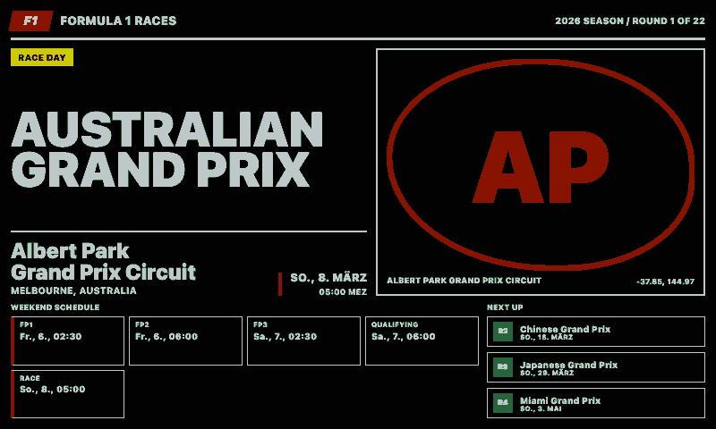
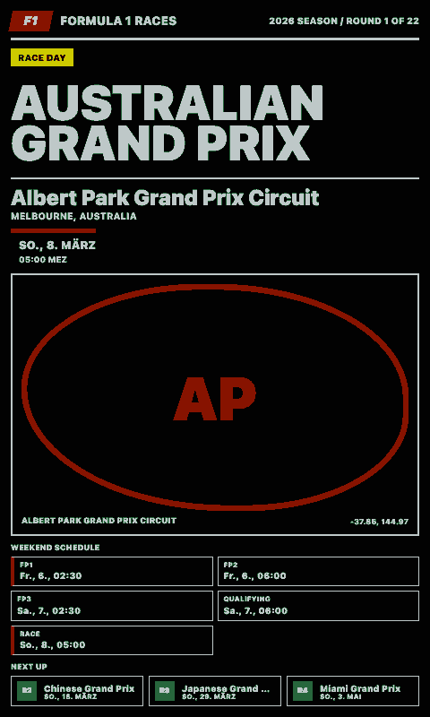
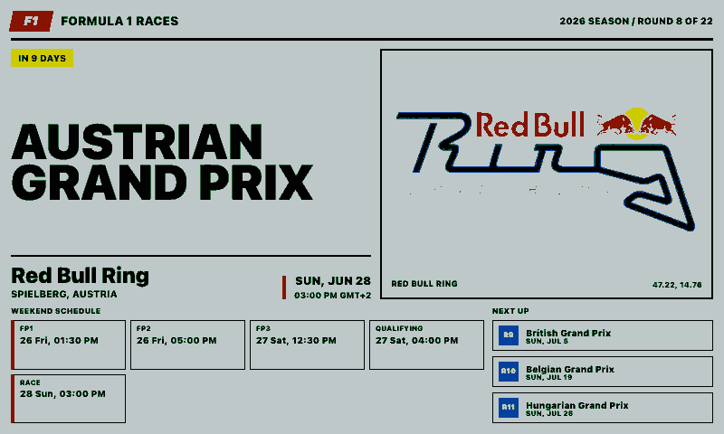
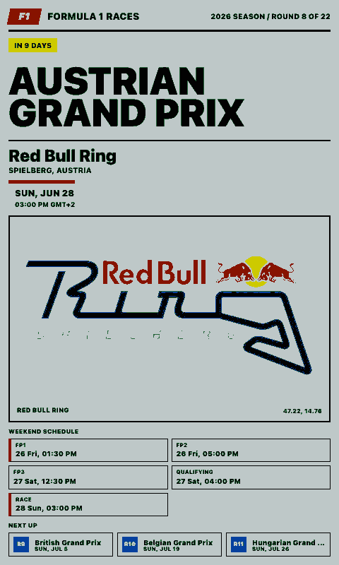

# Formula 1 Races

Displays the upcoming Formula 1 Grand Prix with circuit details, location, race date, session schedule, and a track image.

## Links

- [Demo](https://integrations.paperlesspaper.de/formula-1-races/run)
- [config.json](./config.json)

## Screenshots

| Landscape                                                                                                                                                   | Portrait                                                                                                                                                  |
| ----------------------------------------------------------------------------------------------------------------------------------------------------------- | --------------------------------------------------------------------------------------------------------------------------------------------------------- |
|  |  |
|          |          |

## Settings

- `selection`: `upcoming` or `round`
- `offset`: number of races after the upcoming race when `selection` is `upcoming`
- `round`: explicit race round when `selection` is `round`
- `locale`: BCP 47 locale used for date and time formatting
- `timeZone`: IANA time zone used for race and session times
- `showTrackMap`: show or hide the circuit image
- `showSessions`: show or hide the weekend session schedule

## Data sources

The integration reads the public Jolpica Ergast-compatible Formula 1 API:

```txt
https://api.jolpi.ca/ergast/f1/current.json
```

Circuit images are resolved from the circuit page returned by the race data through the Wikipedia page summary API:

```txt
https://en.wikipedia.org/api/rest_v1/page/summary/{circuit-title}
```

## Language Support

This integration declares `language: ["en", "de", "fr", "es", "it"]` in `config.json` and loads localized fixed UI copy from `languages/<code>.json` using the host-selected `payload.meta.language`.

The language JSON files localize dashboard labels, empty states, update text, and error titles only. Integration settings such as `locale`, `language`, or external API language codes remain separate.
