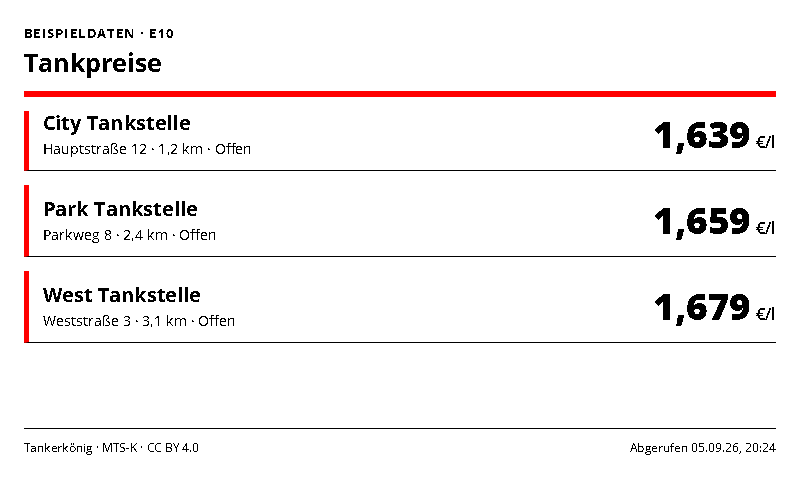
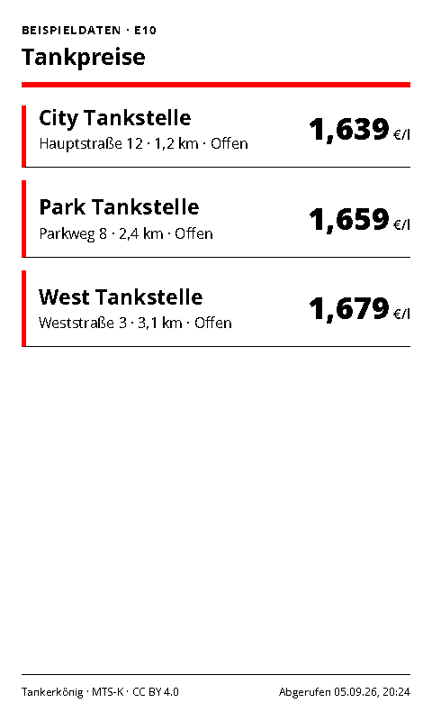
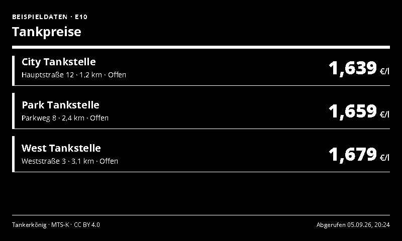
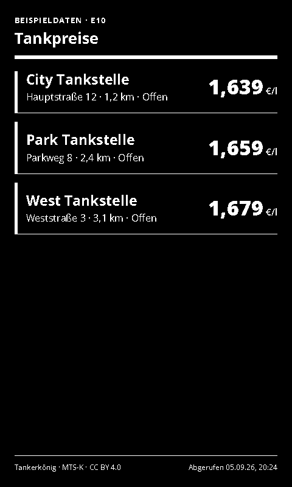

# Fuel Prices

Nearby fuel prices from Tankerkönig.

- [Manifest](./config.json)
- Local preview: `http://localhost:3000/fuel-prices/run`
- Supported UI languages: German and English, selected by the host.
- Default theme: `red-light`, with deliberate Spectra 6 color accents.

## Setup and behavior

Create a personal API key at [Tankerkönig](https://creativecommons.tankerkoenig.de/). Enter the key, coordinates, radius and fuel type, then disable `sampleData`. The display sorts valid prices ascending and optionally hides closed stations. Missing prices are omitted, never displayed as zero. Prices are in EUR per litre. Coordinates avoid an additional geocoding dependency.

The adapter caches identical queries for ten minutes in a bounded process-local cache. The footer retains the actual source retrieval time when served from cache. Suggested display refresh: 10–15 minutes. Tankerkönig attribution and MTS-K credit remain visible. For a large hosted rollout, check the provider's volume terms; each configured key is part of the cache identity.

## Preview and data handling

`sampleData: true` explicitly enables labelled demonstration data. Demo data is never used as a fallback for a failed live connection. Disable demo mode after entering connection settings. All configured screenshot variants use demo data.

Connection values are sent to the same-origin adapter in a JSON POST body, not in render-page query strings. Tokens use password-type form inputs. The trusted renderer and integration server still receive these secrets; deploy on trusted HTTPS infrastructure. Do not paste live secrets into shareable demo links.

The page uses the INIT/update lifecycle, shared theme and ready/error markers. Entry limits and responsive layouts target 800×480, 480×800, 1600×1200 and 1200×1600.

## Screenshots

| Landscape | Portrait |
| --- | --- |
|  |  |
|  |  |

Additional large-format screenshots are declared in `configVariants`.

## Validation

```sh
npx paperless check applications/fuel-prices/config.json
npx paperless render applications/fuel-prices/config.json --viewport 800x480 --settings '{"sampleData":true}' --output /tmp/fuel-prices.png
npm run check:dashboards
npm run check:dashboards -- --render
```

The collection check includes adapter tests; `--render` also generates the two configured variants at four sizes and checks for overflow. Icons and generation prompts: [icon provenance](../../docs/integration-icon-prompts.md).
