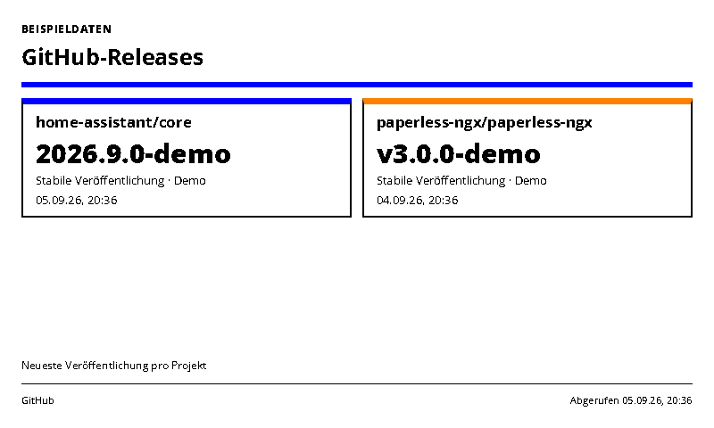
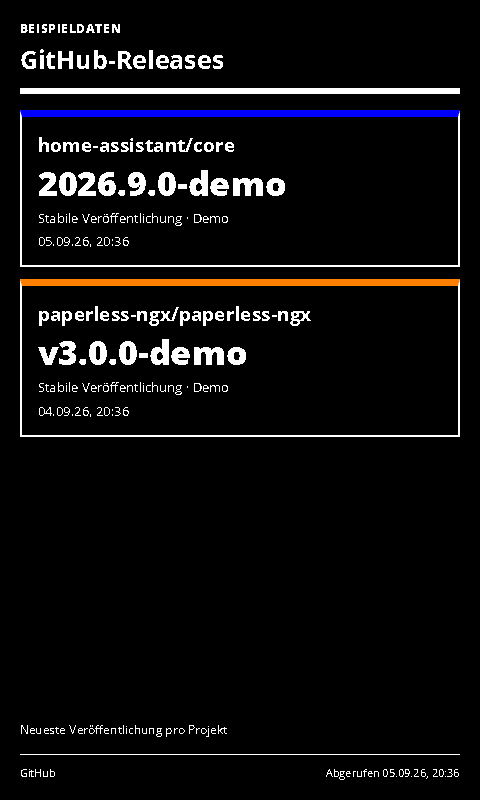

# GitHub Releases

Newest published releases for up to four GitHub repositories.

- [Manifest](./config.json)
- Local preview: `http://localhost:3000/github-releases/run`
- UI languages: German and English; host-selected.
- Theme: `blue-light` with blue/green accents and orange where useful. Yellow is not a default accent.

## Setup and scope

Enter one to four `owner/repository` names, one per line. Public projects work without a token. For private projects, supply a fine-grained token with read access to repository Contents. An optional token also provides authenticated rate limits. Tokens are sent only in the Authorization header to api.github.com.

Shows the newest published release by publication timestamp among the latest 30 returned releases per project. Drafts are always excluded; pre-releases are optional. This does not inspect installed versions, compare semantic versions, list bare Git tags or mark a release as a required update. Repositories with no matching release show that fact explicitly; unavailable projects remain visible. Suggested refresh: 30–60 minutes. Cache: 30 minutes.

API and permissions: [GitHub Releases documentation](https://docs.github.com/en/rest/releases/releases#list-releases). Partial provider failures are labelled; all-project failure is an error.

## Rendering and demo mode

`sampleData: true` uses unmistakably labelled local examples. API failures never silently switch to demo values. The screenshot variants use sample data for reproducible validation; normal defaults are declared in the manifest.

Supports host INIT updates, shared themes, ready/error markers and all four frame sizes. Complete cards are removed when necessary to fit; the footer shows the visible/total count. All displayed timestamps use Europe/Berlin. The source retrieval timestamp remains unchanged while serving a cached response.

Icons are transparent 1024×1024 PNGs; [generation provenance](../../docs/integration-icon-prompts.md). UI graphics use Spectra 6 processing with error diffusion to approximate orange.

## Screenshots

| Light landscape | Dark portrait |
| --- | --- |
|  |  |

Both themes at 800×480, 480×800, 1600×1200 and 1200×1600 are declared in `configVariants`.

## Validation

```sh
npx paperless check applications/github-releases/config.json
npx paperless render applications/github-releases/config.json --viewport 800x480 --settings '{"sampleData":true}' --output /tmp/github-releases.png
npm run check:dashboards
```

Use `PAPERLESSPAPER_TEST_SLUGS=air-quality,river-levels,github-releases,paperless-ngx-inbox npm run check:dashboards -- --render` for the 32 new layout cases and four host-update checks.
