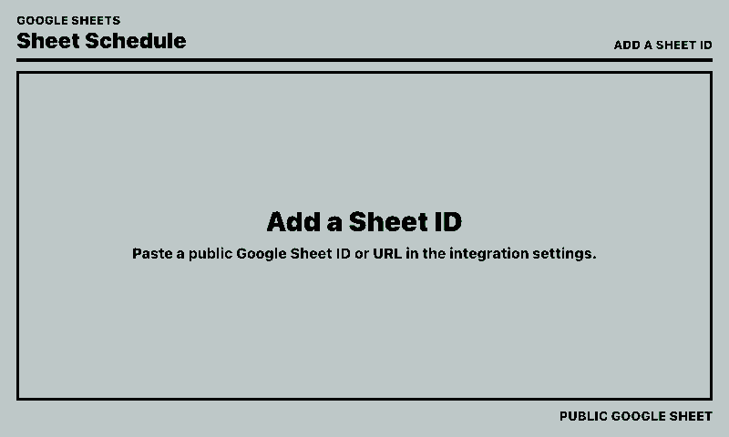
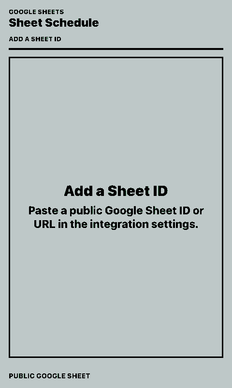

# Google Sheet Table

Shows a public Google Sheet as a compact eInk-friendly table on a paperlesspaper display.

By default it renders the sheet as-is: the first row becomes the header, and rows below it are displayed in the same columns. It can also be used in a filtered summary mode inspired by `supermem613/MMM-GoogleSheetToTable` for MagicMirror, where configured names are searched in configured columns and displayed as a compact `Date | Name | Group` table.

## Links

- [Demo](https://integrations.paperlesspaper.de/google-sheet-table/run)
- [config.json](./config.json)

## Screenshots

| Landscape | Portrait |
| --- | --- |
|  |  |

## Settings

- `Google Sheet ID or URL`: paste the sheet ID or the full Google Sheets URL.
- `Title`: optional. Leave empty to use the Google Sheet title.
- `Sheet gid`: optional worksheet gid. If a full URL contains `gid=...`, it is used automatically unless this field is set.
- `Maximum rows`: limits displayed rows in the default table mode.
- `Names to find`: optional filter mode. One exact value per line, or comma-separated.
- `Display names`: optional aliases in `Full Name=Display Name` form for filter mode.
- `Column mapping`: optional filter mode. One searched column per line, such as `B=K/1 Boys`.
- `Date column`: filter-mode column that contains dates, row labels, or section labels.
- `Show past dates`: include filter-mode entries before today.
- `Use labels from date column`: allow non-date labels in the date/label column to appear in the Date column for filter mode.
- `Table header style`: choose theme contrast, theme plain, or the formatting from the Google Sheet header row.
- `Preserve text styles`: apply exported bold, italic, underline, and strikethrough formatting.
- `Preserve text colors`: apply exported font colors.
- `Preserve background colors`: apply exported cell fills.
- `Preserve alignment`: apply exported cell alignment.

## Sheet Format

The first row is treated as a header. Rows below it are displayed directly when `Names to find` and `Column mapping` are both empty. In this default mode, the integration uses Google's public XLSX export for formatting and column widths, then falls back to `gviz` HTML and CSV. Basic formatting can be preserved or disabled by category: text styles, text color, background color, and alignment.

If either `Names to find` or `Column mapping` is configured, the integration switches to filter mode. Rows below the header are scanned in the mapped columns. If no columns are mapped in filter mode, every non-date column with data is searched.

Dates can be written as `April 4th`, `Apr 4`, `4.4.2026`, or `2026-04-04`. If dates omit the year, the integration infers the year from the previous dated row and rolls over to the next year when the sheet crosses January.

The sheet must be public: anyone with the link must be able to view it.
