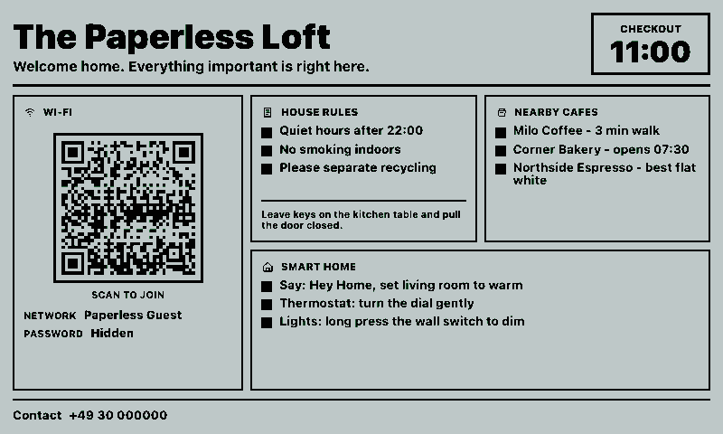
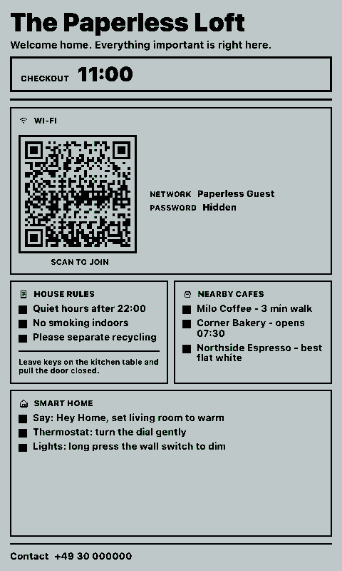
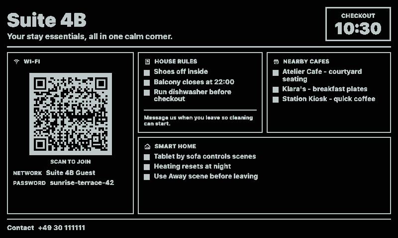
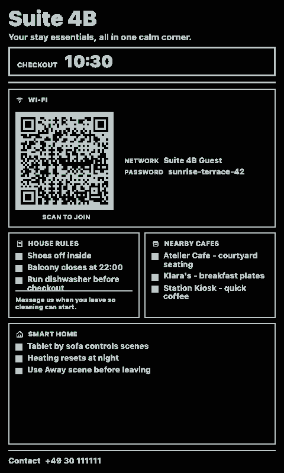

# Guest Mode Card

A guest-ready home card for paperlesspaper displays. It shows a Wi-Fi QR code, checkout time, house rules, nearby cafes, smart-home instructions, and an optional emergency contact.

## Links

- [Demo](https://integrations.paperlesspaper.de/guest-mode-card/run)
- [config.json](./config.json)

## Screenshots

| Landscape | Portrait |
| --- | --- |
|  |  |
|  |  |

## Settings

- `placeName` and `welcomeLine` set the header.
- `wifiName`, `wifiPassword`, and `wifiSecurity` build the scannable Wi-Fi QR payload.
- `showWifiPassword` controls whether the password is printed next to the QR code.
- `checkoutTime` and `checkoutNote` explain departure details.
- `houseRules`, `nearbyCafes`, and `smartHomeInstructions` accept one item per line.
- `emergencyContact` hides the contact footer when empty.

The renderer is static and does not call external services.
