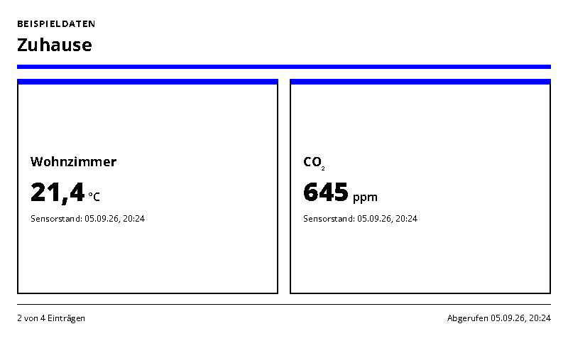
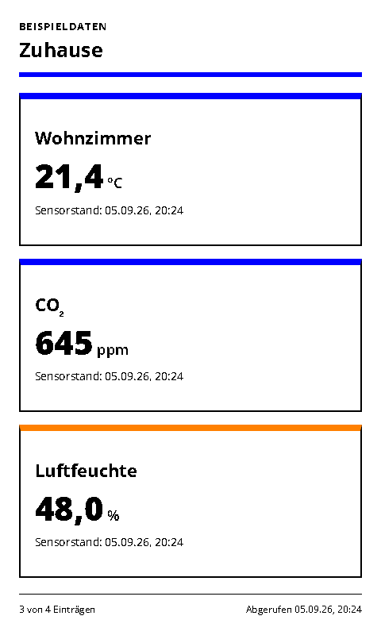
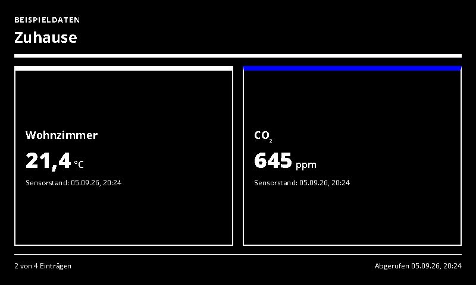
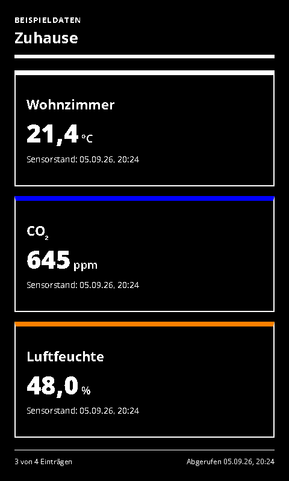

# Home Assistant Sensors

Selected Home Assistant sensor and binary sensor states.

- [Manifest](./config.json)
- Local preview: `http://localhost:3000/home-assistant-sensors/run`
- Supported UI languages: German and English, selected by the host.
- Default theme: `blue-light`, with deliberate Spectra 6 color accents.

## Setup and behavior

Enter the Home Assistant base URL and a long-lived access token, then select 1–12 `sensor.*` or `binary_sensor.*` entity IDs, one per line. Disable `sampleData`. Entity IDs are available in Home Assistant's entity settings / state tools. The adapter fetches only the selected entities via GET `/api/states/{entity_id}`.

The display shows friendly names, values, units and each entity's `last_updated`. `unknown` and `unavailable` remain visibly unavailable. Window/door states have explicit open/closed labels. Values are never assumed to be zero. The layout shows a bounded subset of complete cards with a count when space is limited. This connection does not discover every device or provide controls. See [Home Assistant REST API](https://developers.home-assistant.io/docs/api/rest/).

## Preview and data handling

`sampleData: true` explicitly enables labelled demonstration data. Demo data is never used as a fallback for a failed live connection. Disable demo mode after entering connection settings. All configured screenshot variants use demo data.

Connection values are sent to the same-origin adapter in a JSON POST body, not in render-page query strings. Tokens use password-type form inputs. The trusted renderer and integration server still receive these secrets; deploy on trusted HTTPS infrastructure. Do not paste live secrets into shareable demo links.

For private/local services, see [server network configuration](../../docs/dashboard-integrations.md#private-services). A hosted renderer cannot automatically reach your home network.

The page uses the INIT/update lifecycle, shared theme and ready/error markers. Entry limits and responsive layouts target 800×480, 480×800, 1600×1200 and 1200×1600.

## Screenshots

| Landscape | Portrait |
| --- | --- |
|  |  |
|  |  |

Additional large-format screenshots are declared in `configVariants`.

## Validation

```sh
npx paperless check applications/home-assistant-sensors/config.json
npx paperless render applications/home-assistant-sensors/config.json --viewport 800x480 --settings '{"sampleData":true}' --output /tmp/home-assistant-sensors.png
npm run check:dashboards
npm run check:dashboards -- --render
```

The collection check includes adapter tests; `--render` also generates the two configured variants at four sizes and checks for overflow. Icons and generation prompts: [icon provenance](../../docs/integration-icon-prompts.md).
