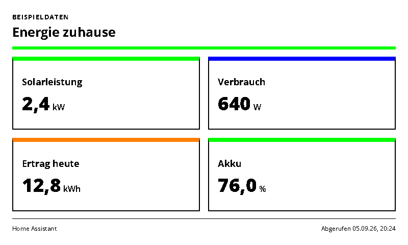
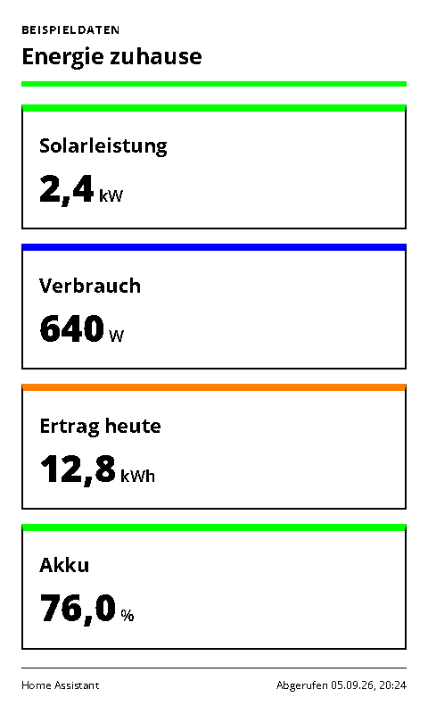
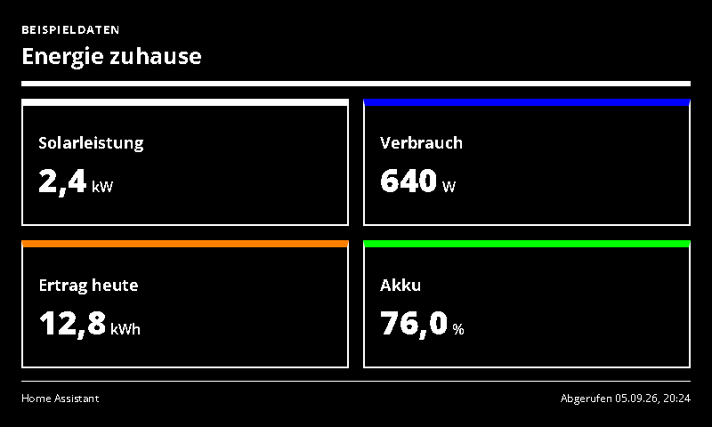
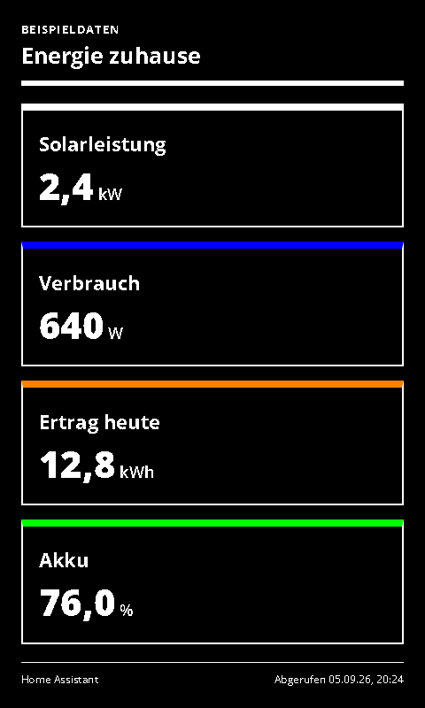

# Home Energy

Solar, consumption, yield and battery values from Home Assistant.

- [Manifest](./config.json)
- Local preview: `http://localhost:3000/home-energy/run`
- Supported UI languages: German and English, selected by the host.
- Default theme: `green-light`, with deliberate Spectra 6 color accents.

## Setup and behavior

Connect Home Assistant with a base URL and long-lived token, disable `sampleData`, and map existing entities for solar power, home consumption, today's yield and battery charge. At least one mapping is required; omitted optional mappings are not shown. The adapter uses the same narrowly selected sensor reads as the Home Assistant Sensors integration.

Configure daily utility-meter sensors in Home Assistant if the source only exposes lifetime energy; this display does not infer daily totals from cumulative readings. Units and sensor timestamps come from Home Assistant. No manufacturer credentials or direct Modbus access are needed here. Devices such as energieleser, Envertech and Sofar can be used when their values already exist in Home Assistant.

## Preview and data handling

`sampleData: true` explicitly enables labelled demonstration data. Demo data is never used as a fallback for a failed live connection. Disable demo mode after entering connection settings. All configured screenshot variants use demo data.

Connection values are sent to the same-origin adapter in a JSON POST body, not in render-page query strings. Tokens use password-type form inputs. The trusted renderer and integration server still receive these secrets; deploy on trusted HTTPS infrastructure. Do not paste live secrets into shareable demo links.

For private/local services, see [server network configuration](../../docs/dashboard-integrations.md#private-services). A hosted renderer cannot automatically reach your home network.

The page uses the INIT/update lifecycle, shared theme and ready/error markers. Entry limits and responsive layouts target 800×480, 480×800, 1600×1200 and 1200×1600.

## Screenshots

| Landscape | Portrait |
| --- | --- |
|  |  |
|  |  |

Additional large-format screenshots are declared in `configVariants`.

## Validation

```sh
npx paperless check applications/home-energy/config.json
npx paperless render applications/home-energy/config.json --viewport 800x480 --settings '{"sampleData":true}' --output /tmp/home-energy.png
npm run check:dashboards
npm run check:dashboards -- --render
```

The collection check includes adapter tests; `--render` also generates the two configured variants at four sizes and checks for overflow. Icons and generation prompts: [icon provenance](../../docs/integration-icon-prompts.md).
