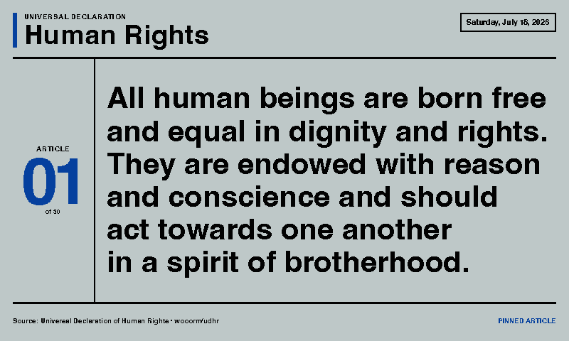
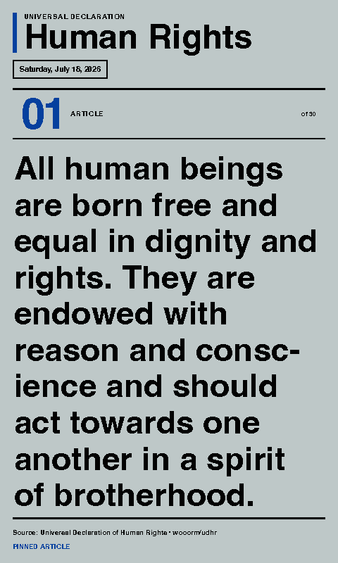

# Human Rights — Article of the Day

Shows one of the 30 articles from the Universal Declaration of Human Rights each day. The rotation is deterministic and repeats every 30 days. An article can also be pinned in the settings.

The complete English and German declaration texts are bundled with the integration, so no network connection is required while rendering. The source texts come from [wooorm/udhr](https://github.com/wooorm/udhr), which publishes the copyright-free declaration in Unicode.

## Links

- [Demo](https://integrations.paperlesspaper.de/human-rights/run)
- [config.json](./config.json)
- [Universal Declaration of Human Rights](https://www.ohchr.org/en/human-rights/universal-declaration/translations/english)

## Screenshots

| Landscape | Portrait |
| --- | --- |
|  |  |

## Settings

- `article`: use the daily rotation or pin Article 1–30.
- `showDate`: show or hide the date used for the daily rotation.
- `showSource`: show or hide the source and rotation mode footer.

The global paperlesspaper color setting is also supported.

## Daily selection

The local day of year selects an article with `(dayOfYear - 1) % 30 + 1`. This keeps the result stable throughout a calendar day and cycles through all 30 articles.

## Local URLs

```txt
http://localhost:3000/human-rights/
http://localhost:3000/human-rights/config.json
```
