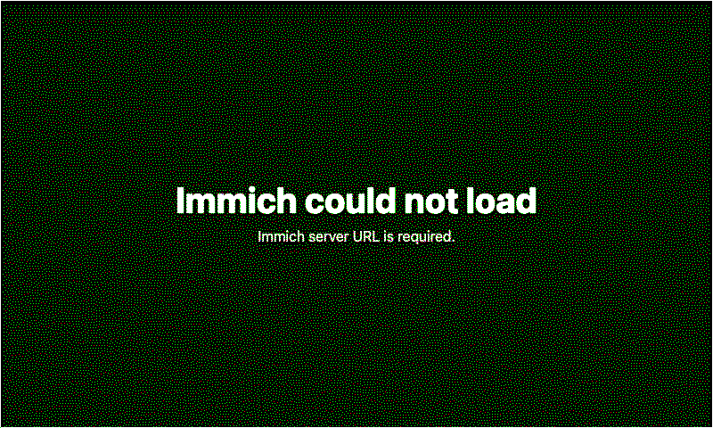
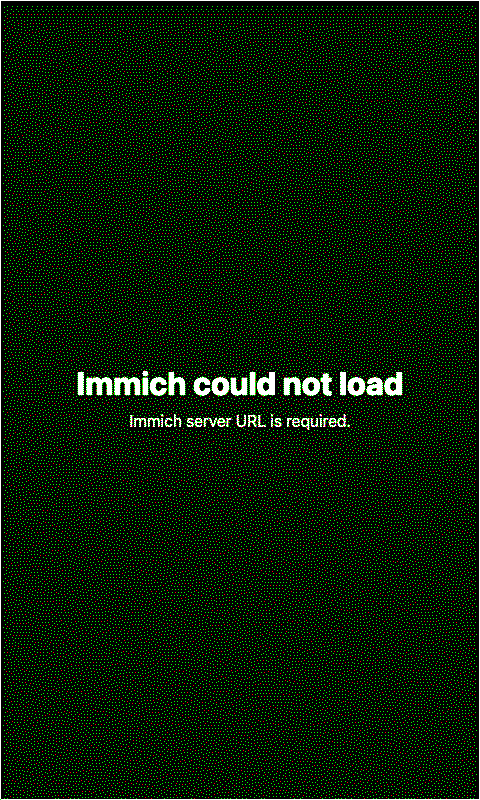

# Immich Photos

Shows a random, newest, or oldest photo from an Immich server on a paperlesspaper display.

## Links

- [Demo](https://integrations.paperlesspaper.de/immich-photos/run)
- [config.json](./config.json)

## Screenshots

| Landscape | Portrait |
| --- | --- |
|  |  |
|  |  |

## Settings

- `serverUrl`: Immich server base URL, with or without `/api`.
- `apiKey`: Immich personal API key. Use a key that can read and view assets. `original` and some `fullsize` images may require download permission.
- `selection`: `random`, `newest`, or `oldest`.
- `albumId`: optional Immich album UUID. Comma-separated IDs are accepted by the API adapter, although the generated form is a single text field.
- `onlyFavorites`: limits results to favorite assets.
- `visibility`: `timeline`, `archive`, `hidden`, or `all`.
- `takenAfter` and `takenBefore`: optional date filters, for example `2024-01-01`.
- `imageSize`: `preview`, `thumbnail`, `fullsize`, or `original`. `preview` is the best default for ePaper rendering.
- `fit`: `cover` fills the frame; `contain` shows the complete image.
- `preferEdited`: asks Immich for the edited version when available.
- `showMetadata`, `showDate`, `showLocation`, and `showAlbumName`: control the bottom overlay.
- `locale`: BCP 47 locale used for date formatting, for example `en-US` or `de-DE`.

## Local preview

```sh
npm run dev -- ../paperlesspaper-integrations/openintegrations/applications/immich-photos/config.json
```

You can pass settings without saving secrets into the manifest:

```sh
npm run dev -- ../paperlesspaper-integrations/openintegrations/applications/immich-photos/config.json -- --settings '{"serverUrl":"https://photos.example.com","apiKey":"YOUR_KEY","selection":"random"}'
```

When `serverUrl` or `apiKey` are blank, the local server and screenshot generator fall back to `IMMICH_SERVER_URL` and `IMMICH_API_KEY` from the root `.env` file.

## Notes

The API adapter uses Immich's `POST /search/random` and `POST /search/metadata` endpoints, then fetches the selected asset through `GET /assets/{id}/thumbnail` or `GET /assets/{id}/original`. The render page receives a data URL for the selected image so the final `` tag does not contain the Immich API key.

## Language Support

This integration declares `language: ["en", "de", "fr", "es", "it"]` in `config.json` and loads localized fixed UI copy from `languages/<code>.json` using the host-selected `payload.meta.language`.

The language JSON files localize dashboard labels, empty states, update text, and error titles only. Integration settings such as `locale`, `language`, or external API language codes remain separate.
