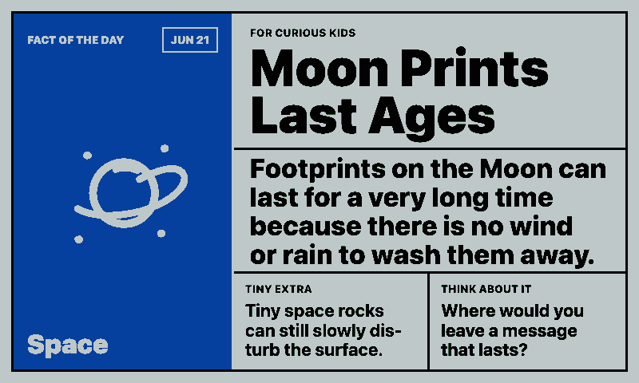
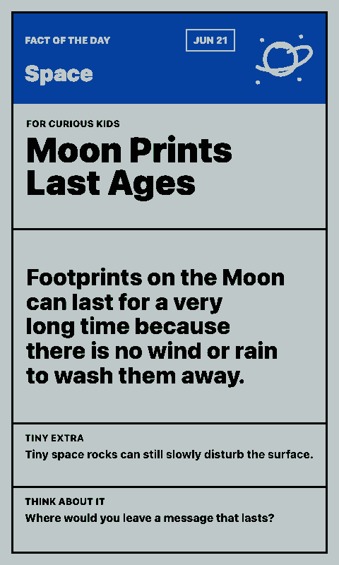
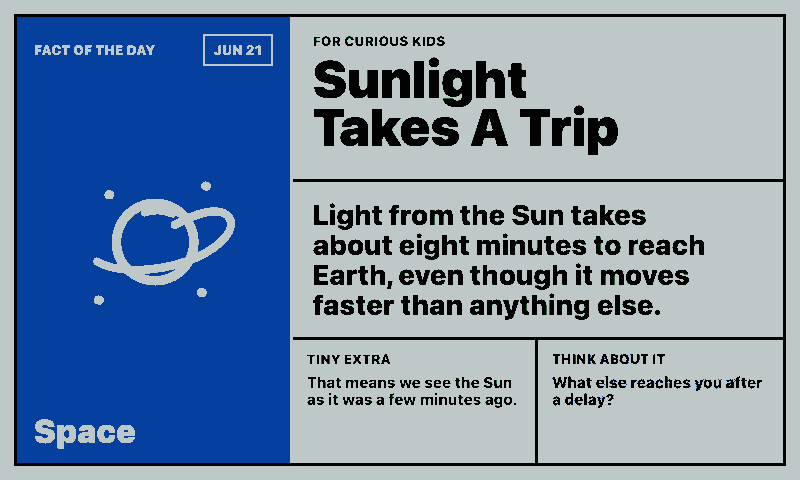
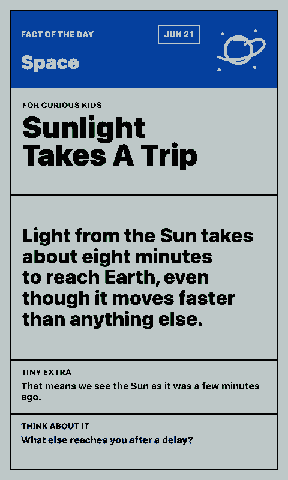

# Kids Fact Card

Shows a kid-friendly dinosaur, space, or animal fact of the day on a paperlesspaper display.

The integration uses a curated local fact bank instead of a live public API. That keeps the wording child-safe, deterministic, and available even when external services are slow or offline.

## Links

- [Demo](https://integrations.paperlesspaper.de/kids-fact-card/run)
- [config.json](./config.json)

## Screenshots

| Landscape | Portrait |
| --- | --- |
|  |  |
|  |  |

## Settings

- `topic`: `mixed`, `dinosaurs`, `space`, or `animals`
- `showQuestion`: show or hide the thinking prompt
- `seed`: optional text for a different deterministic daily rotation

## API Notes

NASA has a public APOD API for space content, but there is no single stable no-key API that reliably covers dinosaur, space, and animal facts with kid-friendly wording. This integration therefore uses local facts and exposes them through `api/data.js`.
