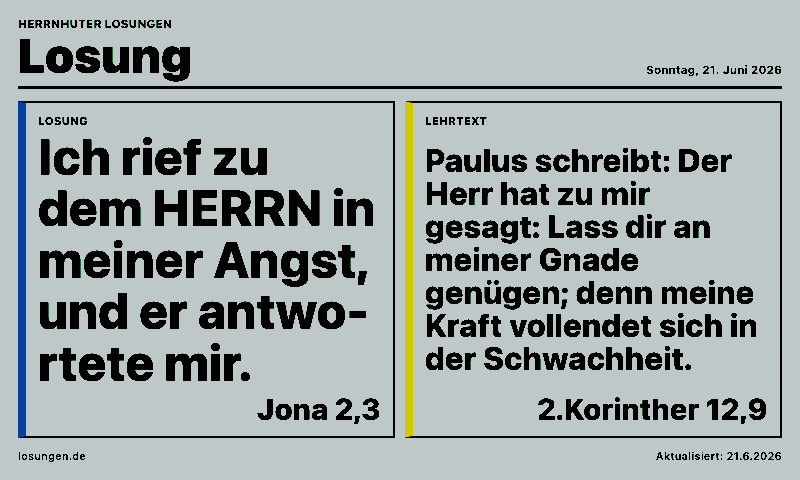
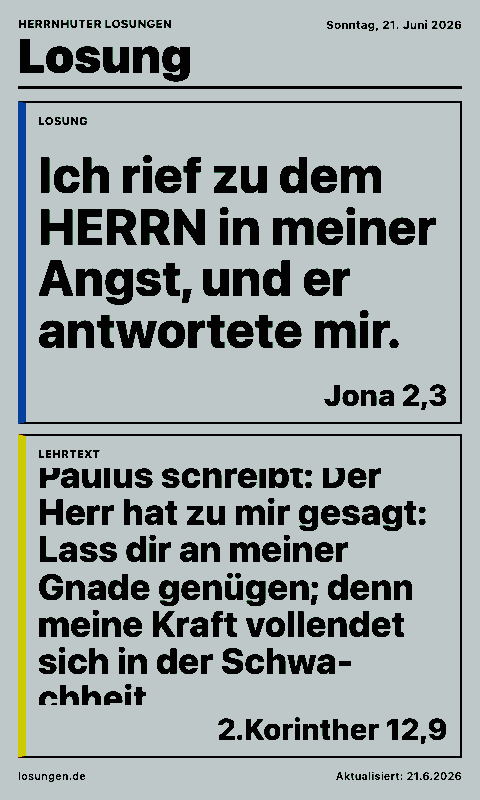
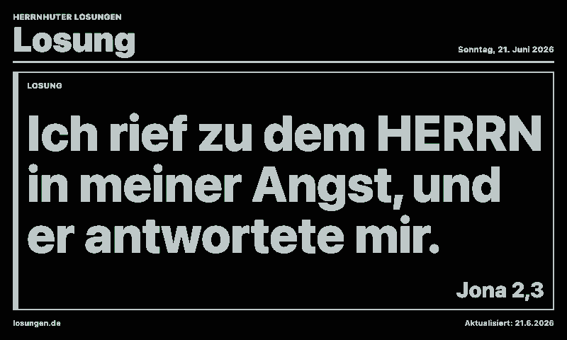
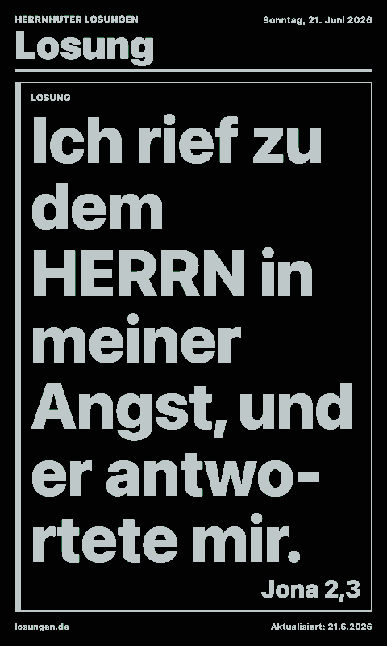

# Losung

Displays the daily Losung and Lehrtext from losungen.de, inspired by the MagicMirror module `Dobherrmann/MMM-Losung`.

The integration fetches the official daily HTML page server-side through `api/data.js`, extracts the two verse blocks, and renders them in a high-contrast layout for paperlesspaper displays.

## Links

- [Demo](https://integrations.paperlesspaper.de/losung/run)
- [config.json](./config.json)

## Screenshots

| Landscape | Portrait |
| --- | --- |
|  |  |
|  |  |

## Settings

- `showLosung`: show the Old Testament daily verse.
- `showLehrtext`: show the New Testament teaching text.
- `showDate`: show the date from losungen.de.
- `dateOffset`: offset from today in days, for example `-1` for yesterday or `1` for tomorrow.
