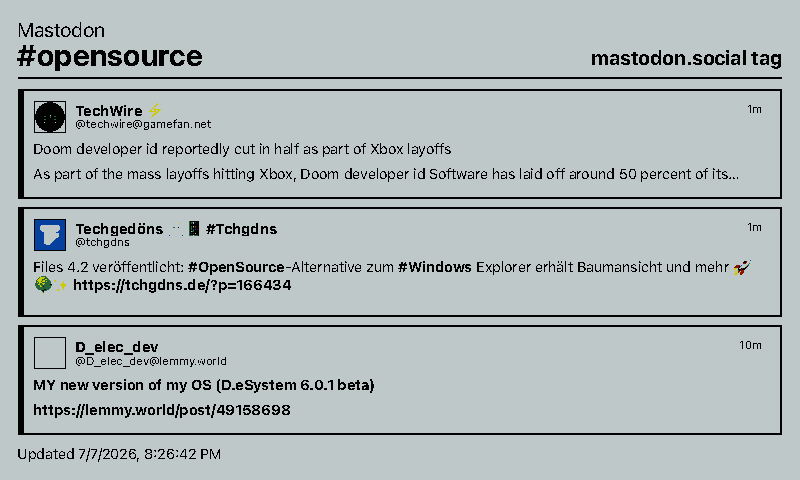
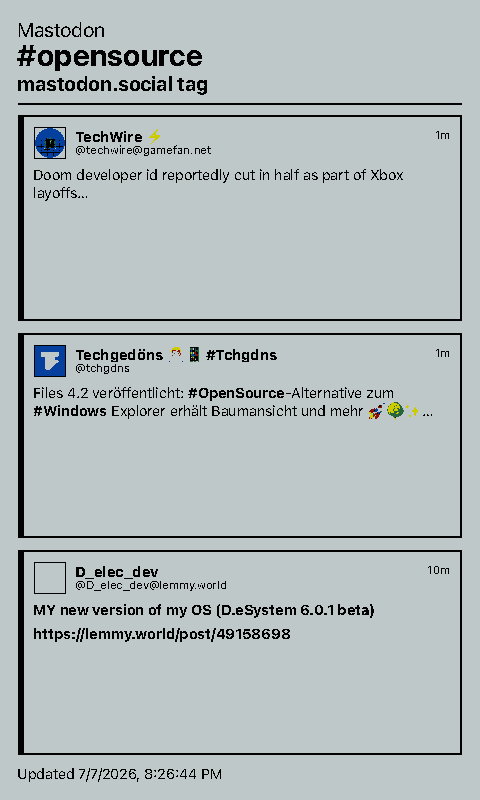
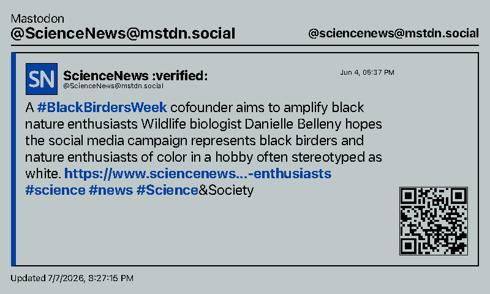
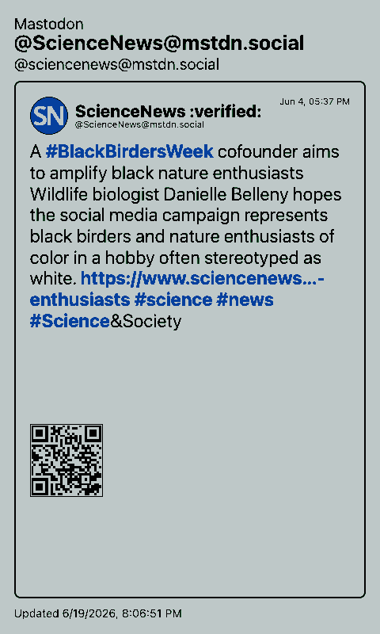

# Mastodon

Shows a Mastodon home timeline, hashtag stream, or profile feed on a paperlesspaper display.

This integration follows the core behavior of
[KristjanESPERANTO/MMM-Mastodon](https://github.com/KristjanESPERANTO/MMM-Mastodon):
it supports home, hashtag, and profile feeds; reply filtering; media thumbnails;
relative or absolute dates; QR codes for posts; and configurable link truncation.

## Links

- [Demo](https://integrations.paperlesspaper.de/mastodon/run)
- [config.json](./config.json)

## Screenshots

| Landscape | Portrait |
| --- | --- |
|  |  |
|  |  |

## Settings

- `instanceUrl`: Base URL of the Mastodon instance.
- `accessToken`: Optional for public hashtag/profile feeds, required for home timelines.
- `feedType`: `home`, `hashtag`, or `profile`.
- `hashtag`: Tag name for hashtag feeds, without the `#`.
- `profileAcct`: Profile handle for profile feeds, such as `@ScienceNews@mstdn.social`.
- `limit`: Maximum number of posts to render.
- `displayMode`: `list` renders the latest posts; `single` renders one selected post.
- `postIndex`: Selected item when `displayMode` is `single`.
- `showMedia`: Shows image and preview thumbnails.
- `dateFormat`: `relative` or `absolute`.
- `hideReplies`: Excludes reply posts.
- `showQrCode`: Shows a QR code that links to the post.
- `qrCodeSize`: QR code size in pixels.
- `maxLinkLength`: Maximum rendered link text length. Use `0` to hide link text.

## Access Token

For a home timeline, create an application in your Mastodon account settings with
read permissions and copy its access token into `accessToken`. Public hashtag and
profile feeds usually work without a token, depending on the instance policy.

## Language Support

This integration declares `language: ["en", "de", "fr", "es", "it"]` in `config.json` and loads localized fixed UI copy from `languages/<code>.json` using the host-selected `payload.meta.language`.

The language JSON files localize dashboard labels, empty states, update text, and error titles only. Integration settings such as `locale`, `language`, or external API language codes remain separate.
