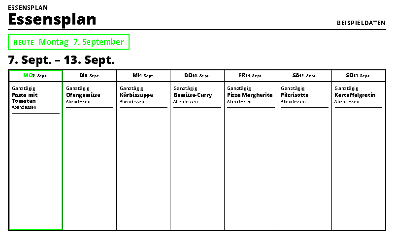
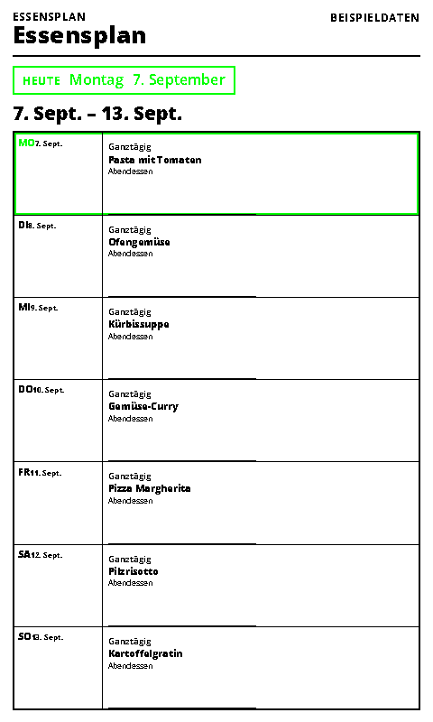
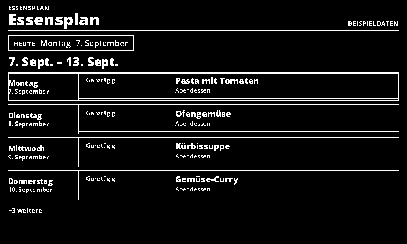
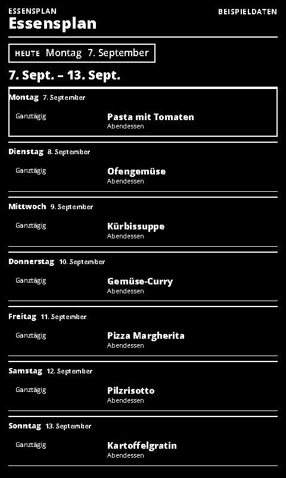

# Mealie Meal Plan

Read-only Mealie meal plans in the shared calendar layouts.

- [Manifest](./config.json)
- Local preview: `http://localhost:3000/mealie/run`
- Supported UI languages: German and English, selected by the host.
- Default theme: `green-light`, with deliberate Spectra 6 color accents.

## Setup and behavior

Connect a [Mealie](https://docs.mealie.io/) instance (v2+ API) by base URL and a long-lived API token from Profile → Manage your API tokens. Disable `sampleData`. The instance must be reachable from the integration server. The adapter performs date-bounded, paginated GET requests to `/api/households/mealplans`, preserving all-day civil dates. It uses the meal-plan title, falling back to the recipe name, and displays the meal type as the calendar location.

The shared calendar renderer provides agenda, day, three-day, week and year views. This first version displays meal plans; recipe photos, QR codes and shopping-list views are not included. It does not change recipes or meal plans. API reference: [Mealie API usage](https://docs.mealie.io/documentation/getting-started/api-usage/). Leave the preview-only `now` setting empty during normal use.

Agenda presentation is capped at four events on short landscape screens, eight
on narrow portrait screens and twenty on larger screens. The shared renderer
shows its remaining-event indicator; the upstream fetch still covers the complete
requested date range.

## Preview and data handling

`sampleData: true` explicitly enables labelled demonstration data. Demo data is never used as a fallback for a failed live connection. Disable demo mode after entering connection settings. All configured screenshot variants use demo data.

Connection values are sent to the same-origin adapter in a JSON POST body, not in render-page query strings. Tokens use password-type form inputs. The trusted renderer and integration server still receive these secrets; deploy on trusted HTTPS infrastructure. Do not paste live secrets into shareable demo links.

For private/local services, see [server network configuration](../../docs/dashboard-integrations.md#private-services). A hosted renderer cannot automatically reach your home network.

The page uses the INIT/update lifecycle, shared theme and ready/error markers. Entry limits and responsive layouts target 800×480, 480×800, 1600×1200 and 1200×1600.

## Screenshots

| Landscape | Portrait |
| --- | --- |
|  |  |
|  |  |

Additional large-format screenshots are declared in `configVariants`.

## Validation

```sh
npx paperless check applications/mealie/config.json
npx paperless render applications/mealie/config.json --viewport 800x480 --settings '{"sampleData":true}' --output /tmp/mealie.png
npm run check:dashboards
npm run check:dashboards -- --render
```

The collection check includes adapter tests; `--render` also generates the two configured variants at four sizes and checks for overflow. Icons and generation prompts: [icon provenance](../../docs/integration-icon-prompts.md).
