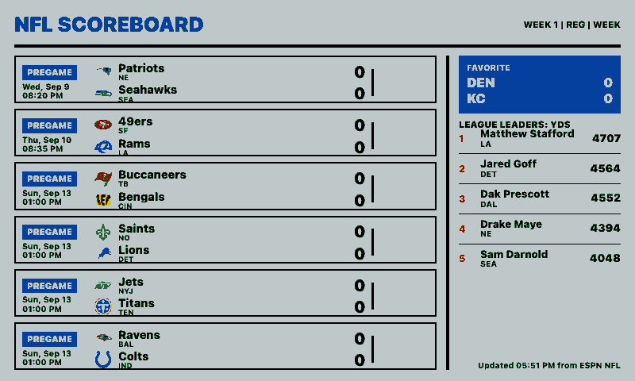
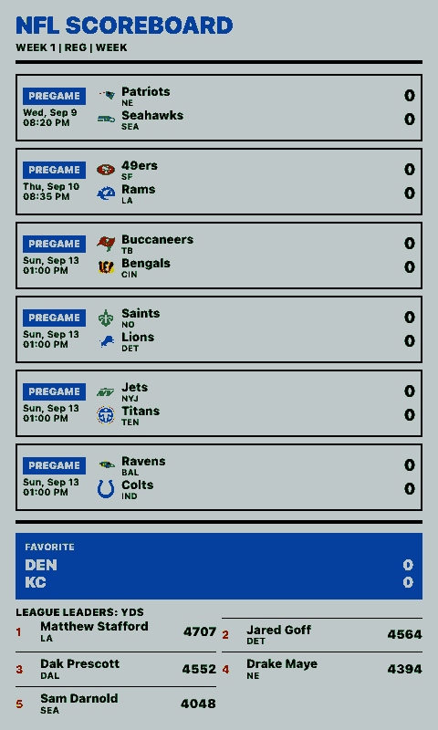
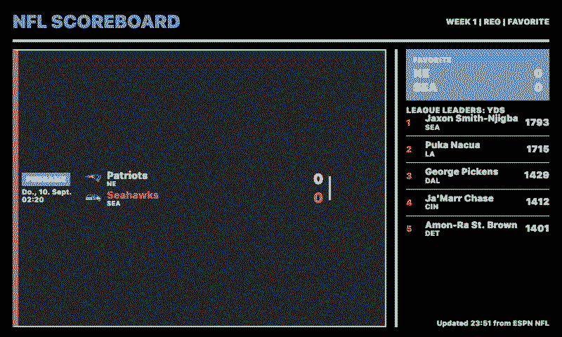
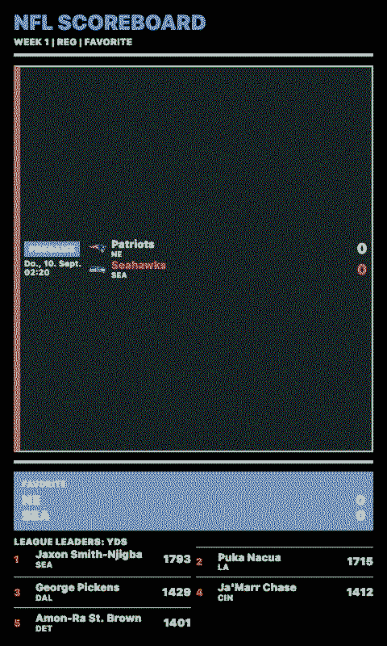

# NFL Scoreboard

NFL dashboard for paperlesspaper OpenIntegrations, inspired by `fewieden/MMM-NFL`.

It uses ESPN's public NFL endpoints to show:

- Live, upcoming, or completed scoreboard rows
- Favorite-team highlighting and optional favorite-only mode
- Game state, clock, possession, red-zone state, score, venue, and records
- Optional league leaders for a selected statistic

Settings:

- `scoreboardMode`: `current`, `week`, or `favorite`
- `team`: favorite NFL team abbreviation
- `season`, `seasonType`, `week`: ESPN scoreboard selectors for week-based views
- `maxGames`: number of scoreboard rows to request; the renderer caps dense landscape layouts for readability
- `showLogos`: whether team logos are shown
- `showLeaders`: whether the leaders panel is shown
- `statType`: ESPN leader category
- `reverseTeams`: display away/home or home/away order
- `locale`, `timeZone`: date and time formatting

## Links

- [Demo](https://integrations.paperlesspaper.de/nfl-scoreboard/run)
- [config.json](./config.json)

## Screenshots

| Landscape | Portrait |
| --- | --- |
|  |  |
|  |  |

## Language Support

This integration declares `language: ["en", "de", "fr", "es", "it"]` and loads localized fixed UI copy from `languages/<code>.json` using the host-selected `payload.meta.language`.
