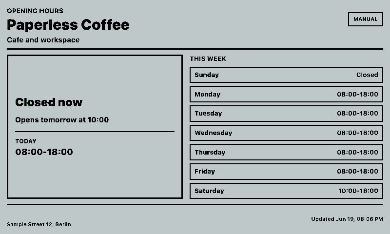
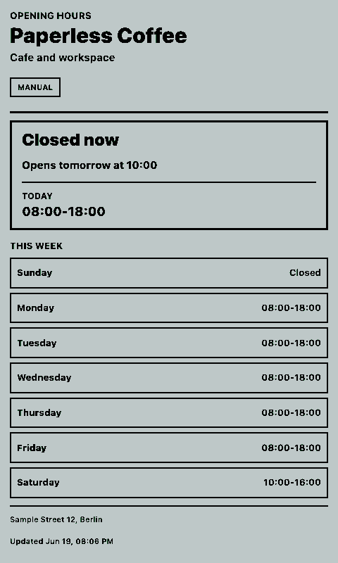
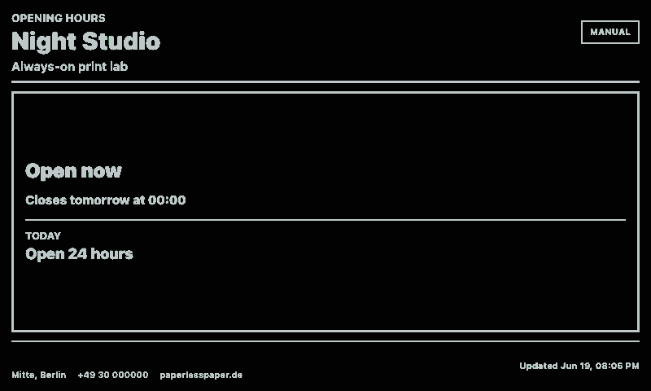
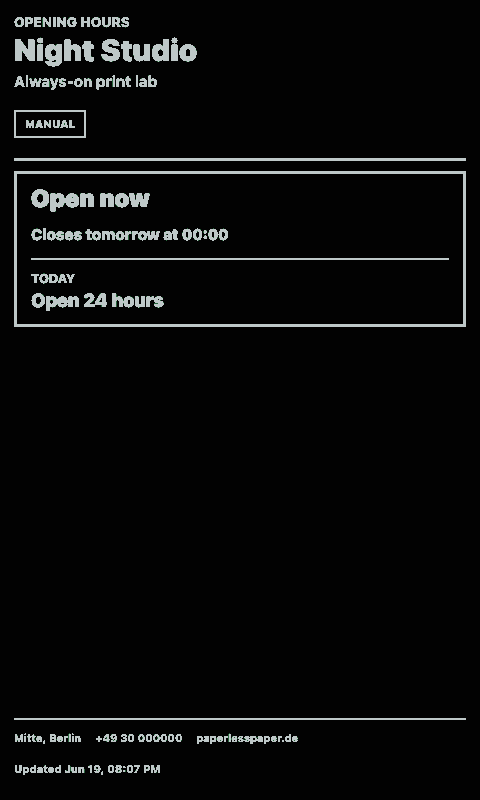

# Opening Hours

OpenIntegration dashboard inspired by TRMNL's Opening hours plugin. It can read live hours from Google Places when `placeId` and `googleMapsApiKey` are configured, and it falls back to manual weekly hours when Google credentials are omitted.

## Links

- [Demo](https://integrations.paperlesspaper.de/opening-hours/run)
- [config.json](./config.json)

## Screenshots

| Landscape | Portrait |
| --- | --- |
|  |  |
|  |  |

## Common URLs

- `/opening-hours/`
- `/opening-hours/?businessName=Paperless%20Coffee`
- `/opening-hours/?placeId=ChIJ...&googleMapsApiKey=...`
- `/opening-hours/config.json`
- `/opening-hours/api/data`

## Settings

- `placeId`: optional Google Places place ID
- `googleMapsApiKey`: optional Google Maps API key, or use `GOOGLE_MAPS_API_KEY` on the server
- `timezone`: IANA timezone for manual schedules
- `monday` through `sunday`: `closed`, `24h`, or comma-separated ranges such as `09:00-13:00,14:00-18:00`
- `showWeeklyHours`: display the full week panel
- `showContact`: display address, phone, website, and Google Maps availability

## Language Support

This integration declares `language: ["en", "de", "fr", "es", "it"]` in `config.json` and loads localized fixed UI copy from `languages/<code>.json` using the host-selected `payload.meta.language`.

The language JSON files localize dashboard labels, empty states, update text, and error titles only. Integration settings such as `locale`, `language`, or external API language codes remain separate.
