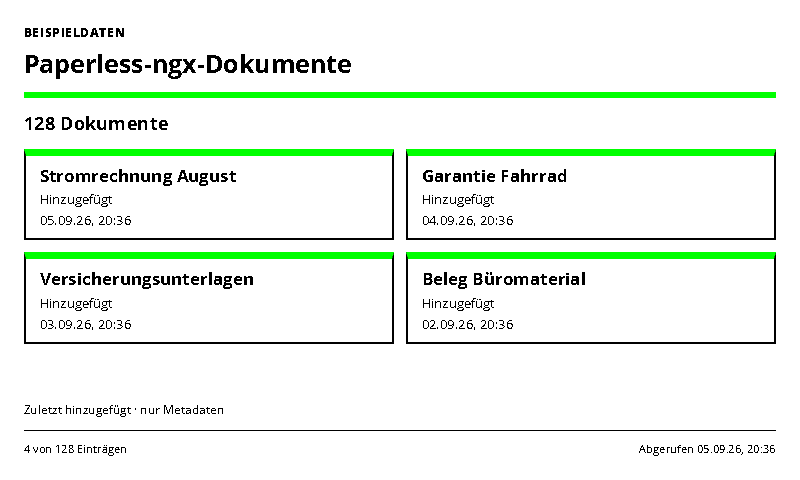
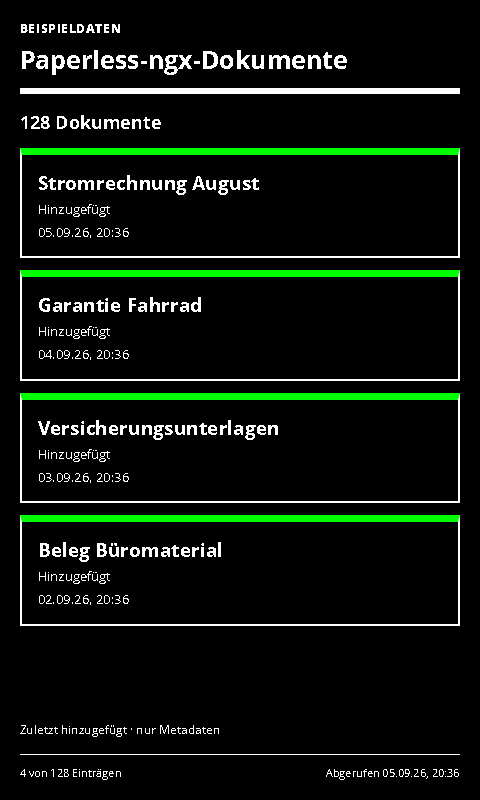

# Paperless-ngx Documents

Document counts and recent additions from a Paperless-ngx instance.

- [Manifest](./config.json)
- Local preview: `http://localhost:3000/paperless-ngx-inbox/run`
- UI languages: German and English; host-selected.
- Theme: `green-light` with blue/green accents and orange where useful. Yellow is not a default accent.

## Setup and scope

Enter your instance base URL and API token, then disable demo data. Use a dedicated account with document read permission. The adapter sends `Authorization: Token …` to the instance, not Bearer authentication. It only reads `/api/documents/`.

Shows the visible document count and up to six most recently added titles. With an optional Paperless-ngx search query, both count and list refer to matching documents. For example, use a query appropriate to your own inbox tag. An empty search shows all documents visible to the token; this is not automatically an unprocessed-inbox count. The displayed time is the document's added timestamp.

Requests only `id,title,added,created` fields and forwards only normalized titles/timestamps/counts to the renderer, even if a provider ignores the field restriction. No PDFs, thumbnails, OCR content or editing actions are exposed. Private document titles are visible on the display. Suggested refresh: 15–30 minutes; no shared response cache.

For a private HTTP instance, set the server environment variable `PAPERLESSPAPER_PRIVATE_API_ORIGINS=http://paperless.local:8000` to the exact origin and restart the provider. The provider must be able to reach the instance. See [private-service configuration](../../docs/dashboard-integrations.md#private-services).

API reference: [Paperless-ngx REST API](https://docs.paperless-ngx.com/api/). Local fixtures cover authentication, search, field selection and result normalization; no private account was connected during implementation.

## Rendering and demo mode

`sampleData: true` uses unmistakably labelled local examples. API failures never silently switch to demo values. The screenshot variants use sample data for reproducible validation; normal defaults are declared in the manifest.

Supports host INIT updates, shared themes, ready/error markers and all four frame sizes. Complete cards are removed when necessary to fit; the footer shows the visible/total count. All displayed timestamps use Europe/Berlin. The source retrieval timestamp remains unchanged while serving a cached response.

Icons are transparent 1024×1024 PNGs; [generation provenance](../../docs/integration-icon-prompts.md). UI graphics use Spectra 6 processing with error diffusion to approximate orange.

## Screenshots

| Light landscape | Dark portrait |
| --- | --- |
|  |  |

Both themes at 800×480, 480×800, 1600×1200 and 1200×1600 are declared in `configVariants`.

## Validation

```sh
npx paperless check applications/paperless-ngx-inbox/config.json
npx paperless render applications/paperless-ngx-inbox/config.json --viewport 800x480 --settings '{"sampleData":true}' --output /tmp/paperless-ngx-inbox.png
npm run check:dashboards
```

Use `PAPERLESSPAPER_TEST_SLUGS=air-quality,river-levels,github-releases,paperless-ngx-inbox npm run check:dashboards -- --render` for the 32 new layout cases and four host-update checks.
