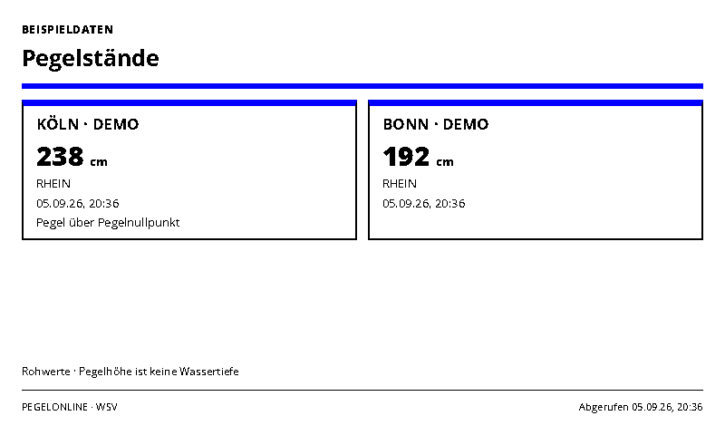
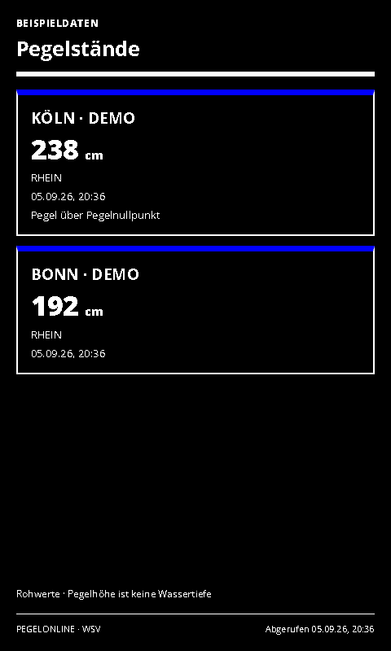

# River Levels

Current water levels at up to three PEGELONLINE stations.

- [Manifest](./config.json)
- Local preview: `http://localhost:3000/river-levels/run`
- UI languages: German and English; host-selected.
- Theme: `blue-light` with blue/green accents and orange where useful. Yellow is not a default accent.

## Setup and scope

Enter up to three station short names or UUIDs, separated by newlines or commas. The default is `KÖLN` and `BONN`. Station names are exact names, not fuzzy city searches. Find names and UUIDs through the [PEGELONLINE station directory](https://www.pegelonline.wsv.de/webservices/rest-api/v2/stations.json). No API key is required.

Shows the latest W-series measurement, its supplied unit, river and observation timestamp. Gauge level is measured relative to the station's gauge zero and is not water depth. Values are raw readings; this view does not derive flood alerts, forecast levels or navigation advice. A failed station remains visibly unavailable; a total failure is an error. Suggested refresh/cache: 5 minutes.

Source and API: [PEGELONLINE / German Federal Waterways and Shipping Administration](https://www.pegelonline.wsv.de/webservice/dokuRestapi). The data endpoint contains the current W-series measurement along with station metadata.

## Rendering and demo mode

`sampleData: true` uses unmistakably labelled local examples. API failures never silently switch to demo values. The screenshot variants use sample data for reproducible validation; normal defaults are declared in the manifest.

Supports host INIT updates, shared themes, ready/error markers and all four frame sizes. Complete cards are removed when necessary to fit; the footer shows the visible/total count. All displayed timestamps use Europe/Berlin. The source retrieval timestamp remains unchanged while serving a cached response.

Icons are transparent 1024×1024 PNGs; [generation provenance](../../docs/integration-icon-prompts.md). UI graphics use Spectra 6 processing with error diffusion to approximate orange.

## Screenshots

| Light landscape | Dark portrait |
| --- | --- |
|  |  |

Both themes at 800×480, 480×800, 1600×1200 and 1200×1600 are declared in `configVariants`.

## Validation

```sh
npx paperless check applications/river-levels/config.json
npx paperless render applications/river-levels/config.json --viewport 800x480 --settings '{"sampleData":true}' --output /tmp/river-levels.png
npm run check:dashboards
```

Use `PAPERLESSPAPER_TEST_SLUGS=air-quality,river-levels,github-releases,paperless-ngx-inbox npm run check:dashboards -- --render` for the 32 new layout cases and four host-update checks.
