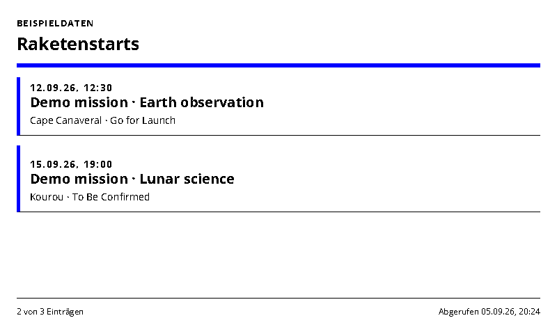
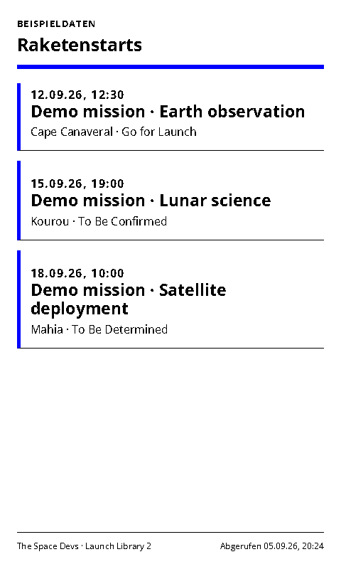
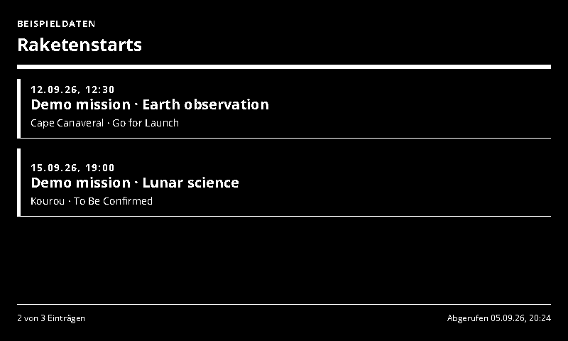
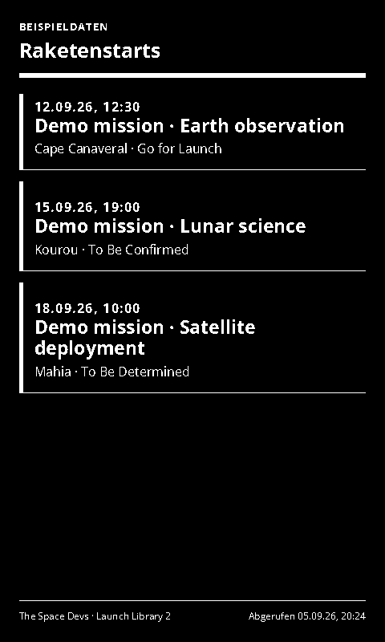

# Rocket Launches

Upcoming launches and schedule status from Launch Library 2.

- [Manifest](./config.json)
- Local preview: `http://localhost:3000/rocket-launches/run`
- Supported UI languages: German and English, selected by the host.
- Default theme: `blue-light`, with deliberate Spectra 6 color accents.

## Setup and behavior

Reads upcoming launches from [The Space Devs Launch Library 2](https://thespacedevs.com/llapi), using its `/2.3.0/launches/upcoming/` endpoint. Optional mission/rocket search, entry count and display timezone are configurable. The display preserves the upstream schedule status, so an estimated or unconfirmed launch is not presented as guaranteed.

Identical queries are cached for 30 minutes to respect the public API's limits. The footer reports the source retrieval time. Suggested refresh: 30–60 minutes. This is a schedule card, not a live second-by-second countdown. Provider access limits can change; a larger rollout may need an API arrangement. Inspiration: [TRMNL Mission Control](https://trmnl.com/recipes/185825).

## Preview and data handling

`sampleData: true` explicitly enables labelled demonstration data. Demo data is never used as a fallback for a failed live connection. Disable demo mode after entering connection settings. All configured screenshot variants use demo data.

The page uses the INIT/update lifecycle, shared theme and ready/error markers. Entry limits and responsive layouts target 800×480, 480×800, 1600×1200 and 1200×1600.

## Screenshots

| Landscape | Portrait |
| --- | --- |
|  |  |
|  |  |

Additional large-format screenshots are declared in `configVariants`.

## Validation

```sh
npx paperless check applications/rocket-launches/config.json
npx paperless render applications/rocket-launches/config.json --viewport 800x480 --settings '{"sampleData":true}' --output /tmp/rocket-launches.png
npm run check:dashboards
npm run check:dashboards -- --render
```

The collection check includes adapter tests; `--render` also generates the two configured variants at four sizes and checks for overflow. Icons and generation prompts: [icon provenance](../../docs/integration-icon-prompts.md).
