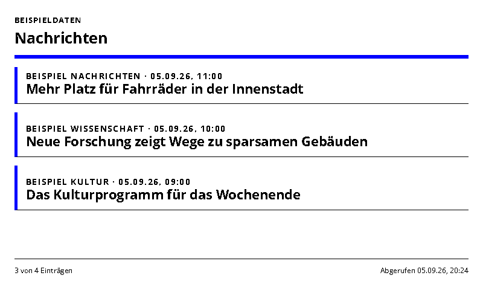
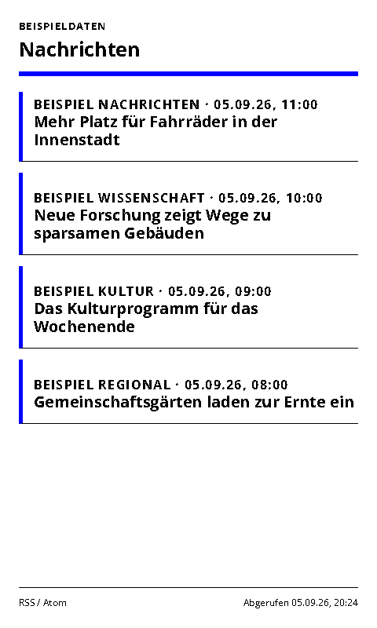
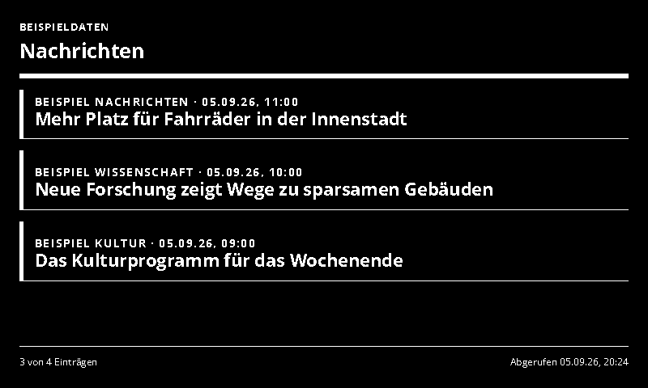
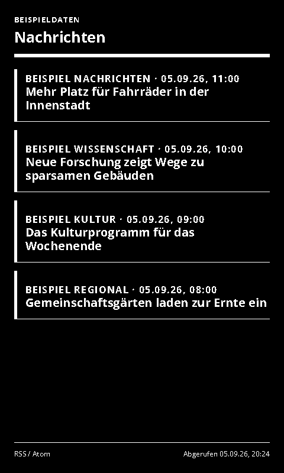

# RSS News

Headlines from up to four RSS or Atom feeds.

- [Manifest](./config.json)
- Local preview: `http://localhost:3000/rss-news/run`
- Supported UI languages: German and English, selected by the host.
- Default theme: `blue-light`, with deliberate Spectra 6 color accents.

## Setup and behavior

Enter one to four HTTPS RSS or Atom feed URLs, one per line. Public feeds work immediately; no account is needed. Items are sorted newest first and deduplicated by link (or title if no valid link exists). Missing dates remain unknown. Provider HTML is reduced to plain text and escaped on display. XML DTDs/entities and malformed feeds are rejected.

The display shows headlines, source names and publication times, with a bounded entry count. A partial-source notice appears if some feeds fail; failure of all feeds produces an error rather than a fabricated empty feed. This first version is text-only and does not copy full articles. Suggested refresh: 15–30 minutes. Inspiration: [TRMNL All Your News](https://trmnl.com/recipes/182990).

## Preview and data handling

`sampleData: true` explicitly enables labelled demonstration data. Demo data is never used as a fallback for a failed live connection. Disable demo mode after entering connection settings. All configured screenshot variants use demo data.

The page uses the INIT/update lifecycle, shared theme and ready/error markers. Entry limits and responsive layouts target 800×480, 480×800, 1600×1200 and 1200×1600.

## Screenshots

| Landscape | Portrait |
| --- | --- |
|  |  |
|  |  |

Additional large-format screenshots are declared in `configVariants`.

## Validation

```sh
npx paperless check applications/rss-news/config.json
npx paperless render applications/rss-news/config.json --viewport 800x480 --settings '{"sampleData":true}' --output /tmp/rss-news.png
npm run check:dashboards
npm run check:dashboards -- --render
```

The collection check includes adapter tests; `--render` also generates the two configured variants at four sizes and checks for overflow. Icons and generation prompts: [icon provenance](../../docs/integration-icon-prompts.md).
