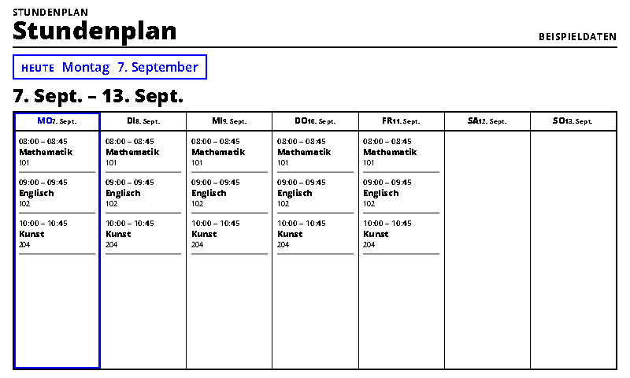
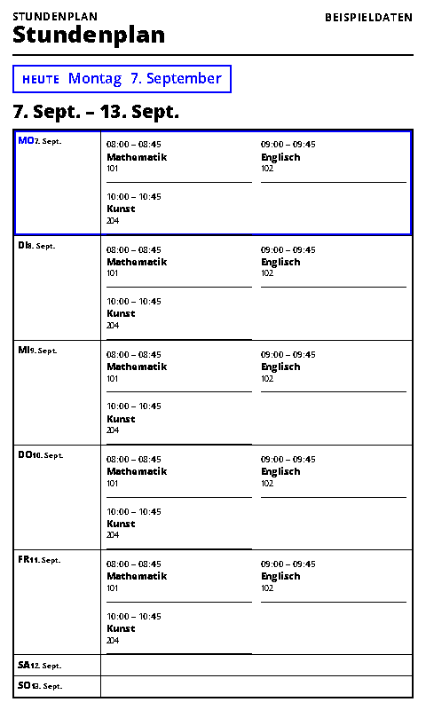
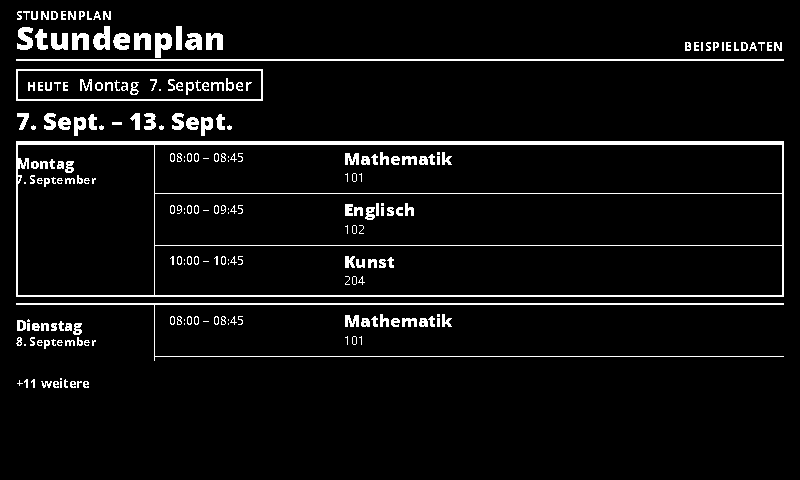
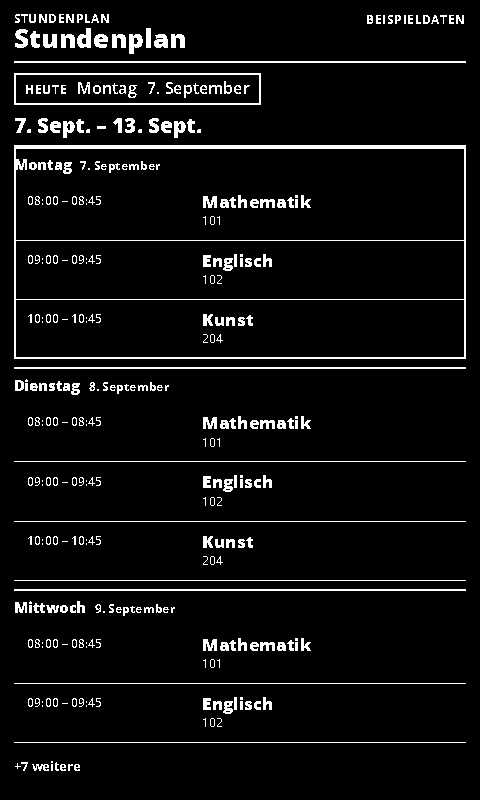

# School Timetable

Manually maintained lessons in the shared calendar layouts.

- [Manifest](./config.json)
- Local preview: `http://localhost:3000/school-timetable/run`
- Supported UI languages: German and English, selected by the host.
- Default theme: `blue-light`, with deliberate Spectra 6 color accents.

## Setup and behavior

Uses the shared OpenIntegration calendar renderer for agenda, day, three-day, week and year views. Start in demo mode, then disable `sampleData` and enter one lesson per line:

```text
1 | 08:00 | 08:45 | Mathematics | Room 101
1 | 09:00 | 09:45 | English | Room 102
2 | 10:00 | 10:45 | Art | Studio
```

Weekdays are ISO numbers: Monday = 1 through Sunday = 7. Times use 24-hour `HH:MM`. End must be later than start. Rooms are optional. Up to 100 weekly lesson definitions are expanded within the requested date range, using the selected IANA timezone across daylight-saving transitions. For larger text on small displays, choose day or three-day view.

This is a manually maintained recurring timetable. It does not connect to school portals or automatically apply school holidays, cancellations or substitutions. The `now` setting is for reproducible previews; leave it empty for normal operation.

Agenda presentation is capped at four events on short landscape screens, eight
on narrow portrait screens and twenty on larger screens. The shared renderer
shows its remaining-event indicator; the upstream fetch still covers the complete
requested date range.

## Preview and data handling

`sampleData: true` explicitly enables labelled demonstration data. Demo data is never used as a fallback for a failed live connection. Disable demo mode after entering connection settings. All configured screenshot variants use demo data.

The page uses the INIT/update lifecycle, shared theme and ready/error markers. Entry limits and responsive layouts target 800×480, 480×800, 1600×1200 and 1200×1600.

## Screenshots

| Landscape | Portrait |
| --- | --- |
|  |  |
|  |  |

Additional large-format screenshots are declared in `configVariants`.

## Validation

```sh
npx paperless check applications/school-timetable/config.json
npx paperless render applications/school-timetable/config.json --viewport 800x480 --settings '{"sampleData":true}' --output /tmp/school-timetable.png
npm run check:dashboards
npm run check:dashboards -- --render
```

The collection check includes adapter tests; `--render` also generates the two configured variants at four sizes and checks for overflow. Icons and generation prompts: [icon provenance](../../docs/integration-icon-prompts.md).
