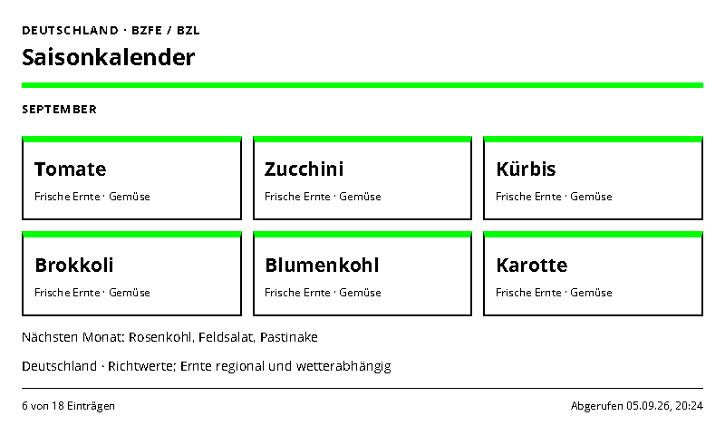
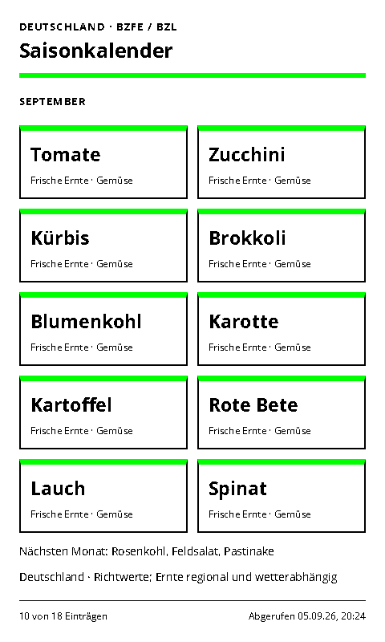
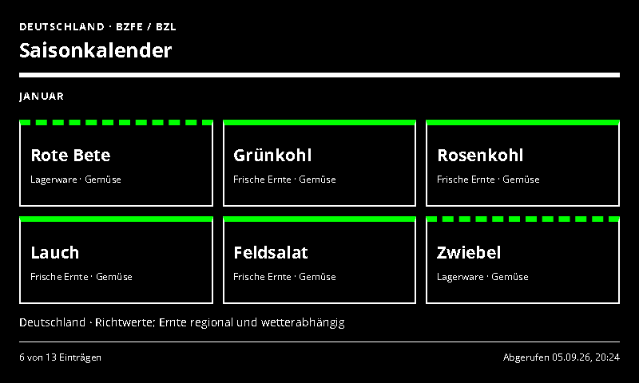
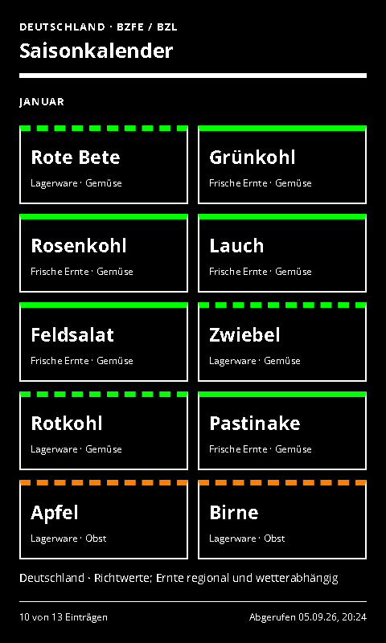

# Seasonal Produce

Seasonal German produce, with fresh harvest and storage distinguished.

- [Manifest](./config.json)
- Local preview: `http://localhost:3000/seasonal-produce/run`
- Supported UI languages: German and English, selected by the host.
- Default theme: `green-light`, with deliberate Spectra 6 color accents.

## Setup and behavior

Works without an account or external runtime request. Choose a month (`0` means the current month in Europe/Berlin), fruit/vegetables/all, and whether stored produce should be included. A daily rotation shows a bounded subset, with an explicit shown/total count. Green and yellow category borders use Spectra 6 colors; stored produce also has a dashed border and a written label.

`assets/produce.json` is a small, manually maintained **approximate German harvest guide**, not a live availability feed or a comprehensive reproduction of another publisher's calendar. Fresh harvest and storage months are separate. Regional weather, varieties and storage conditions vary. Editorial references: [BZfE season calendar overview](https://www.bzfe.de/kueche-und-alltag/einkaufen/der-saisonkalender) and [BZL harvesting through the year](https://www.landwirtschaft.de/garten/selbst-anbauen/obst-und-gemuese-rund-ums-jahr-ernten). The integration does not import their copyrighted artwork. Other countries are not currently modeled.

## Preview and data handling

The page uses the INIT/update lifecycle, shared theme and ready/error markers. Entry limits and responsive layouts target 800×480, 480×800, 1600×1200 and 1200×1600.

## Screenshots

| Landscape | Portrait |
| --- | --- |
|  |  |
|  |  |

Additional large-format screenshots are declared in `configVariants`.

## Validation

```sh
npx paperless check applications/seasonal-produce/config.json
npx paperless render applications/seasonal-produce/config.json --viewport 800x480 --settings '{"sampleData":true}' --output /tmp/seasonal-produce.png
npm run check:dashboards
npm run check:dashboards -- --render
```

The collection check includes adapter tests; `--render` also generates the two configured variants at four sizes and checks for overflow. Icons and generation prompts: [icon provenance](../../docs/integration-icon-prompts.md).
