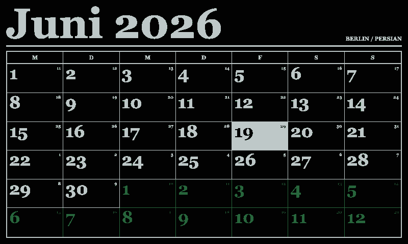
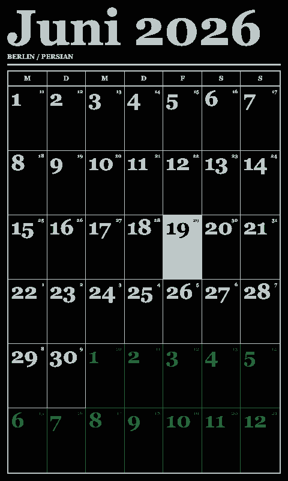
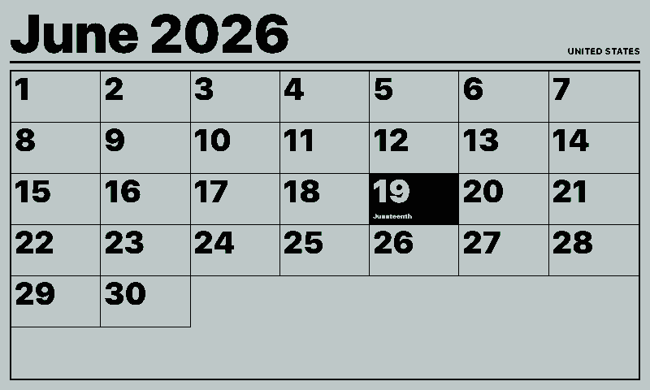
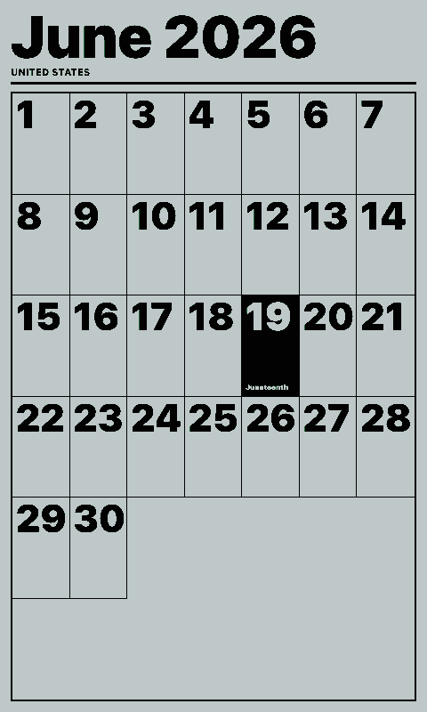

# Simple Calendar

Monthly calendar integration.

## Links

- [Demo](https://integrations.paperlesspaper.de/simple-calendar/run)
- [config.json](./config.json)

## Screenshots

| Landscape                                                                                                                                                             | Portrait                                                                                                                                                            |
| --------------------------------------------------------------------------------------------------------------------------------------------------------------------- | ------------------------------------------------------------------------------------------------------------------------------------------------------------------- |
|  |  |
|                          |                          |

## Settings

- `locale`: BCP 47 locale for month and weekday labels, for example `en-US`, `de-DE`, `fr-FR`, or `ja-JP`.
- `monthOffset`: start month offset, where `0` is this month and `11` is eleven months ahead.
- `monthCount`: number of consecutive months to show, from `1` through `3`.
- `weekStart`: first day of the week, from `sunday` through `saturday`.
- `weeklyHoliday`: highlights one recurring weekday, or `off`.
- `holidayRegion`: optional local public holiday highlights for a compact set of countries and regions.
- `alternateCalendar`: optional small alternate day numbers using the browser Intl calendar support.
- `fontFamily`: `system`, `serif`, or `mono`.
- `density`: `compact`, `regular`, or `large`.
- `weekdayLabels`: `short` or `full`.
- `hideTitleBar`: hides the month title area.
- `shortMonthLabel`: uses a short month label in the title.

## Local preview

```sh
npm run dev -- ../paperlesspaper-integrations/openintegrations/applications/simple-calendar/config.json
```

## Language Support

This integration declares `language: ["en", "de", "fr", "es", "it"]` in `config.json` and loads localized fixed UI copy from `languages/<code>.json` using the host-selected `payload.meta.language`.

The language JSON files localize dashboard labels, empty states, update text, and error titles only. Integration settings such as `locale`, `language`, or external API language codes remain separate.
