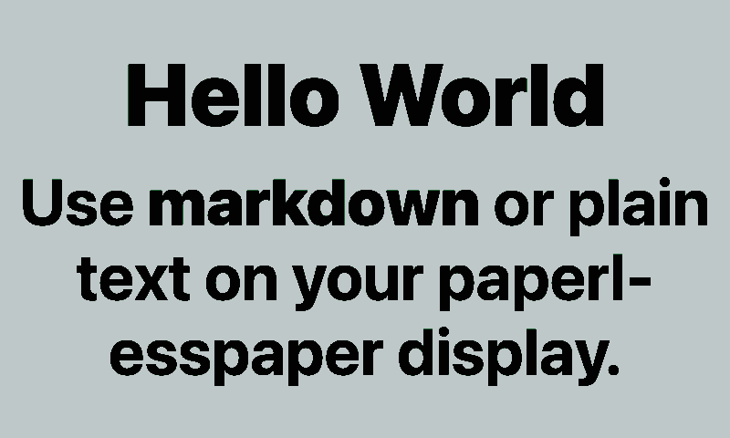
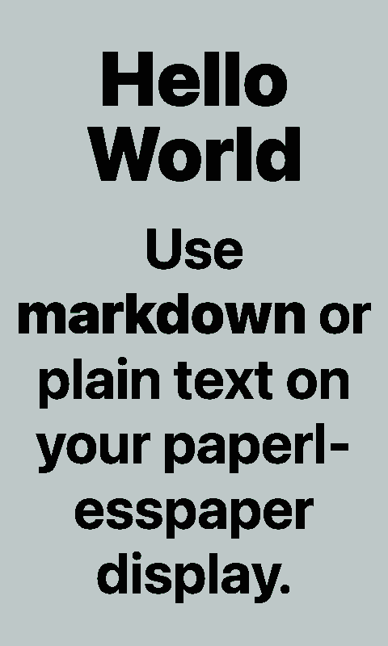
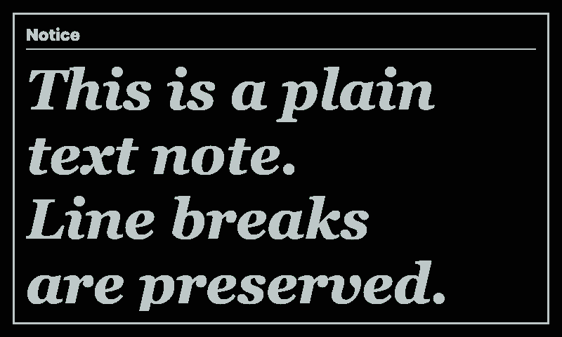
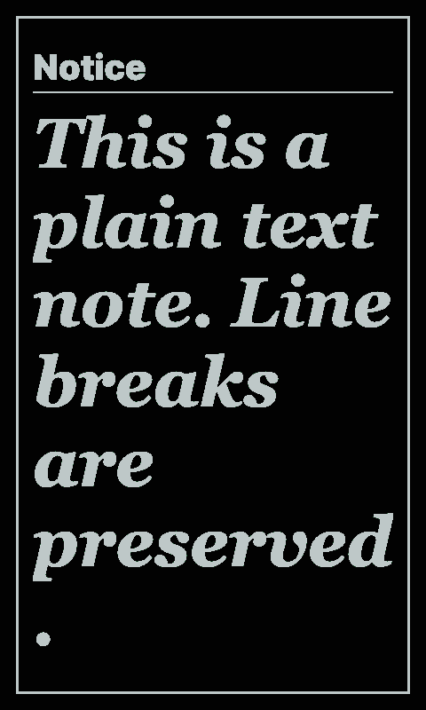

# Simple Text

Displays configurable plain text or markdown on a paperlesspaper display. It is inspired by MagicMirror's `MMM-SimpleText`: the integration keeps the direct text, font, style, size, and alignment controls, then adds a markdown render mode for headings, lists, quotes, links, inline emphasis, and code.

## Links

- [Demo](https://integrations.paperlesspaper.de/simple-text/run)
- [config.json](./config.json)

## Screenshots

| Landscape | Portrait |
| --- | --- |
|  |  |
|  |  |

## Settings

- `title`: optional heading above the content.
- `content`: the plain text or markdown to render.
- `format`: choose `plain` or `markdown`.
- `fontFamily`: choose `system`, `serif`, or `mono`.
- `fontSize`: choose from `xx-small` through `xx-large`.
- `fontStyle`: choose `normal` or `italic`.
- `fontWeight`: choose a CSS font weight.
- `textAlign`: align the content horizontally.
- `verticalAlign`: place the content at the top, center, or bottom.
- `lineHeight`: adjust line spacing.
- `showFrame`: draw a simple border around the content.

## Local URLs

```txt
http://localhost:3000/simple-text/
http://localhost:3000/simple-text/config.json
```
