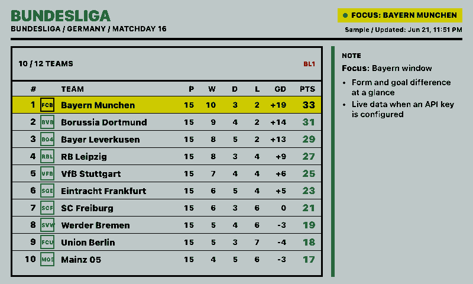
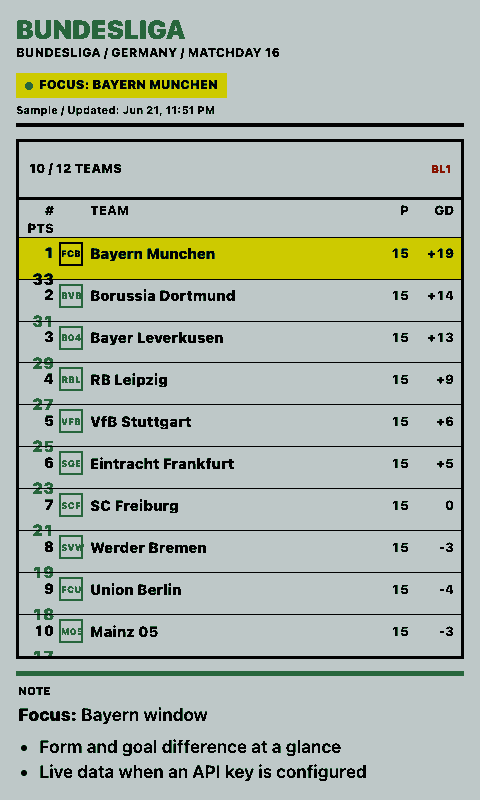
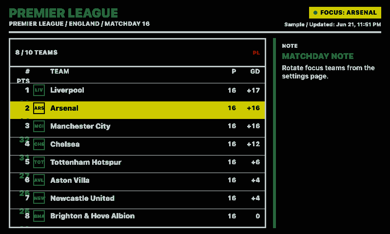
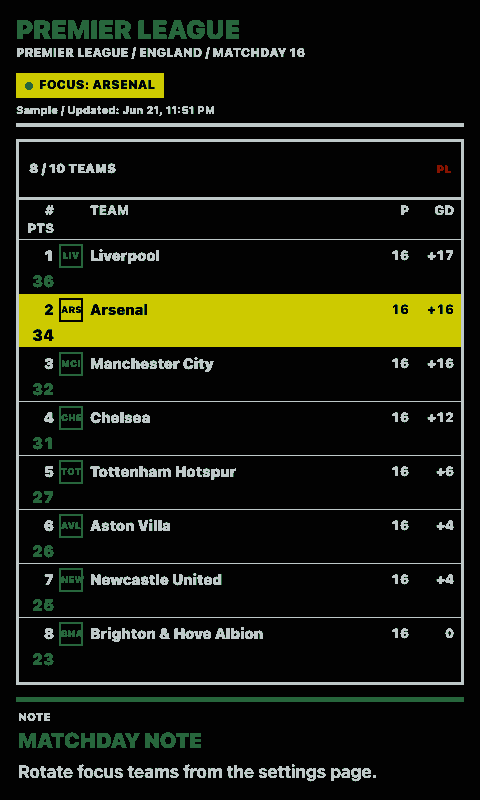

# Soccer Standings

Shows a compact European soccer league table inspired by `fewieden/MMM-soccer`, adapted for paperlesspaper Open Integrations.

The integration can display live `football-data.org` standings when an API key is configured. Without a key it renders deterministic sample standings, which keeps previews and screenshots useful.

## Links

- [Demo](https://integrations.paperlesspaper.de/soccer-standings/run)
- [config.json](./config.json)

## Screenshots

| Landscape | Portrait |
| --- | --- |
|  |  |
|  |  |

## Settings

| Setting | Purpose |
| --- | --- |
| `competition` | League code such as `BL1`, `PL`, `PD`, `SA`, `FL1`, `DED`, `PPL`, or `CL`. |
| `apiKey` | Optional `football-data.org` token. Leave blank to use `FOOTBALL_DATA_API_KEY` from `.env`. |
| `focusTeam` | Optional team name, short name, or TLA. The rendered table centers around the match when possible. |
| `maxTeams` | Maximum rows to show. Use `0` for the full table. |
| `showCrests` | Shows team crests from live data, or compact initials for sample data. |
| `compact` | Uses a denser table with fewer form columns. |
| `headline` | Plain text headline displayed above the table. |
| `markdown` | Optional markdown note displayed beside or below the table. |
| `markdownUrl` | Optional HTTP(S) URL to a raw markdown file. When set, the remote file is displayed instead of `markdown`. |

Supported markdown is intentionally small and safe: headings, bold, italic, inline code, links, blockquotes, unordered lists, ordered lists, and paragraphs.

## Local Preview

```sh
npm start
```

Then open:

```txt
http://localhost:3000/soccer-standings/run
```

The manifest is available at:

```txt
http://localhost:3000/soccer-standings/config.json
```
