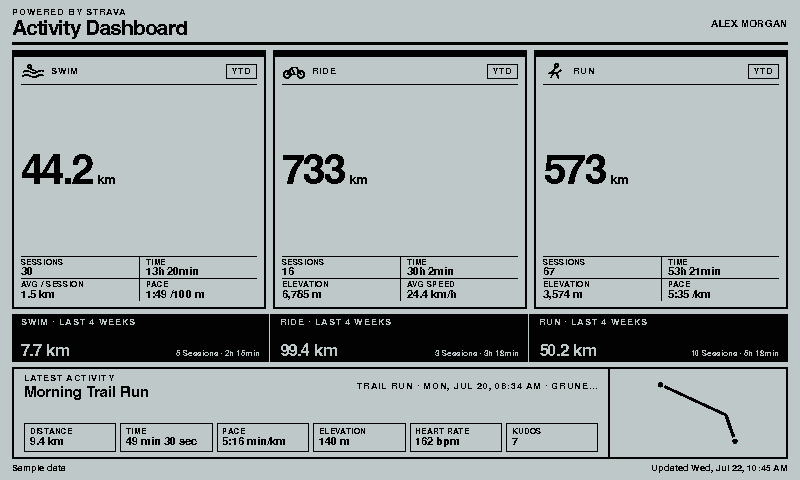
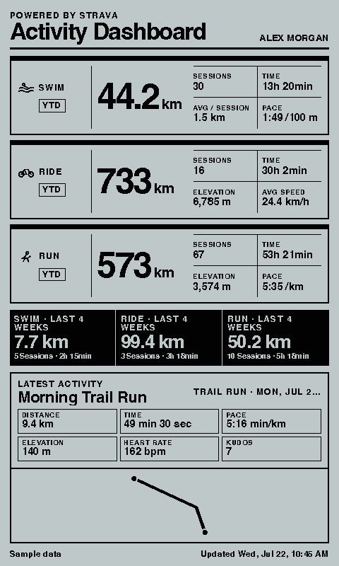
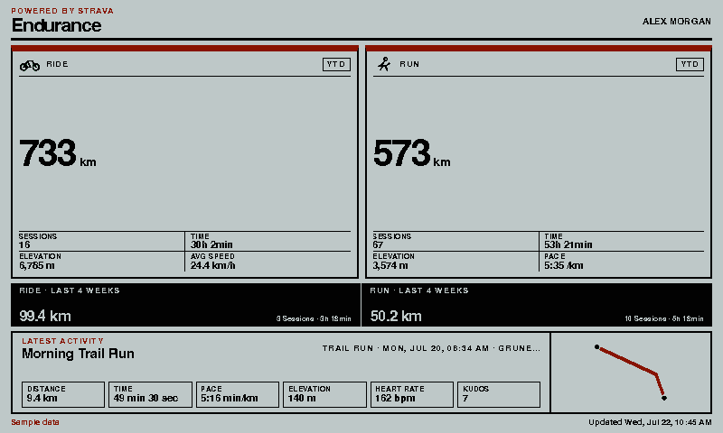
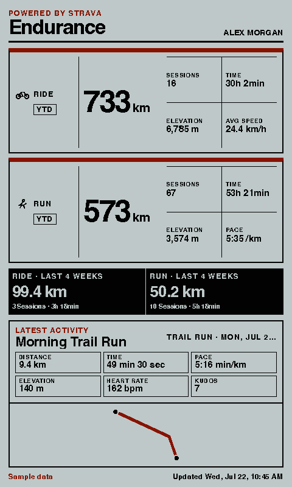

# Strava Dashboard

Shows a high-contrast Strava activity dashboard on a paperlesspaper display. The
layout combines year-to-date totals for swimming, cycling, and running with a
rolling four-week summary and the latest activity, including a route trace when
one is available.

This version connects directly to the official Strava API. It does **not** use
Home Assistant or require `ha_strava`.

## Links

- [Demo](https://integrations.paperlesspaper.de/strava-dashboard/run)
- [config.json](./config.json)
- [Strava authentication](https://developers.strava.com/docs/authentication/)
- [Strava API reference](https://developers.strava.com/docs/reference/)

## Screenshots

| Landscape | Portrait |
| --- | --- |
|  |  |
|  |  |

## Setup

1. Open [Strava API settings](https://www.strava.com/settings/api) and create a
   personal API application.
2. Open this integration's **Connect Strava** settings page. It shows the
   callback domain and full redirect URI for the current installation.
3. Put the displayed domain in Strava's **Authorization Callback Domain**.
4. Copy the app's client ID and client secret into the integration settings.
5. Select **Connect with Strava**, approve the read-only `read` and
   `activity:read_all` scopes, and return to paperlesspaper.
6. Use **Test connection** to verify the athlete and save any refreshed token.

The integration stores the client secret, access token, and refresh token with
the paper's plugin settings. Treat the paper configuration as sensitive. Do not
share its URL or settings payload, and revoke the app in Strava when it is no
longer used.

If no Strava credentials are configured, deterministic sample data is rendered
for previews and screenshots. A self-hosted integrations server can alternatively
provide `STRAVA_CLIENT_ID`, `STRAVA_CLIENT_SECRET`, `STRAVA_ACCESS_TOKEN`,
`STRAVA_REFRESH_TOKEN`, `STRAVA_EXPIRES_AT`, and `STRAVA_ATHLETE_ID` as
environment variables.

## Settings

- `title`: optional custom dashboard title.
- `clientId`, `clientSecret`: credentials for the user's Strava API app.
- `accessToken`, `refreshToken`, `expiresAt`: OAuth credentials managed by the
  Connect Strava page and token refresh flow.
- `athleteId`, `athleteName`: connected athlete metadata.
- `activityTypes`: ordered selection of `swim`, `ride`, and `run` summary cards.
- `units`: metric (`km`, `m`, `km/h`) or imperial (`mi`, `ft`, `mph`).
- `timezone`: IANA timezone used for the latest activity and update time.
- `showRecent`: show the rolling four-week strip.
- `showLatest`: show the latest activity panel.
- `showRoute`: draw the latest activity polyline when available.
- `showSource`: show the data source and update time.

## API behavior

`GET /strava-dashboard/api/data` is the server-side adapter. It refreshes a
short-lived Strava access token when necessary, reads the authenticated athlete,
paginates the current year's activities, and fetches the newest activity's
detailed representation. It calculates YTD and rolling 28-day totals from those
authorized activities, so activities set to **Only You** can be counted when the
athlete granted `activity:read_all`.

Strava can rotate its refresh token whenever a new access token is issued. The
adapter returns the newest token values and the render page sends a standard
OpenIntegration `UPDATE_SETTINGS` patch so the host can persist them. Always use
the latest returned refresh token; an older token stops working after rotation.

The activity list is capped at five pages of 200 activities per refresh to keep
API use bounded. Summary cards are limited to swim, ride, and run; the latest
activity panel can show any sport type returned by Strava. The integration is
read-only and never creates or edits Strava data.

## References and inspiration

- [`craibo/ha_strava`](https://github.com/craibo/ha_strava) — inspiration for
  the activity summary data model. It is no longer a runtime dependency.
- [“ReTerminal E1003 + data from Strava” on r/eink](https://www.reddit.com/r/eink/comments/1uw9pmw/reterminal_e1003_data_from_strava/)
  — inspiration for the YTD cards, four-week strip, latest-activity metrics, and
  route-focused eInk layout.
- [TRMNL STRMNL integration](https://trmnl.com/integrations/strmnl) — a compact
  Strava display reference that motivated the richer summary view.
- [Strava OAuth documentation](https://developers.strava.com/docs/authentication/)
  — authorization, scopes, token exchange, and refresh-token rotation.
- [Strava API reference](https://developers.strava.com/docs/reference/) —
  authenticated athlete, activity list, and detailed activity definitions.
- [Strava API rate limits](https://developers.strava.com/docs/rate-limits/) —
  request-budget behavior considered by the bounded pagination.

This is an unofficial integration and is not affiliated with or endorsed by
Strava. Strava and the Strava marks are trademarks of Strava, Inc.
