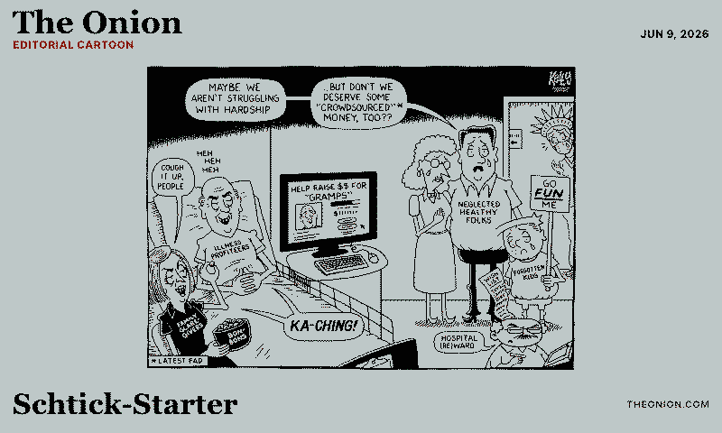
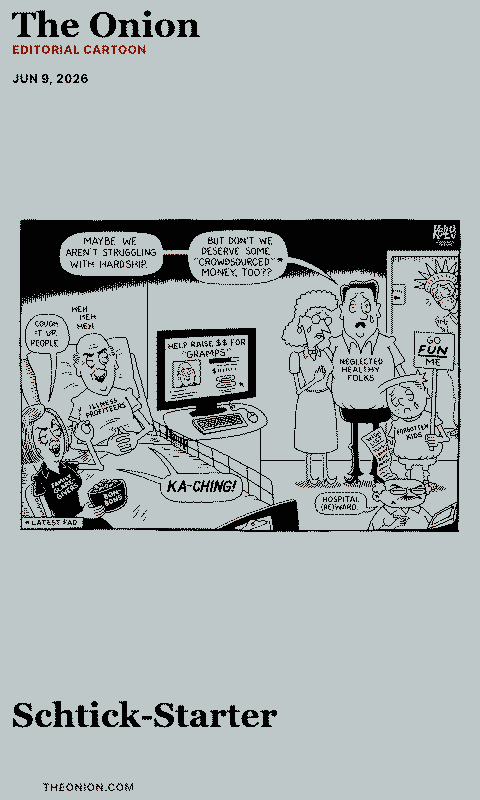
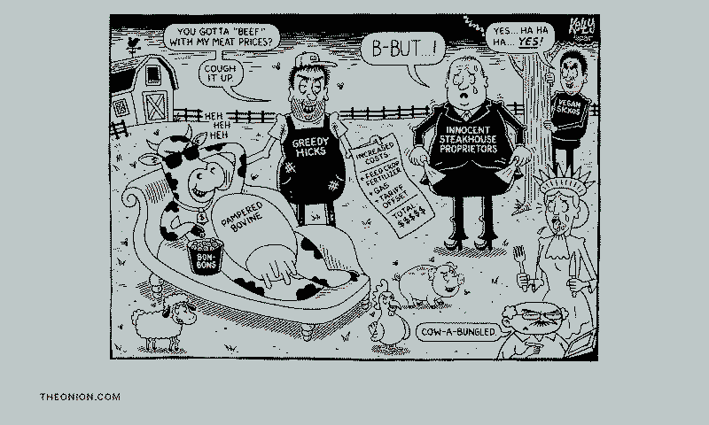
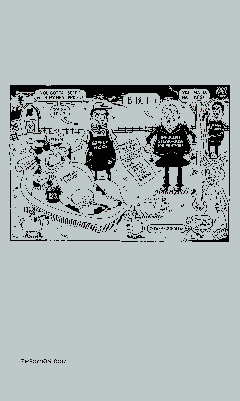

# The Onion - Editorial Cartoon

Displays a recent cartoon from The Onion's `Cartoons` category, inspired by TRMNL recipe 32609.

## Links

- [Demo](https://integrations.paperlesspaper.de/the-onion-editorial-cartoon/run)
- [config.json](./config.json)

## Screenshots

| Landscape | Portrait |
| --- | --- |
|  |  |
|  |  |

## Settings

- `selection`: `latest`, `random`, or `offset`
- `offset`: number of cartoons behind the newest item when `selection` is `offset`
- `showTitle`: show or hide the cartoon title
- `showDate`: show or hide the publication date

## Data source

The integration reads The Onion's public WordPress REST API:

```txt
https://theonion.com/wp-json/wp/v2/posts?categories=977&per_page=20&_embed=1
```

## Language Support

This integration declares `language: ["en", "de", "fr", "es", "it"]` in `config.json` and loads localized fixed UI copy from `languages/<code>.json` using the host-selected `payload.meta.language`.

The language JSON files localize dashboard labels, empty states, update text, and error titles only. Integration settings such as `locale`, `language`, or external API language codes remain separate.
