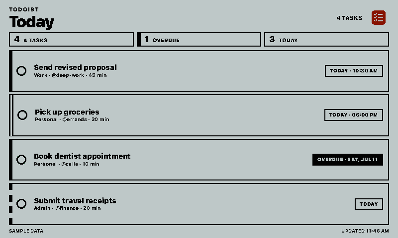
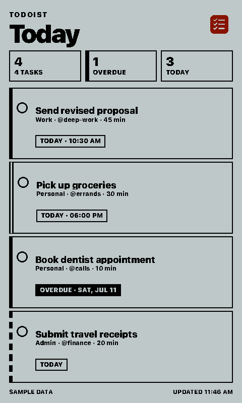
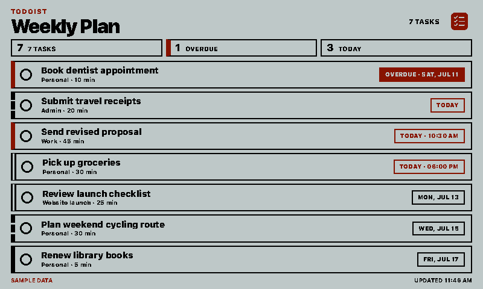
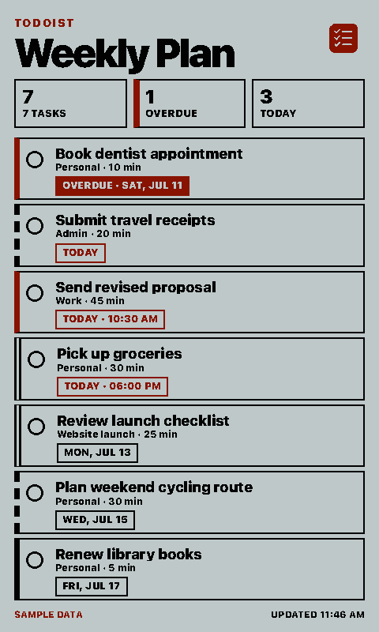

# Todoist

Shows active Todoist tasks on a paperlesspaper display. Choose a focused view for
today, the next seven days, one project, a custom Todoist filter, or all active
tasks. The integration is display-only and never creates, completes, or edits a
task.

## Links

- [Demo](https://integrations.paperlesspaper.de/todoist/run)
- [config.json](./config.json)
- [Todoist API v1](https://developer.todoist.com/api/v1/)

## Screenshots

| Landscape | Portrait |
| --- | --- |
|  |  |
|  |  |

## Setup

1. Open Todoist and go to **Settings → Integrations → Developer**.
2. Copy the personal API token.
3. Paste it into the integration's **Todoist API token** setting.
4. Choose a task view and refresh interval.

The server can alternatively provide `TODOIST_API_TOKEN` through its environment.
Without a token the integration renders deterministic sample data for previews.

## Settings

- `title`: Optional custom heading.
- `apiToken`: Personal Todoist API token, sent as a Bearer token to Todoist.
- `view`: `today`, `upcoming`, `project`, `custom`, or `all`.
- `filter`: Todoist filter expression used by the `custom` view.
- `projectId`: Required by the `project` view.
- `limit`: Maximum displayed tasks, from 1 to 12.
- `sortBy`: Preserve Todoist order, or sort by due date or priority.
- `timezone`: IANA timezone used to classify and format due dates.
- `showStats`: Show matched, overdue, and today counts.
- `showProject`: Include project names in task metadata.
- `showLabels`: Include Todoist labels.
- `showDescription`: Include the first line of task descriptions.
- `showDuration`: Include Todoist task durations.

## API behavior

The integration uses the current Todoist API v1 task endpoints. Today and upcoming
views use `GET /api/v1/tasks/filter`; project and all-task views use
`GET /api/v1/tasks`. Project names come from `GET /api/v1/projects`. Requests are
read-only, use cursor-aware response shapes, and cap upstream pages at 200 items
before applying the display limit.

## Language support

The integration declares English, German, French, Spanish, and Italian. Fixed UI
copy is loaded from `languages/<code>.json`; Todoist custom filter expressions are
sent with the selected host language.
