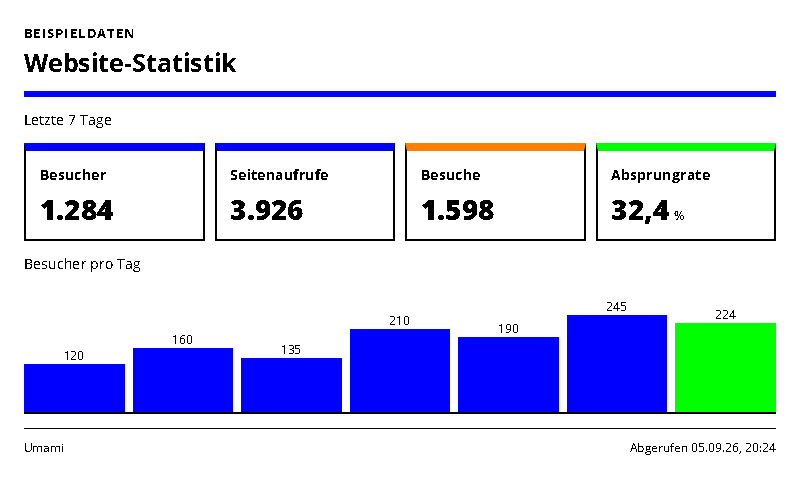
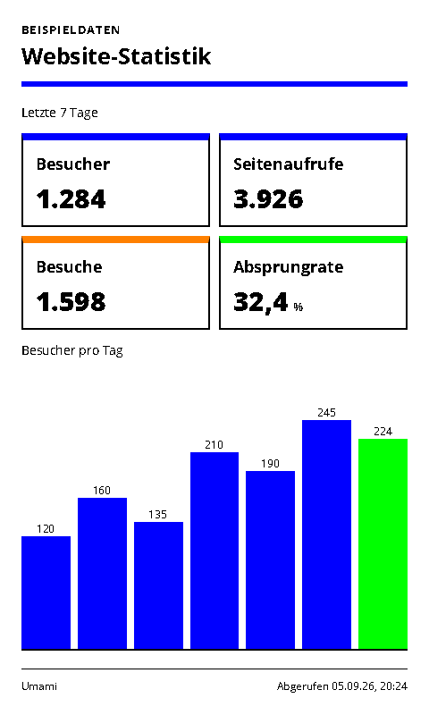
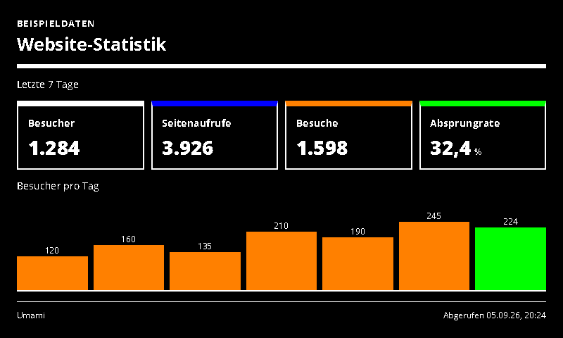
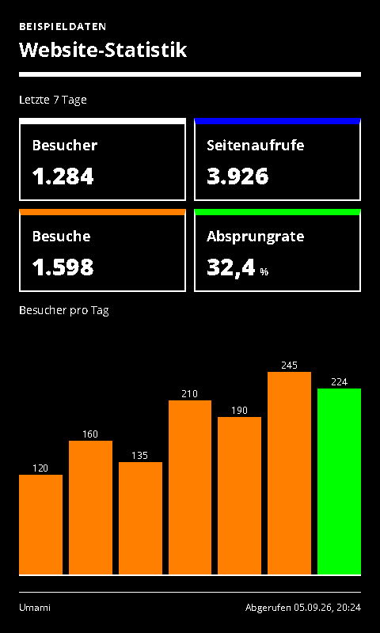

# Umami Stats

Visitors, pageviews, visits and a daily visitors chart from Umami.

- [Manifest](./config.json)
- Local preview: `http://localhost:3000/umami-stats/run`
- Supported UI languages: German and English, selected by the host.
- Default theme: `blue-light`, with deliberate Spectra 6 color accents.

## Setup and behavior

Select Umami Cloud or self-hosted, enter the website ID and token, and disable `sampleData`. Cloud uses `https://api.umami.is/v1` with a Bearer API key, following the [current Cloud documentation](https://docs.umami.is/docs/cloud/api-key). Self-hosted uses the instance base URL plus `/api` and a Bearer access token obtained through Umami's login API; expired tokens must be replaced.

The adapter reads summarized stats and daily series for the trailing 1–30 days, in the chosen timezone. It displays visitors, pageviews, visits, calculated bounce rate and a daily visitor chart. It supports both numeric and older `{ value }` summary fields, rejecting missing metrics instead of inventing zeroes. The current day can be partial. Suggested refresh: 30 minutes. [Statistics API](https://docs.umami.is/docs/api/website-stats).

## Preview and data handling

`sampleData: true` explicitly enables labelled demonstration data. Demo data is never used as a fallback for a failed live connection. Disable demo mode after entering connection settings. All configured screenshot variants use demo data.

Connection values are sent to the same-origin adapter in a JSON POST body, not in render-page query strings. Tokens use password-type form inputs. The trusted renderer and integration server still receive these secrets; deploy on trusted HTTPS infrastructure. Do not paste live secrets into shareable demo links.

For private/local services, see [server network configuration](../../docs/dashboard-integrations.md#private-services). A hosted renderer cannot automatically reach your home network.

The page uses the INIT/update lifecycle, shared theme and ready/error markers. Entry limits and responsive layouts target 800×480, 480×800, 1600×1200 and 1200×1600.

## Screenshots

| Landscape | Portrait |
| --- | --- |
|  |  |
|  |  |

Additional large-format screenshots are declared in `configVariants`.

## Validation

```sh
npx paperless check applications/umami-stats/config.json
npx paperless render applications/umami-stats/config.json --viewport 800x480 --settings '{"sampleData":true}' --output /tmp/umami-stats.png
npm run check:dashboards
npm run check:dashboards -- --render
```

The collection check includes adapter tests; `--render` also generates the two configured variants at four sizes and checks for overflow. Icons and generation prompts: [icon provenance](../../docs/integration-icon-prompts.md).
