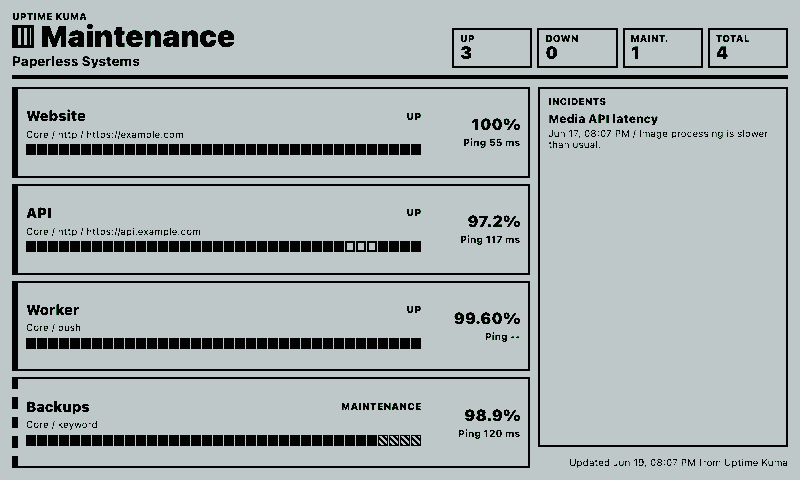
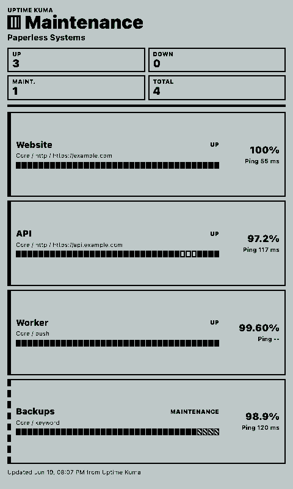
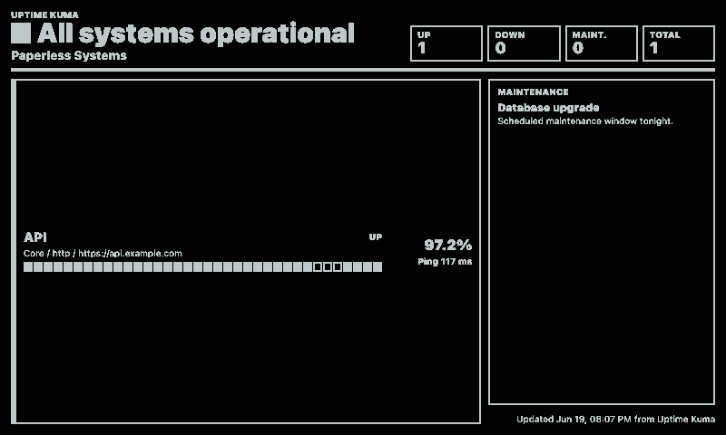
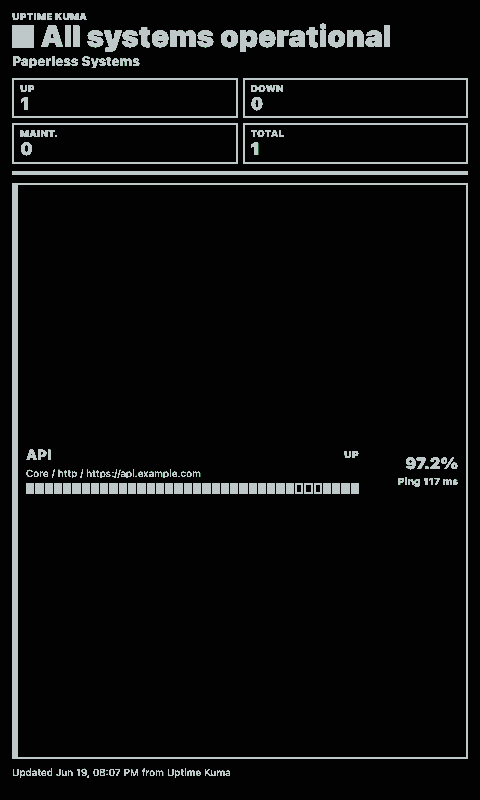

# Uptime Kuma Monitor

Shows public Uptime Kuma status-page monitors on a paperlesspaper display.

## Links

- [Demo](https://integrations.paperlesspaper.de/uptime-kuma-monitor/run)
- [config.json](./config.json)

## Screenshots

| Landscape | Portrait |
| --- | --- |
|  |  |
|  |  |

## Settings

- `baseUrl`: Uptime Kuma base URL, for example `https://status.example.com`. Leave blank to use `UPTIME_KUMA_BASE_URL` from `.env` or render sample data.
- `slug`: status page slug from `/status/{slug}`. Use `default` for the default status page.
- `monitor`: optional monitor ID or part of a monitor name. Leave blank for the status-page overview.
- `limit`: maximum number of public monitors to show.
- `showIncidents`: shows active status-page incidents.
- `showMaintenance`: shows active maintenance entries.
- `showHeartbeats`: shows the latest public heartbeat strip for each monitor.
- `showPing`: shows latest or average ping where Uptime Kuma exposes one.
- `timeoutMs`: request timeout for the Uptime Kuma public API.

## Local preview

```sh
npm run dev -- ../paperlesspaper-integrations/openintegrations/applications/uptime-kuma-monitor/config.json
```

With a real status page:

```sh
npm run dev -- ../paperlesspaper-integrations/openintegrations/applications/uptime-kuma-monitor/config.json -- --settings '{"baseUrl":"https://status.example.com","slug":"default","monitor":"","limit":6}'
```

When `baseUrl` is blank, the API adapter falls back to sample data so screenshots and local previews still render.

## Notes

The integration uses Uptime Kuma's public status-page endpoints:

- `/api/status-page/{slug}`
- `/api/status-page/heartbeat/{slug}`

Only monitors published on that status page are visible. Private dashboard monitors are intentionally not fetched.

## Language Support

This integration declares `language: ["en", "de", "fr", "es", "it"]` in `config.json` and loads localized fixed UI copy from `languages/<code>.json` using the host-selected `payload.meta.language`.

The language JSON files localize dashboard labels, empty states, update text, and error titles only. Integration settings such as `locale`, `language`, or external API language codes remain separate.
