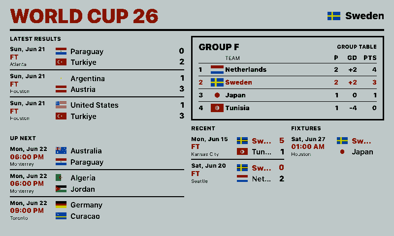
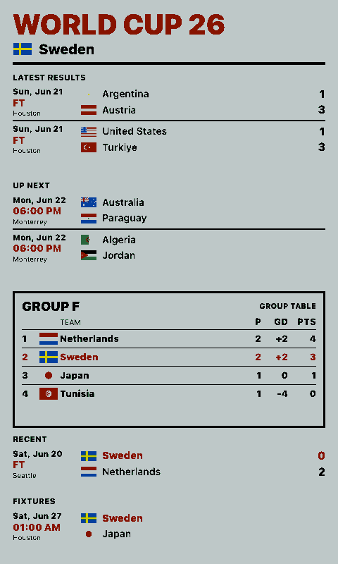
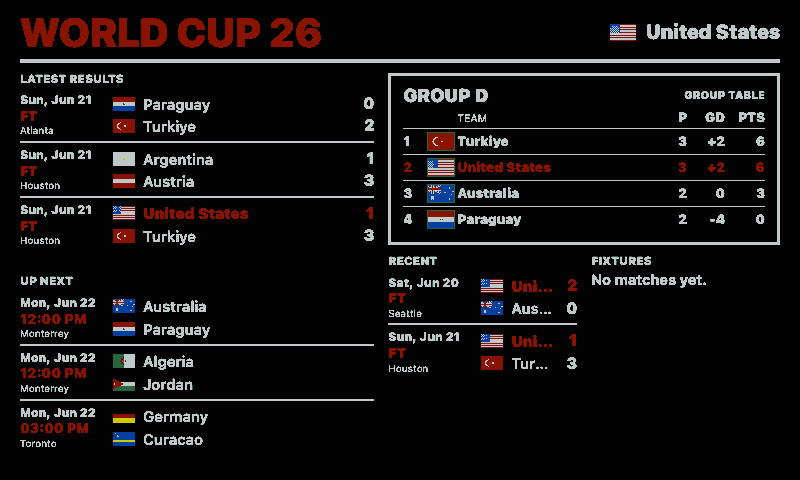
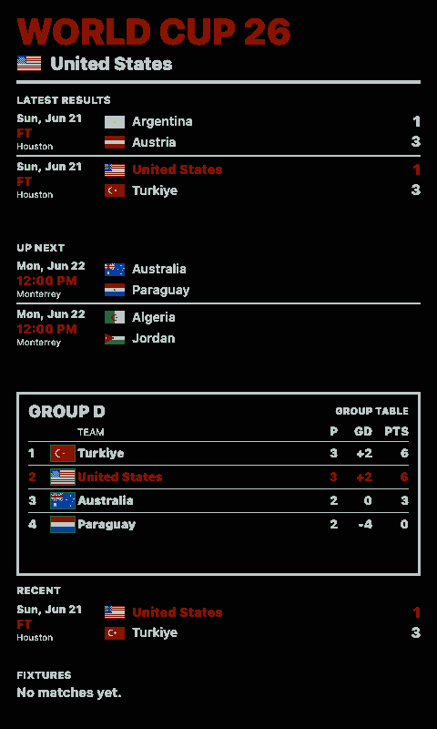

# World Cup 2026

World Cup 2026 dashboard for paperlesspaper OpenIntegrations. It is inspired by the TRMNL dashboard at `https://trmnl-fifa-2026.westling.dev/` and shows:

- Latest completed matches
- Upcoming matches
- The selected favorite team's group table
- Recent and upcoming matches for the selected team

Settings:

- `team`: favorite team code
- `locale`: date/time locale
- `timeZone`: IANA time zone for match times
- `highlightGlobalMatches`: whether to highlight the favorite team in global result/fixture lists

## Links

- [Demo](https://integrations.paperlesspaper.de/world-cup-2026/run)
- [config.json](./config.json)

## Screenshots

| Landscape | Portrait |
| --- | --- |
|  |  |
|  |  |

## Language Support

This integration declares `language: ["en", "de", "fr", "es", "it"]` in `config.json` and loads localized fixed UI copy from `languages/<code>.json` using the host-selected `payload.meta.language`.

The language JSON files localize dashboard labels, empty states, update text, and error titles only. Integration settings such as `locale`, `language`, or external API language codes remain separate.
