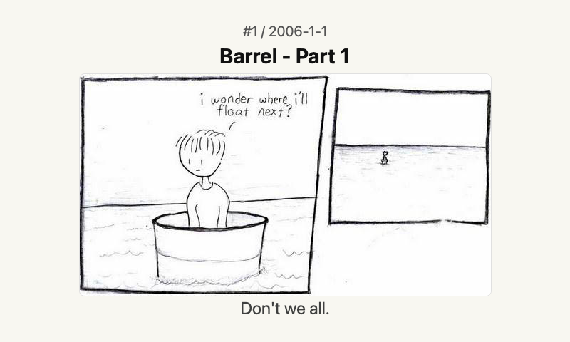
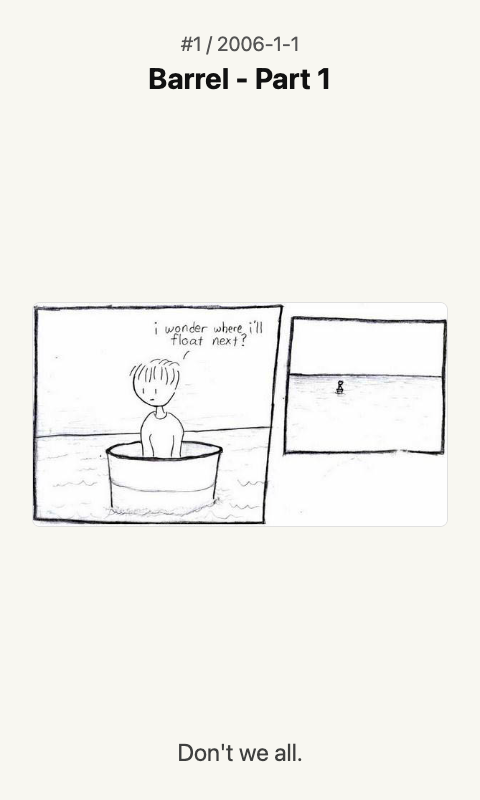

# XKCD

Plain OpenIntegration screen for XKCD comics. The render page uses the shared Paperless helpers, waits for payload settings, merges query settings, fetches `./api/data`, and calls grouped `fitHyphenatedText(...)`, `fitToScreen()`, and `markReady()`.

## Links

- [Demo](https://integrations.paperlesspaper.de/xkcd/run)
- [config.json](./config.json)

## Screenshots

| Landscape | Portrait |
| --- | --- |
|  |  |
|  |  |

## Common URLs

- `/xkcd/`
- `/xkcd/?kind=random`
- `/xkcd/?kind=offset&difference=10`
- `/xkcd/?num=1`
- `/xkcd/config.json`
- `/xkcd/api/data`

## Settings

- `kind`: `latest`, `random`, or `offset`
- `difference`: number of comics to subtract from the latest comic when `kind=offset`
- `num`: optional explicit XKCD comic number

## Language Support

This integration declares `language: ["en", "de", "fr", "es", "it"]` in `config.json` and loads localized fixed UI copy from `languages/<code>.json` using the host-selected `payload.meta.language`.

The language JSON files localize dashboard labels, empty states, update text, and error titles only. Integration settings such as `locale`, `language`, or external API language codes remain separate.
